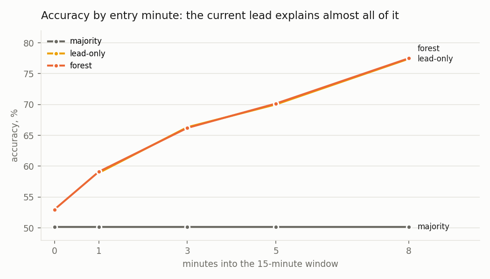
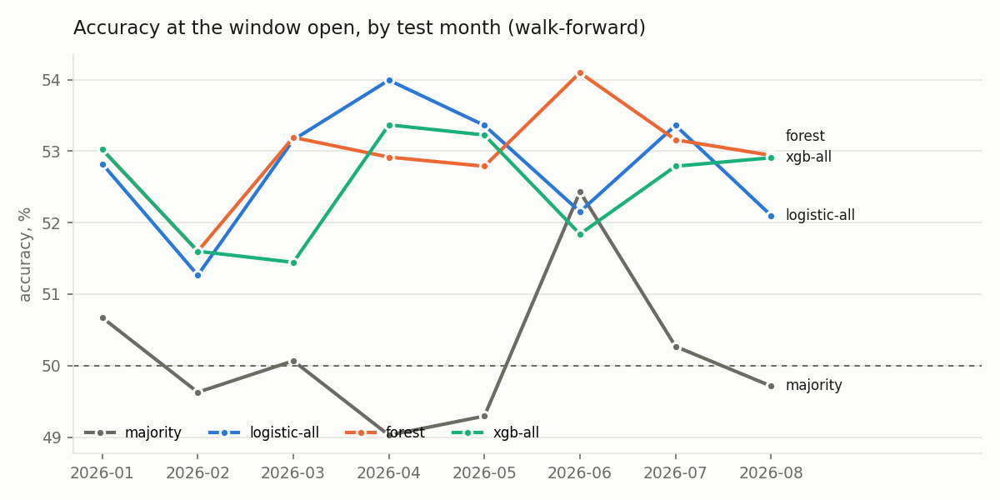
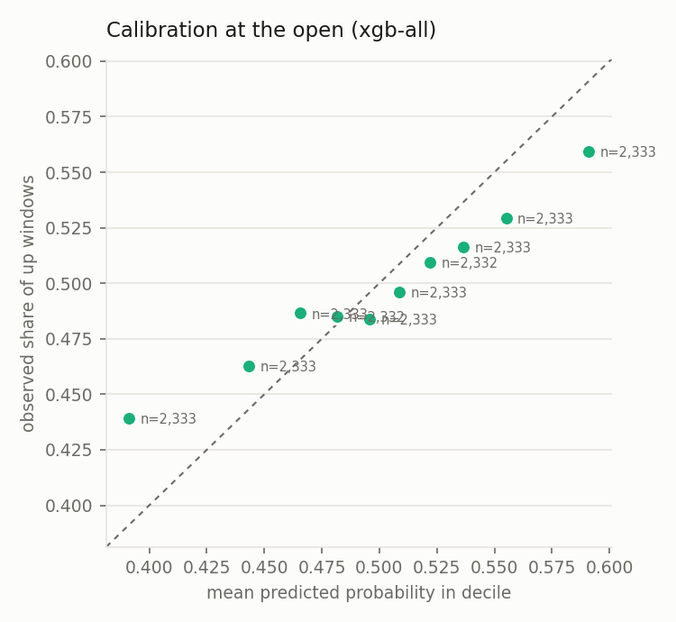
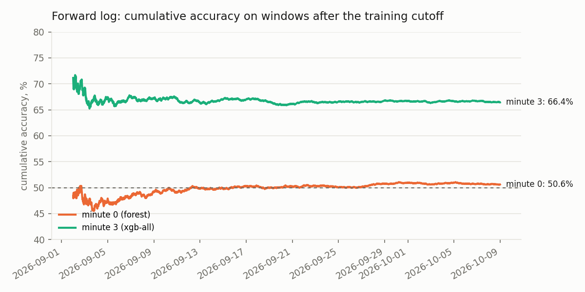

# BTC 15-minute direction: a boundary reversal, and what models add to it

This report asks whether a model can predict, better than a simple rule, whether Bitcoin closes a quarter-hour window at or above its open. The answer it reaches: consecutive windows tend to reverse, a one-bit rule captures that reversal, and the fitted models add little or nothing beyond it.

- **A one-bit rule is the number to beat at the open.** The rule calls the opposite of the previous window's direction; the first bullet under "What the tables and charts say" gives its accuracy and each model's gain over it.
- **After the open, the lead over the open does the work.** The bullet on the lead in that list gives the accuracy it reaches at each minute; no model beats it.
- **The probabilities at the open are too extreme.** The last bullet in that list gives the calibration slope.

Everything the model was tested on is here in the order it was done, regenerated on 2026-10-01 after an outside review (studies 20 to 29 are the review's questions, the sequence comparison and the hidden Markov predictors). Every table is generated into `results/btc_15m/` and spliced here by `scripts/update_readme.py`. The prose is written against those tables and checked before each commit. [process.md](process.md) records the bugs found on the way and the decisions behind each study.

## The problem

The model predicts whether Bitcoin closes a 15-minute window (aligned to the quarter hour) at or above where it opened. The data are free public 1-minute candles from Binance, including the taker-buy volume, a per-minute measure of order flow.

The question is asked at the open (minute 0, nothing of the window seen yet) and at 1, 3, 5 and 8 minutes in. Every model is compared with a one-feature baseline that holds the most useful single fact at that minute. At the open the baseline is the previous window's direction. Back-to-back windows share a boundary print, so a reversal between them is the first thing to rule out. After the open the baseline is the current lead over the open, scaled by the volatility expected over the minutes that remain. A model that cannot beat its one-feature baseline has found nothing the baseline does not already say.

Evaluation is walk-forward by calendar month: each test month is predicted by a model trained only on earlier months. The first three months are training only.

## Models compared

| name | what it is | features |
|---|---|---|
| majority | predicts the more common class in the training data | none |
| prev-window | the training up-rate after an up window and after a down window (minute 0) | previous window's direction |
| win1-logistic | logistic regression (minute 0) | previous window's move in bp |
| lead-only | logistic regression (minutes 1+) | current lead over the open |
| lead-z | logistic regression (minutes 1+) | lead divided by vol60 times the square root of the minutes remaining |
| logistic-all | logistic regression, standardised inputs | all 24 |
| forest | random forest, 300 trees, leaves of 50+ windows, 4 threads | all 24 |
| hgb-all | histogram gradient boosting (scikit-learn) | all 24 |
| xgb-price | XGBoost, depth 3 (GPU when available) | 15 price features |
| xgb-all | XGBoost, depth 3 | 15 price + 9 order-flow features |

The features fall into two groups.

- Price features:
  - lead over the open
  - returns over the prior 5, 15, 60 and 240 minutes
  - the last four windows' returns
  - realised volatility at three horizons
  - position in the 4-hour range
  - hour and weekday
- Order-flow features:
  - taker-buy share of volume over 1, 3, 5, 15 and 60 minutes
  - volume and trade-count ratios to the 24-hour average
  - mean trade size ratio

## Main results

<!-- table:walk_forward:start -->
Walk-forward results, 2025-10 to 2026-08, test months after the first three.

| minute | model | n test | accuracy | AUC | log loss |
|---|---|---|---|---|---|
| 0 | majority | 23,328 | 50.14% | 0.494 | 0.6932 |
| 0 | prev-window | 23,328 | 52.21% | 0.519 | 0.6922 |
| 0 | win1-logistic | 23,328 | 52.19% | 0.531 | 0.6917 |
| 0 | logistic-all | 23,328 | 52.89% | 0.542 | 0.6906 |
| 0 | forest | 23,328 | 52.65% | 0.539 | 0.6910 |
| 0 | hgb-all | 23,328 | 52.73% | 0.539 | 0.6911 |
| 0 | xgb-price | 23,328 | 52.38% | 0.533 | 0.6926 |
| 0 | xgb-all | 23,328 | 52.37% | 0.536 | 0.6918 |
| 0 | xgb-all, label from 1 min in | 23,328 | 51.86% | 0.526 | 0.6933 |
| 1 | majority | 23,328 | 50.14% | 0.494 | 0.6932 |
| 1 | lead-only | 23,328 | 58.91% | 0.623 | 0.6727 |
| 1 | lead-z | 23,328 | 58.86% | 0.629 | 0.6663 |
| 1 | logistic-all | 23,328 | 59.21% | 0.627 | 0.6692 |
| 1 | forest | 23,328 | 59.22% | 0.629 | 0.6666 |
| 1 | hgb-all | 23,328 | 59.34% | 0.628 | 0.6678 |
| 1 | xgb-price | 23,328 | 59.08% | 0.628 | 0.6675 |
| 1 | xgb-all | 23,328 | 59.24% | 0.628 | 0.6677 |
| 3 | majority | 23,328 | 50.14% | 0.494 | 0.6932 |
| 3 | lead-only | 23,328 | 66.32% | 0.713 | 0.6304 |
| 3 | lead-z | 23,328 | 66.35% | 0.721 | 0.6150 |
| 3 | logistic-all | 23,328 | 65.66% | 0.712 | 0.6253 |
| 3 | forest | 23,328 | 66.13% | 0.719 | 0.6162 |
| 3 | hgb-all | 23,328 | 66.35% | 0.719 | 0.6165 |
| 3 | xgb-price | 23,328 | 66.14% | 0.718 | 0.6171 |
| 3 | xgb-all | 23,328 | 66.28% | 0.719 | 0.6169 |
| 5 | majority | 23,328 | 50.14% | 0.494 | 0.6932 |
| 5 | lead-only | 23,328 | 70.00% | 0.762 | 0.5916 |
| 5 | lead-z | 23,328 | 69.98% | 0.775 | 0.5673 |
| 5 | logistic-all | 23,328 | 69.09% | 0.761 | 0.5863 |
| 5 | forest | 23,328 | 69.98% | 0.774 | 0.5683 |
| 5 | hgb-all | 23,328 | 69.85% | 0.772 | 0.5713 |
| 5 | xgb-price | 23,328 | 69.91% | 0.773 | 0.5705 |
| 5 | xgb-all | 23,328 | 69.96% | 0.773 | 0.5706 |
| 8 | majority | 23,328 | 50.14% | 0.494 | 0.6932 |
| 8 | lead-only | 23,328 | 77.40% | 0.846 | 0.5009 |
| 8 | lead-z | 23,328 | 77.46% | 0.858 | 0.4697 |
| 8 | logistic-all | 23,328 | 76.87% | 0.845 | 0.4975 |
| 8 | forest | 23,328 | 77.51% | 0.856 | 0.4724 |
| 8 | hgb-all | 23,328 | 77.38% | 0.855 | 0.4742 |
| 8 | xgb-price | 23,328 | 77.45% | 0.856 | 0.4722 |
| 8 | xgb-all | 23,328 | 77.33% | 0.856 | 0.4731 |
<!-- table:walk_forward:end -->

The table above shows entry minutes 0, 1, 3, 5 and 8. The walk-forward was run at every minute from 0 to 14, and the table below puts each minute's one-feature rule beside the fitted families. The full tables are in `results/btc_15m/`: `walk_forward_all.md` has every model at every minute, and `checks.md` has the intervals and tests at every minute.

<!-- table:walk_forward_by_minute:start -->
The one-feature rule of the minute against each fitted family, accuracy at every entry minute, walk-forward 2025-10 to 2026-08, test months after the first three, 23,328 windows at each minute. The rule is the previous window's direction at minute 0 and the lead z-score after. Accuracy is the share of windows called right; the families are fitted on all features (logistic-all, forest, hgb-all) or on price (xgb-price) or price and flow (xgb-all). The last column is the most accurate of the five families at that minute minus the rule on the same windows, in points, with a 95% interval from resampling whole days and the family's name. The best of five is chosen on these windows, so the difference is biased upward and the interval does not correct for the choice (study 23 does, for minutes 0 and 3).

| minute | one-feature rule (prev-window at 0, lead-z after) | logistic-all | forest | hgb-all | xgb-price | xgb-all | best fitted minus rule (points) [95% interval] |
|---|---|---|---|---|---|---|---|
| 0 | 52.21% | 52.89% | 52.65% | 52.73% | 52.38% | 52.37% | +0.69 [-0.01, +1.37] (logistic-all) |
| 1 | 58.86% | 59.21% | 59.22% | 59.34% | 59.08% | 59.24% | +0.48 [+0.06, +0.88] (hgb-all) |
| 2 | 63.24% | 62.52% | 63.15% | 63.06% | 63.25% | 62.88% | +0.01 [-0.37, +0.41] (xgb-price) |
| 3 | 66.35% | 65.66% | 66.13% | 66.35% | 66.14% | 66.28% | +0.00 [-0.29, +0.29] (hgb-all) |
| 4 | 68.27% | 67.73% | 68.12% | 68.20% | 68.28% | 68.22% | +0.01 [-0.30, +0.31] (xgb-price) |
| 5 | 69.98% | 69.09% | 69.98% | 69.85% | 69.91% | 69.96% | -0.00 [-0.33, +0.33] (forest) |
| 6 | 72.90% | 72.26% | 72.90% | 72.81% | 72.90% | 72.77% | +0.00 [-0.25, +0.24] (xgb-price) |
| 7 | 75.66% | 74.79% | 75.57% | 75.56% | 75.50% | 75.55% | -0.09 [-0.27, +0.10] (forest) |
| 8 | 77.46% | 76.87% | 77.51% | 77.38% | 77.45% | 77.33% | +0.05 [-0.12, +0.21] (forest) |
| 9 | 79.59% | 79.03% | 79.43% | 79.39% | 79.58% | 79.47% | -0.00 [-0.24, +0.24] (xgb-price) |
| 10 | 82.25% | 81.63% | 82.00% | 82.03% | 81.99% | 82.04% | -0.21 [-0.41, -0.02] (xgb-all) |
| 11 | 84.46% | 84.04% | 84.38% | 84.28% | 84.25% | 84.23% | -0.08 [-0.23, +0.06] (forest) |
| 12 | 86.35% | 86.17% | 86.34% | 86.33% | 86.28% | 86.25% | -0.01 [-0.14, +0.12] (forest) |
| 13 | 89.23% | 89.04% | 89.18% | 89.16% | 89.08% | 89.05% | -0.04 [-0.13, +0.05] (forest) |
| 14 | 92.30% | 91.94% | 92.31% | 92.24% | 92.25% | 92.23% | +0.00 [-0.05, +0.06] (forest) |

Across minutes 1 to 14 the largest best-fitted-minus-rule difference is +0.48 [+0.06, +0.88] points at minute 1 (hgb-all) and the smallest is -0.21 [-0.41, -0.02] points at minute 10 (xgb-all); at minute 0 it is +0.69 [-0.01, +1.37] points (logistic-all).

The interval lies entirely above zero at 1 of the 15 minutes (minute 1) and entirely below zero at 1 (minute 10). The intervals are not adjusted for the number of minutes.
<!-- table:walk_forward_by_minute:end -->

Does a fitted model add anything over the window's own move at any minute? Not after the first two minutes. At the open and at minute 1 the best fitted family is above the rule. Only at minute 1 does the interval exclude zero, and that is before any correction for choosing the best of five or for reading fifteen minutes. From minute 2 on the best family is level with the rule, and at minute 10 it is below it.

- **The gap is confined to the first two minutes.** The two largest values in the last column are at minutes 0 and 1. The first sentence under the table names the largest difference and the minute-0 value, and the minute-0 interval includes zero.
- **From minute 2 the rule is as good as any family.** The interval includes zero at every minute from 2 to 9 and from 11 to 14. These rows cannot tell the best family from the rule.
- **One minute is below zero, and the intervals are not adjusted.** The second sentence under the table lists the minutes whose interval excludes zero. With fifteen unadjusted intervals, one or two that miss zero are not evidence of an effect at those minutes.
- **Method.** The rule is the previous window's direction at minute 0 and the lead z-score after. The best fitted family is the most accurate of the five at that minute on these windows, so the difference is biased upward; study 23 corrects for the choice at minutes 0 and 3 only. Hits are paired by window and whole days are resampled.

What the tables and charts say:

- At the open the number to beat is one bit: consecutive windows tend to go opposite ways, and calling the opposite of the previous window is right 52.2% of the time (the prev-window row). Earlier versions of this report compared the models with the 50.1% majority rate and called the forest's 53% a 3-point signal. Against the one-bit rule the forest is +0.44 points, with intervals of [-0.25, +1.18] on day blocks and [-0.30, +1.04] on month blocks, and it beats the rule on 54% of days (sign-test p 0.10). The best of the five fitted models, the logistic regression, is +0.69 [-0.01, +1.37], and +0.52 [-0.17, +1.21] after the selection correction of study 23. Studies 20 to 26 show that the one bit is the stable part and the increment is not.
- Logistic regression on the same features does as well as the tree models at the open. With the indicator bank (study 1) every model lands about a point above the one-bit rule. Nothing a linear model misses is being found.
- The reversal survives removing the shared boundary print. Measuring the label from one minute in leaves 51.9% for the model. Study 21 relabels every window from 60-second volume-weighted prices with no shared trades, and the reversal rule still scores 52.5%.
- Once the window is under way, the current lead over the open, scaled by the volatility left in the window, explains the accuracy: 66.4% at minute 3 and 77.5% at minute 8 from that one number. No model beats it. The direction of the remaining path is a coin flip (study 10). The tree models improve the probabilities (lower log loss) but not the direction calls.
- Minute-level order flow (the taker-buy share) adds a few tenths of a point at the open with intervals across zero; the indicator bank is the only feature addition whose interval excludes zero on day blocks (study 1).
- The probabilities at the open are too extreme: the calibration slope is 0.63 [0.52, 0.76] where 1 is calibrated (study 12), so a raw 0.55 does not mean 55%. Platt scaling fixes the slope. At minute 3 the raw probabilities are calibrated (slope 0.99).

## Forward log

The backtest above can be re-run and tuned; the forward log cannot. `models/btc_15m/log.py` freezes models trained through a cutoff month and scores every later window as Binance publishes its daily files. It appends each window to `results/btc_15m/predictions.csv` under a hash chain (`--verify` checks it), with a manifest of what the frozen models are. September 2026 is an out-of-time holdout rather than a forward month, because the log was first written after the month had passed. After the review's bug fixes (the weekday feature had been coded wrong), the frozen models were re-fitted on the same training months. September was scored again under the new model id, beside the earlier rows and not over them. The block below reads the current models' rows. The forward log proper begins with October 2026: one model, no revisions.

<!-- forward:start -->
Models trained through 2026-08 (model id dbba22d74696). September 2026 is an out-of-time holdout: the log was first written after the month had passed. The forward log proper begins 2026-10-01.

Holdout (September 2026): 2026-09-01 to 2026-09-30.

| minute | model | windows | accuracy |
|---|---|---|---|
| 0 | forest | 2,880 | 50.94% |
| 3 | xgb-all | 2,880 | 66.67% |

Forward log (from October 2026): 2026-10-01 to 2026-10-08.

| minute | model | windows | accuracy |
|---|---|---|---|
| 0 | forest | 768 | 49.35% |
| 3 | xgb-all | 768 | 65.49% |

<!-- forward:end -->

On September's 2,880 windows the re-fitted frozen forest scored 50.9% at the open, below the one-bit rule's backtest level. The stable event rules of study 19 kept their direction in 562 of 666 cases (study 20 gives the null for that count), and the strongest-event rule of study 17 scored 52.4% [50.6, 54.4]. An earlier version of this report read that as "signal intact, model unstable". The review pointed out that the rules were selected on data through August and the portfolio was built after the 50.4% was known, so the reading had been made in the direction the author hoped. The adopted reading: September failed to reject the one-bit reversal, and the fitted forest failed to show an increment over it. The 2025 holdout (study 26) and the phase study (study 22) say the same. The minute-3 model is where the backtest said it would be, which is where the lead puts it.

## Checks the numbers pass

- **No lookahead.** Features are pure functions of past candles. `tests/test_features.py` multiplies every candle from the entry minute onward by three and asserts the features do not change, at five different entry minutes.
- **Uncertainty that respects time.** Windows in one day share conditions, and neighbouring windows are correlated. So every interval resamples whole days (and, for the headline, whole months). The model-against-baseline test works on daily differences with random sign flips. The significance test rotates the label sequence within each month rather than shuffling it. `tests/test_stats.py` checks that the day bootstrap widens when a day's windows are identical, that the month bootstrap is wider when months differ, and that the rotation test gives no credit for the labels' own runs. (A within-day label permutation was used until 2026-10-01; it ignored the dependence between neighbouring windows and was retired.)
- **One-feature baselines at the same moment.** Every model is reported next to the previous window's direction at the open and the lead z-score after it, on the same windows.
- **Shared-boundary check.** The label is re-measured from one minute in, and study 21 re-measures it from 60-second volume-weighted prices, to see how much of the open-of-window signal is boundary noise (little: the reversal survives both).
- **Numbers come from scripts.** The tables in this file are spliced from `results/` by `scripts/update_readme.py`; the charts are drawn from the same CSVs.

## Follow-up experiments

Six follow-ups, each with the reason it was worth running and what it found. All tables carry the one-feature baseline on the same windows. The tables are generated into `results/btc_15m/` and spliced here.

**1. Feature sets, including an indicator bank and tick-level order flow.** Do classic indicators or tick-level order flow add anything to price features? At the open the indicator bank adds a small gain and tick flow adds nothing reliable; three minutes in, nothing beats the lead.

- **The indicator bank is the one addition that helps at the open.** The first sentence under the table gives the gain and its limits.
- **Tick-level flow does not reliably help.** The tick-flow sentence under the table: its interval against the price-only forest includes zero.
- **Three minutes in, no feature set beats the lead.** The last column of the table, rows for three minutes in.

**Method.** The indicators (RSI, MACD, Bollinger %b, ATR, EMA cross, stochastic, OBV slope, VWAP deviation, ADX) are deterministic transforms of the same prices, so the expectation was little gain. Tick-level flow is Binance aggregated trades reduced to one-second bins: signed volume imbalance over the 5 to 300 seconds before the entry, large-trade share and trade-rate ratio. It is the one input the minute candles cannot express. Published work on Binance futures reports that order imbalance at quarter-hour openings carries information over hours, so the question was whether any of it shows at 15 minutes.

<!-- table:ablation:start -->
Feature-set ablation, walk-forward by month. The last two columns are accuracy minus the price-only forest and minus the one-feature baseline (the previous window at the open, the lead z-score after), on the same windows, day-block 95% intervals.

| minute | features | model | n | accuracy | AUC | log loss | vs price-only forest | vs one-feature baseline |
|---|---|---|---|---|---|---|---|---|
| 0 | price | forest | 23328 | 52.49% | 0.537 | 0.6916 | +0.00 [+0.00, +0.00] | +0.28 [-0.32, +0.91] |
| 0 | price | xgb | 23328 | 52.38% | 0.533 | 0.6926 | -0.10 [-0.60, +0.39] | +0.18 [-0.52, +0.86] |
| 0 | price + flow | forest | 23328 | 52.65% | 0.539 | 0.6910 | +0.16 [-0.42, +0.76] | +0.44 [-0.25, +1.18] |
| 0 | price + flow | xgb | 23328 | 52.37% | 0.536 | 0.6918 | -0.11 [-0.74, +0.52] | +0.17 [-0.55, +0.87] |
| 0 | price + flow + indicators | forest | 23328 | 53.48% | 0.547 | 0.6899 | +0.99 [+0.42, +1.55] | +1.27 [+0.58, +1.95] |
| 0 | price + flow + indicators | xgb | 23328 | 53.11% | 0.544 | 0.6909 | +0.63 [+0.05, +1.21] | +0.90 [+0.26, +1.59] |
| 0 | price + flow + tick flow | forest | 23328 | 53.03% | 0.546 | 0.6898 | +0.55 [-0.03, +1.15] | +0.83 [+0.16, +1.53] |
| 0 | price + flow + tick flow | xgb | 23328 | 53.01% | 0.542 | 0.6912 | +0.53 [-0.09, +1.11] | +0.81 [+0.13, +1.51] |
| 0 | everything | forest | 23328 | 53.15% | 0.546 | 0.6899 | +0.66 [+0.06, +1.29] | +0.94 [+0.24, +1.66] |
| 0 | everything | xgb | 23328 | 53.02% | 0.546 | 0.6906 | +0.53 [-0.09, +1.13] | +0.81 [+0.15, +1.48] |
| 0 | one-feature baseline (prev-window) |  | 23328 | 52.21% | 0.519 | 0.6922 |  | baseline |
| 3 | price | forest | 23328 | 65.96% | 0.719 | 0.6165 | +0.00 [+0.00, +0.00] | -0.39 [-0.72, -0.07] |
| 3 | price | xgb | 23328 | 66.14% | 0.718 | 0.6171 | +0.18 [-0.09, +0.46] | -0.21 [-0.53, +0.12] |
| 3 | price + flow | forest | 23328 | 66.13% | 0.719 | 0.6162 | +0.17 [-0.05, +0.41] | -0.22 [-0.54, +0.11] |
| 3 | price + flow | xgb | 23328 | 66.28% | 0.719 | 0.6169 | +0.32 [+0.04, +0.61] | -0.07 [-0.42, +0.27] |
| 3 | price + flow + indicators | forest | 23328 | 66.13% | 0.720 | 0.6158 | +0.18 [-0.06, +0.41] | -0.21 [-0.56, +0.10] |
| 3 | price + flow + indicators | xgb | 23328 | 66.32% | 0.720 | 0.6161 | +0.36 [+0.07, +0.65] | -0.03 [-0.38, +0.28] |
| 3 | price + flow + tick flow | forest | 23328 | 66.19% | 0.719 | 0.6161 | +0.24 [-0.02, +0.49] | -0.15 [-0.48, +0.16] |
| 3 | price + flow + tick flow | xgb | 23328 | 66.34% | 0.718 | 0.6171 | +0.38 [+0.11, +0.65] | -0.01 [-0.36, +0.34] |
| 3 | everything | forest | 23328 | 66.33% | 0.720 | 0.6156 | +0.37 [+0.13, +0.63] | -0.02 [-0.36, +0.29] |
| 3 | everything | xgb | 23328 | 66.27% | 0.720 | 0.6163 | +0.32 [+0.02, +0.61] | -0.07 [-0.43, +0.27] |
| 3 | one-feature baseline (lead-z) |  | 23328 | 66.35% | 0.721 | 0.6150 |  | baseline |
<!-- table:ablation:end -->

At the open, the indicator bank is the only addition whose interval excludes zero: +0.99 [+0.42, +1.55] points over the price-only forest, and +1.27 [+0.58, +1.95] over the one-bit rule (the one-feature baseline: the previous window's direction), on day blocks. It is one of ten comparisons in the table. The 2025 holdout puts the same model at +0.40 [-0.22, +1.02] over the rule (study 26), and the selection correction of study 23 applies, so read it as "worth keeping" and no more. Tick-level flow adds +0.55 [-0.03, +1.15] over the price-only forest: the imbalance in the seconds before a window opens does not reliably predict the next 15 minutes here. Three minutes in, no feature set beats the lead z-score; every "vs one-feature baseline" interval includes zero or sits below it.

**2. A sequence model on the raw minute series.** Can a recurrent network (a GRU) find a signal that hand-built features miss? No: it scores below the one-feature baseline at the open and three minutes in.

- **At the open the GRU scores below the previous-window rule.** The first sentence under the table gives the gap.
- **Three minutes in it scores below the lead z-score.** The same sentence; the last column of the table carries both intervals.

**Method.** The GRU reads the last 120 minutes of returns, volume ratios and taker-buy share, with the lead and hour as side inputs. It is trained walk-forward with early stopping and runs on the GPU when one is present.

<!-- table:sequence:start -->
GRU over the last 120 minutes (return, volume ratio, taker-buy share) plus lead and hour, walk-forward by month, early stopping on the last 10% of training months.

| minute | model | n | accuracy [95% CI] | AUC | log loss | vs baseline |
|---|---|---|---|---|---|---|
| 0 | gru-sequence | 23328 | 51.16% [50.57, 51.76] | 0.520 | 0.6924 | -1.05 [-1.68, -0.40] vs prev-window |
| 3 | gru-sequence | 23328 | 65.89% [65.28, 66.54] | 0.715 | 0.6203 | -0.46 [-0.79, -0.12] vs lead-z |
<!-- table:sequence:end -->

It does not learn the one-bit rule (the previous window's direction): 51.2% at the open is a point below it (-1.05 [-1.68, -0.40]). Three minutes in it is half a point below the lead z-score. With 23,000 training windows a GRU on the raw series finds less than the hand-built features, which themselves add little to the rule. Study 28 repeats this with honest tuning, three architectures and three sequence lengths.

**3. A magnitude label.** Can a model predict whether a window moves a meaningful distance, in either direction? It predicts that far better than it predicts direction, and volatility alone gets most of the way there.

- **The size of the move is far more predictable than its direction.** The first sentence under the table compares accuracy with the base rate.
- **Most of that comes from volatility clustering.** The same sentence gives the volatility-only baseline.
- **Three minutes in, the picture is the same.** The second sentence under the table.

**Method.** The label is whether the window closes at least 10 basis points from its open, up or down. That question decides whether a window is worth acting on at all. The baseline is logistic regression on the trailing 60-minute volatility alone.

<!-- table:magnitude:start -->
Magnitude label: the window's close is at least 10 basis points from the entry price (the open at minute 0, the price at entry after it), in either direction.

| minute | model | n | share of windows that move | accuracy [95% CI] | AUC | log loss |
|---|---|---|---|---|---|---|
| 0 | vol60 only | 23328 | 50.7% | 64.70% [63.40, 65.99] | 0.708 | 0.6360 |
| 0 | all features | 23328 | 50.7% | 65.26% [63.98, 66.49] | 0.715 | 0.6165 |
| 3 | vol60 only | 23328 | 45.1% | 65.63% [64.28, 67.02] | 0.719 | 0.6260 |
| 3 | all features | 23328 | 45.1% | 66.85% [65.57, 68.13] | 0.730 | 0.6006 |
<!-- table:magnitude:end -->

Magnitude is far more predictable than direction (65.3% at the open against a 50.7% base rate), and most of it is volatility clustering: the volatility-only baseline gets 64.7%. At minute 3 the label is measured from the entry price over the remaining minutes (the review found the earlier version let the lead decide it). The picture is the same: 66.9% against 65.6% for volatility alone.

**4. Where the direction signal lives.** Does the forest's accuracy at the open depend on the trading session, the volatility level or the recent trend? It barely does: accuracy is even across sessions and volatility levels, and only windows after a strong four-hour move stand out.

- **Accuracy is even across sessions and volatility levels.** The first sentence under the table gives the range.
- **Windows after a strong four-hour move score highest.** The second sentence under the table notes that their interval overlaps the other trend groups.

**Method.** Accuracy at the open is split three ways: by trading session, by tercile of trailing volatility and by tercile of the absolute 4-hour return.

<!-- table:regime:start -->
Accuracy at the open (forest, price + flow) by regime, walk-forward predictions. Volatility is the trailing 60-minute realised volatility; trend is the absolute 4-hour return.

| split | group | windows | accuracy [95% CI] |
|---|---|---|---|
| session | Asia 00-07 | 7776 | 53.02% [51.90, 54.18] |
| session | Europe 08-13 | 5832 | 52.07% [50.82, 53.45] |
| session | US 14-21 | 7776 | 52.85% [51.77, 53.99] |
| session | late 22-23 | 1944 | 52.06% [50.05, 54.06] |
| volatility | low | 7776 | 52.46% [51.50, 53.48] |
| volatility | mid | 7776 | 52.74% [51.58, 53.82] |
| volatility | high | 7776 | 52.75% [51.62, 53.85] |
| trend | flat | 7776 | 51.83% [50.74, 52.93] |
| trend | mid | 7776 | 52.30% [51.19, 53.47] |
| trend | strong | 7776 | 53.82% [52.81, 54.86] |
<!-- table:regime:end -->

The forest's accuracy at the open is spread evenly across sessions and volatility levels (51.8% to 53.0%). The only group that stands out is windows following a strong 4-hour move, 53.8%, and the intervals of the three trend groups overlap.

**5. Combinatorial purged cross-validation as a second estimate.** Does the walk-forward accuracy at the open depend on the particular order of the months? It does not: a second validation scheme gives the same accuracy.

- **The second estimate agrees with walk-forward.** The sentence under the table compares the two.
- **The agreement checks that month order is not driving the walk-forward result.** Some paths train on later data, which walk-forward never does.

**Method.** The data is split into six contiguous blocks and every pair is used once as the test set (15 paths). Training rows within 25 hours of a test block are dropped (the longest feature lookback; the review found the earlier four-hour embargo shorter than the 24-hour volume baseline). Unlike walk-forward, some paths train on data from after the test block.

<!-- table:cpcv:start -->
Combinatorial purged cross-validation at minute 0: 6 contiguous blocks, every pair as the test set, training rows within 25 hours of a test block dropped (the longest feature lookback). Forest, price + flow. Unlike walk-forward, some paths train on data from after the test block.

| test blocks | train rows | test rows | accuracy |
|---|---|---|---|
| (0, 1) | 21271 | 10687 | 52.38% |
| (0, 2) | 21070 | 10687 | 52.51% |
| (0, 3) | 21070 | 10687 | 53.03% |
| (0, 4) | 21070 | 10687 | 52.18% |
| (0, 5) | 21171 | 10687 | 52.59% |
| (1, 2) | 21172 | 10686 | 53.55% |
| (1, 3) | 20971 | 10686 | 53.41% |
| (1, 4) | 20971 | 10686 | 53.18% |
| (1, 5) | 21072 | 10686 | 52.98% |
| (2, 3) | 21172 | 10686 | 52.98% |
| (2, 4) | 20971 | 10686 | 52.73% |
| (2, 5) | 21072 | 10686 | 52.52% |
| (3, 4) | 21172 | 10686 | 52.92% |
| (3, 5) | 21072 | 10686 | 52.94% |
| (4, 5) | 21273 | 10686 | 52.48% |
| all 15 paths |  |  | mean 52.82%, min 52.18%, max 53.55% |
<!-- table:cpcv:end -->

The 15 paths give 52.2% to 53.6% with a mean of 52.8%, in line with the walk-forward 52.65%.

**6. Break-even accuracy under hypothetical costs.** Does the model's accuracy at the open exceed the break-even accuracy under assumed trading costs? Acting on every window it only matches break-even; acting only on its most confident calls goes above it.

- **Acting on every window at the open, accuracy is level with break-even.** The first sentence under the table gives the margin and its interval.
- **Acting only on the most confident windows lifts accuracy above break-even.** The open rows with a stricter cutoff; studies 10 and 13 reach the same result by other routes.
- **Rows after the open are not meaningful.** The last sentence under the table gives the reason.

**Method.** This is a sensitivity calculation, not a backtest of trades. A $1 binary is bought at 0.5 plus half a 1-cent spread, with a 1.75-cent fee, which puts the break-even accuracy at 52.25%. The table shows accuracy minus that, acting only when the model's probability is far enough from 0.5. No venue settles on a Binance last print, and the price model is an assumption.

<!-- table:cost:start -->
Break-even accuracy under hypothetical costs. Forest, price + flow features, walk-forward, acting only when the probability is far enough from 0.5. Under a hypothetical cost model (buy the favoured side at 0.5 plus half a 1c spread, pay a 1.75c fee, receive 1 if right) the break-even accuracy is 52.25%. These are sensitivity figures, not a backtest of trades: no venue settles on a Binance last print, and the price model is an assumption. After the open a market would not be priced at 0.5, so only the minute-0 rows are even hypothetically meaningful. Last column: accuracy minus break-even, in points, day-block 95% interval.

| minute | act when probability | windows | share acted on | accuracy | accuracy minus break-even, points [95% CI] |
|---|---|---|---|---|---|
| 0 | >= 0.50 or <= 0.50 | 23328 | 100% | 52.65% | +0.40 [-0.24, +1.08] |
| 0 | >= 0.53 or <= 0.47 | 12585 | 54% | 54.17% | +1.92 [+1.06, +2.79] |
| 0 | >= 0.55 or <= 0.45 | 7300 | 31% | 55.11% | +2.86 [+1.83, +3.98] |
| 0 | >= 0.58 or <= 0.42 | 2645 | 11% | 57.77% | +5.52 [+3.78, +7.30] |
| 3 | >= 0.50 or <= 0.50 | 23328 | 100% | 66.13% | +13.88 [+13.27, +14.50] |
| 3 | >= 0.53 or <= 0.47 | 21114 | 91% | 67.64% | +15.39 [+14.78, +16.02] |
| 3 | >= 0.55 or <= 0.45 | 19584 | 84% | 68.83% | +16.58 [+15.96, +17.24] |
| 3 | >= 0.58 or <= 0.42 | 17306 | 74% | 70.41% | +18.16 [+17.51, +18.83] |
<!-- table:cost:end -->

Acting on every window at the open, the forest sits +0.40 points above the hypothetical break-even with an interval across zero. The one-bit rule (the previous window's direction), at 52.21%, is level with it. Acting only on the most confident 11% of windows gives +5.5 points. The meta-labelling (study 10) and conformal (study 13) tables apply the same confidence cutoff by other routes and reach the same result. After the open the rows describe a contract that a real market would not price at 0.5, so they are not meaningful.

## Going deeper

Thirteen more studies on the questions a careful reader asks after the first six. Each uses the same walk-forward harness, day-clustered intervals and the same splice.

**7. Four coins, and what one coin says about another.** Does the reversal at the open show up in other coins, and does another coin's history or recent price help predict Bitcoin? The reversal appears in every coin; pooling coins adds little, and ETH and SOL features add nothing for BTC.

- **All four coins show the same reversal at the open.** The first sentence under the table compares each coin's model with its own one-feature rule.
- **Pooling the coins' history adds little.** The sentences on pooling under the table give the intervals and the reason.
- **ETH's and SOL's recent minutes add nothing to BTC.** The sentence on ETH and SOL under the table.

**Method.** The features are scale-free (basis points, ratios, shares), so the same pipeline runs on ETH, SOL and DOGE. Their earlier months can be pooled to train one model that is tested on each coin. A second question is cross-asset lead-lag: do ETH's or SOL's last few minutes say anything about BTC's next window?

<!-- table:multi_asset:start -->
Multi-asset results (xgb, price + flow features), walk-forward by month, 2025-10 to 2026-08. Last column: accuracy minus the coin's own-history model on the same windows, day-block 95% interval.

| minute | setup | n | accuracy [95% CI] | AUC | log loss | vs own |
|---|---|---|---|---|---|---|
| 0 | BTC own | 23328 | 52.52% [51.92, 53.18] | 0.537 | 0.6917 | baseline |
| 0 | ETH own | 23328 | 53.48% [52.88, 54.08] | 0.545 | 0.6911 | baseline |
| 0 | SOL own | 23328 | 52.49% [51.87, 53.14] | 0.531 | 0.6930 | baseline |
| 0 | DOGE own | 23328 | 52.83% [52.14, 53.49] | 0.540 | 0.6924 | baseline |
| 0 | BTC one-feature baseline (prev-window) | 23328 | 52.21% [51.63, 52.82] | 0.519 | 0.6922 | -0.32 [-1.03, +0.38] |
| 0 | ETH one-feature baseline (prev-window) | 23328 | 52.76% [52.16, 53.33] | 0.528 | 0.6917 | -0.71 [-1.33, -0.07] |
| 0 | SOL one-feature baseline (prev-window) | 23328 | 51.99% [51.38, 52.64] | 0.520 | 0.6922 | -0.50 [-1.19, +0.18] |
| 0 | DOGE one-feature baseline (prev-window) | 23328 | 52.82% [52.18, 53.47] | 0.531 | 0.6917 | -0.01 [-0.70, +0.67] |
| 0 | BTC pooled (4 coins) | 23328 | 52.85% [52.25, 53.44] | 0.541 | 0.6908 | +0.33 [-0.25, +0.90] |
| 0 | ETH pooled (4 coins) | 23328 | 53.55% [52.99, 54.15] | 0.547 | 0.6898 | +0.08 [-0.44, +0.60] |
| 0 | SOL pooled (4 coins) | 23328 | 52.65% [52.01, 53.27] | 0.536 | 0.6920 | +0.15 [-0.46, +0.74] |
| 0 | DOGE pooled (4 coins) | 23328 | 52.85% [52.18, 53.50] | 0.540 | 0.6912 | +0.02 [-0.50, +0.56] |
| 0 | BTC own (cross-joined rows) | 23328 | 52.52% [51.92, 53.18] | 0.537 | 0.6917 | baseline |
| 0 | BTC + ETH and SOL features | 23328 | 52.31% [51.71, 52.95] | 0.536 | 0.6919 | -0.22 [-0.72, +0.25] |
| 3 | BTC own | 23328 | 66.22% [65.61, 66.86] | 0.718 | 0.6168 | baseline |
| 3 | ETH own | 23328 | 66.82% [66.21, 67.45] | 0.728 | 0.6095 | baseline |
| 3 | SOL own | 23328 | 66.26% [65.65, 66.88] | 0.726 | 0.6104 | baseline |
| 3 | DOGE own | 23328 | 66.96% [66.40, 67.50] | 0.731 | 0.6072 | baseline |
| 3 | BTC one-feature baseline (lead-z) | 23328 | 66.35% [65.73, 66.98] | 0.721 | 0.6150 | +0.13 [-0.21, +0.48] |
| 3 | ETH one-feature baseline (lead-z) | 23328 | 66.72% [66.13, 67.34] | 0.727 | 0.6093 | -0.10 [-0.45, +0.23] |
| 3 | SOL one-feature baseline (lead-z) | 23328 | 66.55% [65.98, 67.16] | 0.728 | 0.6089 | +0.28 [-0.03, +0.60] |
| 3 | DOGE one-feature baseline (lead-z) | 23328 | 66.97% [66.40, 67.53] | 0.732 | 0.6065 | +0.01 [-0.38, +0.41] |
| 3 | BTC pooled (4 coins) | 23328 | 66.32% [65.72, 66.90] | 0.720 | 0.6155 | +0.10 [-0.18, +0.38] |
| 3 | ETH pooled (4 coins) | 23328 | 67.00% [66.44, 67.59] | 0.730 | 0.6080 | +0.18 [-0.09, +0.44] |
| 3 | SOL pooled (4 coins) | 23328 | 66.56% [65.99, 67.16] | 0.730 | 0.6078 | +0.29 [+0.03, +0.57] |
| 3 | DOGE pooled (4 coins) | 23328 | 67.21% [66.65, 67.73] | 0.735 | 0.6043 | +0.24 [-0.02, +0.51] |
| 3 | BTC own (cross-joined rows) | 23328 | 66.22% [65.61, 66.86] | 0.718 | 0.6168 | baseline |
| 3 | BTC + ETH and SOL features | 23328 | 66.27% [65.68, 66.91] | 0.718 | 0.6169 | +0.05 [-0.16, +0.28] |
<!-- table:multi_asset:end -->

All four coins show the same reversal at the open: each coin's own one-bit rule (the previous window's direction) scores 52.0% to 52.8%, and each coin's own model 52.5% to 53.5%. The model's increment over the rule is between zero and 0.7 points (ETH's +0.71 [+0.07, +1.33] is the only interval that excludes zero, one of four). Pooling four coins' history adds +0.0 to +0.3 points, every interval across zero. Four coins over the same months are close to one sample of the same effect, and not four replications. ETH's and SOL's last minutes add nothing to BTC (-0.22 at the open, +0.05 at minute 3). This table is also where a caching bug was caught. A first run showed four identical rows because the feature cache was keyed on the time span alone, which the coins share. The key now covers the content and a test covers it.

**8. Hyperparameter search, honest and dishonest.** How much does tuning on the test month inflate a result compared with tuning on earlier data? Here the inflation is small, because tuning adds little in either form.

- **Honest tuning adds little at the open and nothing three minutes in.** The first sentence under the table gives the gain and its interval.
- **Tuning on the test month adds only a little more than honest tuning.** The second sentence under the table gives the reason.
- **The untuned model with indicators is above the previous-window rule.** The last sentence under the table repeats the increment from study 1.

**Method.** For each test month, Optuna picks XGBoost parameters two ways. The honest way validates on the month before the test month. The other validates on the test month itself, which is what happens when a notebook tunes and reports on the same split. The gap between the two rows is the optimism to subtract from any tuned result that does not name its validation split.

<!-- table:tuning:start -->
XGBoost with default parameters vs Optuna search (30 trials per month) validated honestly (on the month before the test month) and validated on the test month itself. Walk-forward, price + flow + indicator features. Last column: accuracy minus default on the same windows, day-block 95% interval.

| minute | variant | n | accuracy [95% CI] | AUC | log loss | vs default |
|---|---|---|---|---|---|---|
| 0 | default | 23328 | 53.11% [52.55, 53.70] | 0.544 | 0.6909 | baseline |
| 0 | tuned-honest | 23328 | 53.34% [52.74, 53.99] | 0.546 | 0.6900 | +0.23 [-0.25, +0.71] |
| 0 | tuned-on-test | 23328 | 53.51% [52.91, 54.15] | 0.551 | 0.6889 | +0.40 [-0.05, +0.86] |
| 0 | one-feature baseline (prev-window) | 23328 | 52.21% [51.63, 52.82] | 0.519 | 0.6922 | -0.90 [-1.59, -0.26] |
| 3 | default | 23328 | 66.32% [65.70, 66.93] | 0.720 | 0.6161 | baseline |
| 3 | tuned-honest | 23328 | 66.13% [65.52, 66.75] | 0.720 | 0.6155 | -0.19 [-0.40, +0.04] |
| 3 | tuned-on-test | 23328 | 66.27% [65.69, 66.86] | 0.721 | 0.6147 | -0.04 [-0.26, +0.20] |
| 3 | one-feature baseline (lead-z) | 23328 | 66.35% [65.73, 66.98] | 0.721 | 0.6150 | +0.03 [-0.28, +0.38] |
<!-- table:tuning:end -->

Honest tuning adds +0.23 points at the open with an interval across zero, and nothing at minute 3. The leaky variant is +0.17 above honest: with 30 trials over a small space and a weak signal there is little room to overfit the test month. The gap grows with the number of trials and the flexibility of the space, which is the usual setting of a tuned notebook. The default XGBoost with indicators is +0.90 [+0.26, +1.59] over the one-bit rule (the previous window's direction), the same increment the ablation shows.

**9. How much history, and how often to retrain.** Does a shorter training window or more frequent retraining improve the model? It does not help at the open, and three minutes in the longer window is slightly better.

- **A shorter training window does no better than all earlier months.** The first sentence under the tables; the first table's last column.
- **A model retrained one to three months earlier scores about as well as a fresh one.** The second sentence under the tables; the second table's last column.
- **Whatever the fitted models add does not drift within the year.** The last sentence under the tables.

**Method.** Training on only the last few months should beat training on everything if the relationship drifts. The first table tests that for each test month. The second table scores, on each target month, the model retrained just before it and the models last retrained one, two and three months earlier. All are scored on the same windows (the review found the earlier version pooled each age over different months).

<!-- table:drift:start -->
Training window: for each test month, train on the last W months only or on every earlier month. XGBoost, price + flow + indicators, walk-forward. Last column: accuracy minus expanding on the same windows, day-block 95% interval.

| minute | training window | n | accuracy [95% CI] | log loss | vs expanding |
|---|---|---|---|---|---|
| 0 | last 2 months | 23328 | 53.02% [52.40, 53.66] | 0.6942 | +0.19 [-0.46, +0.81] |
| 0 | last 3 months | 23328 | 52.87% [52.28, 53.47] | 0.6929 | +0.04 [-0.54, +0.59] |
| 0 | last 4 months | 23328 | 52.75% [52.14, 53.38] | 0.6917 | -0.08 [-0.54, +0.39] |
| 0 | last 6 months | 23328 | 52.71% [52.12, 53.31] | 0.6912 | -0.12 [-0.48, +0.24] |
| 0 | expanding | 23328 | 52.83% [52.25, 53.45] | 0.6911 | baseline |
| 3 | last 2 months | 23328 | 66.23% [65.64, 66.87] | 0.6212 | -0.19 [-0.50, +0.15] |
| 3 | last 3 months | 23328 | 66.06% [65.46, 66.71] | 0.6186 | -0.36 [-0.61, -0.10] |
| 3 | last 4 months | 23328 | 66.17% [65.55, 66.80] | 0.6173 | -0.25 [-0.51, -0.01] |
| 3 | last 6 months | 23328 | 66.26% [65.63, 66.88] | 0.6162 | -0.16 [-0.33, +0.00] |
| 3 | expanding | 23328 | 66.42% [65.80, 67.03] | 0.6160 | baseline |

Retrain frequency: on each target month (2026-04 to 2026-08), the model retrained just before it and the models last retrained one, two and three months earlier, all scored on the same windows. Last column: accuracy minus the fresh model, day-block 95% interval.

| minute | months since retrain | target months | n | accuracy [95% CI] | vs fresh model |
|---|---|---|---|---|---|
| 0 | 0 | 5 | 14688 | 52.79% [51.98, 53.64] | reference |
| 0 | 1 | 5 | 14688 | 53.02% [52.23, 53.81] | +0.22 [-0.37, +0.80] |
| 0 | 2 | 5 | 14688 | 52.41% [51.65, 53.19] | -0.38 [-1.01, +0.26] |
| 0 | 3 | 5 | 14688 | 52.38% [51.57, 53.23] | -0.41 [-1.10, +0.31] |
| 3 | 0 | 5 | 14688 | 66.98% [66.20, 67.73] | reference |
| 3 | 1 | 5 | 14688 | 66.76% [66.01, 67.50] | -0.22 [-0.44, +0.01] |
| 3 | 2 | 5 | 14688 | 66.87% [66.15, 67.58] | -0.11 [-0.39, +0.20] |
| 3 | 3 | 5 | 14688 | 66.74% [66.04, 67.46] | -0.24 [-0.52, +0.05] |
<!-- table:drift:end -->

Training on the last two to six months does no better or worse than training on everything at the open; at minute 3 the expanding set is slightly better. A model one to three months stale is within half a point of a fresh one on the same windows, with every interval across zero. Whatever the fitted models add, it is not drifting within the year. That fits the rest of the evidence: the stable part is the one-bit rule (the previous window's direction), and the increment is small everywhere.

**10. Minute-bar barrier labels and meta-labelling.** Can a model predict which price barrier is touched first, and can a second model pick the windows where the first model's call is right? Barrier direction after entry is a coin flip, and the second model selects a small set of windows where accuracy is higher.

- **At the open, barrier labels behave like the plain up-or-down label.** The first sentence under the tables.
- **Three minutes in, barrier direction is a coin flip.** The second sentence under the tables; the plain label's accuracy three minutes in is the lead already in hand.
- **The second model ranks right calls only slightly above wrong ones at the open.** The sentence on the second model under the tables gives its AUC.
- **Acting only on its most confident calls raises accuracy on a small share of windows.** The last meta-labelling rows; studies 6 and 13 reach the same result.

**Method.** Instead of "close above open", a window is labelled by which barrier the price touches first inside its remaining minutes, or by the time limit. A minute's high counts for the upper barrier and its low for the lower. A minute crossing both is labelled by its close and counted as ambiguous, which happens in under 1% of windows. At entry minute k the barriers are measured from the entry price over the remaining minutes only. Measuring them from the open lets a barrier touched in minutes the model has already seen decide the label. That produced a false 74% at minute 3 before a test caught it. Meta-labelling trains a second model to predict whether the first model's direction call will be right, using only first-model predictions made out of sample. The second model's output decides when to act.

<!-- table:meta:start -->
Minute-bar barrier labels: which comes first in the minutes after entry, a minute's high reaching the upper barrier, a minute's low reaching the lower barrier, or the time limit (then the sign of the final move). A minute that crosses both is ambiguous with one-minute bars and is labelled by its close. XGBoost, price + flow + indicators, walk-forward.

| minute | label | how windows resolved | share up | accuracy [95% CI] | AUC |
|---|---|---|---|---|---|
| 0 | close >= open (plain) |  | 49.7% | 53.11% [52.55, 53.70] | 0.544 |
| 0 | minute-bar barrier, fixed 10 bp | upper 39%, lower 40%, ambiguous 0.7%, time 20% | 49.6% | 52.22% [51.56, 52.87] | 0.531 |
| 0 | minute-bar barrier, 1.0 x volatility | upper 26%, lower 26%, ambiguous 0.0%, time 48% | 49.5% | 52.28% [51.69, 52.89] | 0.532 |
| 0 | minute-bar barrier, 2.0 x volatility | upper 6%, lower 7%, ambiguous 0.0%, time 87% | 49.7% | 53.04% [52.45, 53.70] | 0.543 |
| 3 | close >= open (plain) |  | 49.7% | 66.32% [65.70, 66.93] | 0.720 |
| 3 | minute-bar barrier, fixed 10 bp | upper 36%, lower 36%, ambiguous 0.6%, time 27% | 50.1% | 50.91% [50.28, 51.51] | 0.513 |
| 3 | minute-bar barrier, 1.0 x volatility | upper 25%, lower 25%, ambiguous 0.0%, time 50% | 50.1% | 50.89% [50.24, 51.47] | 0.513 |
| 3 | minute-bar barrier, 2.0 x volatility | upper 6%, lower 6%, ambiguous 0.0%, time 88% | 50.1% | 50.99% [50.34, 51.58] | 0.518 |

Meta-labelling: a second model predicts whether the primary direction call is right, trained only on out-of-sample primary predictions from earlier months. Under a hypothetical cost model (buy the favoured side at 0.5 plus half a 1c spread, pay a 1.75c fee, receive 1 if right) the break-even accuracy is 52.25%. These are sensitivity figures, not a backtest of trades: no venue settles on a Binance last print, and the price model is an assumption. Only the minute-0 rows are even hypothetically meaningful. The AUC is the secondary model's ability to rank right calls above wrong ones.

| minute | rule | windows | share acted on | accuracy of primary [95% CI] | accuracy minus break-even, points [95% CI] | meta AUC |
|---|---|---|---|---|---|---|
| 0 | act always | 20352 | 100% | 52.95% [52.33, 53.55] | +0.70 [+0.08, +1.30] | 0.514 |
| 0 | act when meta >= 0.5 | 15086 | 74% | 53.14% [52.41, 53.86] | +0.89 [+0.16, +1.61] |  |
| 0 | act when meta >= 0.55 | 7225 | 36% | 54.62% [53.54, 55.66] | +2.37 [+1.29, +3.41] |  |
| 0 | act when meta >= 0.6 | 2470 | 12% | 57.25% [55.31, 59.21] | +5.00 [+3.06, +6.96] |  |
| 3 | act always | 20352 | 100% | 66.40% [65.77, 67.06] | +14.15 [+13.52, +14.81] | 0.616 |
| 3 | act when meta >= 0.5 | 18938 | 93% | 67.10% [66.45, 67.79] | +14.85 [+14.20, +15.54] |  |
| 3 | act when meta >= 0.55 | 16273 | 80% | 69.15% [68.45, 69.85] | +16.90 [+16.20, +17.60] |  |
| 3 | act when meta >= 0.6 | 12855 | 63% | 72.05% [71.35, 72.78] | +19.80 [+19.10, +20.53] |  |
<!-- table:meta:end -->

At the open, the barrier labels behave like the plain label (52.2% to 53.0%). Three minutes in, predicting which barrier the remaining path touches first from the entry price is a coin flip (50.9% to 51.0%). The 66% accuracy of the plain label at minute 3 is entirely the lead already in hand, and the direction of the rest of the window is not predictable. The meta model ranks right calls above wrong ones with an AUC of 0.51 at the open and 0.62 at minute 3. Acting only when it is at least 0.6 confident raises the primary's accuracy at the open from 53.0% to 57.3% on the 12% of windows it selects. This applies the confidence cutoff of study 6 by another route, as study 13 does; the three studies are one idea with one result, and not three findings.

**11. Ensembles and stacking.** Does combining the four base models beat the best one? It does not: neither averaging nor stacking improves on the best single model.

- **Neither the average nor the stacker beats the best single model.** The second sentence under the table gives both gaps at the open.
- **The base models make the same calls, so there is little to combine.** The third sentence under the table.
- **The indicator-bearing models stay above the previous-window rule at the open.** The last sentence under the table.

**Method.** The ensemble is the mean of the four base models' out-of-fold probabilities. A logistic stacker is fit on earlier months' out-of-fold probabilities only, so it never sees a base prediction that was fit on the month it scores.

<!-- table:ensemble:start -->
Ensembles: the mean of four base models' out-of-fold probabilities, and a logistic stacker fit on earlier months' out-of-fold probabilities only. Scored on the months where every variant exists (the stacker needs one month of base predictions to start). The last two columns are accuracy minus the best single base model and minus the one-feature baseline (the previous window at the open, the lead z-score after), on the same windows, day-block 95% intervals.

| minute | model | n | accuracy [95% CI] | AUC | log loss | vs best single | vs one-feature baseline |
|---|---|---|---|---|---|---|---|
| 0 | logistic-all | 20352 | 52.97% [52.30, 53.67] | 0.544 | 0.6905 | -0.41 [-1.02, +0.18] vs forest | +0.92 [+0.25, +1.58] |
| 0 | forest | 20352 | 53.38% [52.76, 54.02] | 0.544 | 0.6905 | best single | +1.33 [+0.62, +2.01] |
| 0 | hgb-all | 20352 | 52.90% [52.23, 53.55] | 0.540 | 0.6904 | -0.48 [-1.06, +0.08] vs forest | +0.85 [+0.28, +1.39] |
| 0 | xgb-all | 20352 | 52.72% [52.04, 53.47] | 0.541 | 0.6913 | -0.66 [-1.18, -0.12] vs forest | +0.67 [-0.13, +1.47] |
| 0 | average | 20352 | 53.24% [52.56, 53.92] | 0.545 | 0.6899 | -0.14 [-0.57, +0.24] vs forest | +1.19 [+0.53, +1.87] |
| 0 | stacking | 20352 | 53.23% [52.62, 53.85] | 0.544 | 0.6901 | -0.15 [-0.50, +0.20] vs forest | +1.18 [+0.49, +1.86] |
| 0 | prev-window | 20352 | 52.05% [51.45, 52.68] | 0.518 | 0.6924 | -1.33 [-2.01, -0.62] vs forest | baseline |
| 3 | logistic-all | 20352 | 65.78% [65.15, 66.43] | 0.715 | 0.6208 | -0.70 [-1.08, -0.27] vs xgb-all | -0.67 [-1.13, -0.19] |
| 3 | forest | 20352 | 66.19% [65.53, 66.88] | 0.720 | 0.6157 | -0.29 [-0.57, -0.01] vs xgb-all | -0.27 [-0.64, +0.10] |
| 3 | hgb-all | 20352 | 66.26% [65.62, 66.90] | 0.720 | 0.6157 | -0.22 [-0.47, +0.01] vs xgb-all | -0.19 [-0.51, +0.14] |
| 3 | xgb-all | 20352 | 66.48% [65.86, 67.14] | 0.720 | 0.6157 | best single | +0.03 [-0.32, +0.39] |
| 3 | average | 20352 | 66.30% [65.67, 66.96] | 0.721 | 0.6144 | -0.18 [-0.40, +0.04] vs xgb-all | -0.15 [-0.49, +0.20] |
| 3 | stacking | 20352 | 66.18% [65.53, 66.86] | 0.721 | 0.6147 | -0.30 [-0.59, -0.00] vs xgb-all | -0.27 [-0.61, +0.06] |
| 3 | lead-z | 20352 | 66.45% [65.80, 67.10] | 0.721 | 0.6146 | -0.03 [-0.39, +0.32] vs xgb-all | baseline |
<!-- table:ensemble:end -->

Neither helps. The average is -0.14 points from the best single model at the open and the stacker -0.15, both intervals across zero; at minute 3 both are slightly behind. The four base models make the same calls on the same windows, so there is nothing to combine. The last column compares every row with the one-bit rule (the previous window's direction at the open) on the same windows. The indicator-bearing models are +0.7 to +1.3 above it on these 20,352 windows.

**12. Calibration.** Are the model's probabilities calibrated? At the open they are too extreme, and a Platt rescaling fixes that; three minutes in they are calibrated as they stand.

- **At the open the raw probabilities are too extreme.** The first sentence under the tables gives the calibration slope.
- **Platt scaling corrects the slope at little cost.** The Platt sentence under the tables gives the new slope; the Brier score barely moves.
- **Three minutes in, the raw probabilities are calibrated.** The sentence on three minutes in, under the tables.
- **Month by month, the mean predicted probability tracks the observed rate.** The last sentence under the tables names the largest miss.

**Method.** Three measurements:

- Platt and isotonic recalibration, each fit on earlier months' out-of-fold probabilities only.
- The Brier score split into reliability (calibration error) and resolution (information).
- The expected calibration error, month by month.

<!-- table:calibration:start -->
Calibration of the XGBoost probabilities (price + flow + indicators), walk-forward. Platt and isotonic recalibration are fit on earlier months' out-of-fold probabilities only. Binned decomposition over ten quantile bins of the predicted probability: Brier is approximately reliability - resolution + uncertainty, and the residual column is the part the binning does not account for. Lower reliability is better calibration, higher resolution is more information. ECE is the expected calibration error over the same quantile bins. The calibration slope is the coefficient of a logistic regression of the outcome on the logit of the probability, with a day-block interval: 1 is calibrated, below 1 means the probabilities are too extreme, above 1 too timid.

| minute | probabilities | n | Brier | reliability | resolution | uncertainty | residual | ECE | calibration slope [95% CI] |
|---|---|---|---|---|---|---|---|---|---|
| 0 | raw | 20352 | 0.2491 | 0.00050 | 0.00132 | 0.24999 | -0.00010 | 1.75% | 0.63 [0.52, 0.76] |
| 0 | platt | 20352 | 0.2487 | 0.00008 | 0.00126 | 0.24999 | -0.00007 | 0.82% | 1.02 [0.83, 1.22] |
| 0 | isotonic | 20352 | 0.2489 | 0.00012 | 0.00122 | 0.24999 | +0.00004 | 0.94% | 0.72 [0.50, 0.98] |
| 3 | raw | 20352 | 0.2135 | 0.00022 | 0.03627 | 0.24999 | -0.00045 | 1.09% | 0.99 [0.95, 1.03] |
| 3 | platt | 20352 | 0.2136 | 0.00019 | 0.03602 | 0.24999 | -0.00060 | 1.26% | 1.05 [1.01, 1.09] |
| 3 | isotonic | 20352 | 0.2140 | 0.00022 | 0.03562 | 0.24999 | -0.00060 | 1.09% | 0.96 [0.90, 1.02] |

Reliability by month (raw probabilities): ECE, mean predicted, observed rate of up.

| minute | month | n | ECE | mean predicted | observed |
|---|---|---|---|---|---|
| 0 | 2026-01 | 2976 | 2.97% | 49.9% | 49.3% |
| 0 | 2026-02 | 2688 | 4.03% | 49.4% | 50.4% |
| 0 | 2026-03 | 2976 | 3.31% | 50.2% | 49.9% |
| 0 | 2026-04 | 2880 | 2.47% | 49.7% | 51.0% |
| 0 | 2026-05 | 2976 | 2.41% | 49.9% | 49.3% |
| 0 | 2026-06 | 2880 | 5.32% | 49.9% | 47.6% |
| 0 | 2026-07 | 2976 | 2.52% | 49.6% | 49.7% |
| 0 | 2026-08 | 2976 | 1.89% | 49.8% | 50.3% |
| 3 | 2026-01 | 2976 | 2.15% | 49.8% | 49.3% |
| 3 | 2026-02 | 2688 | 3.20% | 50.1% | 50.4% |
| 3 | 2026-03 | 2976 | 2.37% | 50.5% | 49.9% |
| 3 | 2026-04 | 2880 | 1.71% | 49.9% | 51.0% |
| 3 | 2026-05 | 2976 | 2.99% | 50.4% | 49.3% |
| 3 | 2026-06 | 2880 | 2.68% | 49.4% | 47.6% |
| 3 | 2026-07 | 2976 | 2.93% | 49.0% | 49.7% |
| 3 | 2026-08 | 2976 | 2.81% | 49.8% | 50.3% |
<!-- table:calibration:end -->

The raw probabilities at the open are not calibrated: the calibration slope is 0.63 [0.52, 0.76], meaning the model's deviations from 0.5 are about one and a half times too large. The expected calibration error (1.75% over quantile bins) looks small because almost every probability falls between 0.45 and 0.55. Platt scaling, fit on earlier months only, brings the slope to 1.02 [0.83, 1.22] at the cost of a little resolution, and the Brier score barely moves. At minute 3 the raw probabilities are calibrated (slope 0.99 [0.95, 1.03]). The decomposition columns come from binning; the residual column holds what the binning does not explain and is small throughout. Month by month, the mean predicted probability tracks the observed rate within about two points; June 2026, when 47.6% of windows closed up, is the largest miss.

**13. Abstention with conformal prediction.** Can the model abstain on uncertain windows and be right more often on the rest? It can: a strict coverage target leaves calls on a small share of windows, and those calls are right more often than the model is across all windows.

- **The coverage guarantee holds at every target.** The first sentence under the table.
- **At the open, the calls that remain are right more often.** The second sentence under the table; it is the same trade as studies 6 and 10.
- **Low coverage targets produce empty sets, which the table counts as misses.** The sentence on empty sets under the table.

**Method.** Instead of a fixed confidence cutoff, split conformal prediction uses the previous month to set a threshold that guarantees a coverage rate. It issues a set: {up}, {down}, or both. A two-class set is an abstention.

<!-- table:conformal:start -->
Split conformal prediction sets: the previous month calibrates the threshold, the current month is scored. Coverage is how often the set contains the truth (should be at least the target); an empty set contains neither class and counts as a miss. Empty sets appear when the target is below about 50%. A single-class set is a call; a two-class set is an abstention.

| minute | target coverage | n | coverage | empty sets | single-class sets | two-class sets | accuracy when a call is made |
|---|---|---|---|---|---|---|---|
| 0 | 90% | 20352 | 90.9% | 0.0% | 21.2% | 78.8% | 56.86% |
| 0 | 80% | 20352 | 80.9% | 0.0% | 42.3% | 57.7% | 54.94% |
| 0 | 70% | 20352 | 70.7% | 0.0% | 63.6% | 36.4% | 53.88% |
| 0 | 60% | 20352 | 60.4% | 0.0% | 84.8% | 15.2% | 53.36% |
| 0 | 50% | 20352 | 49.8% | 5.8% | 94.2% | 0.0% | 52.84% |
| 0 | 40% | 20352 | 39.2% | 26.9% | 73.1% | 0.0% | 53.65% |
| 3 | 90% | 20352 | 90.2% | 0.0% | 41.2% | 58.8% | 76.10% |
| 3 | 80% | 20352 | 80.7% | 0.0% | 67.9% | 32.1% | 71.59% |
| 3 | 70% | 20352 | 70.5% | 0.0% | 91.4% | 8.6% | 67.69% |
| 3 | 60% | 20352 | 60.0% | 12.1% | 87.9% | 0.0% | 68.29% |
| 3 | 50% | 20352 | 49.6% | 30.3% | 69.7% | 0.0% | 71.19% |
| 3 | 40% | 20352 | 39.5% | 46.8% | 53.2% | 0.0% | 74.14% |
<!-- table:conformal:end -->

The coverage guarantee holds at every target (90.9% delivered for 90% promised). At the open, asking for 90% coverage makes a call on 21% of windows, and those calls are right 56.9% of the time. That is the same trade as the meta-labelling rule (57.3% on 12%) and the confidence cutoff of study 6 (57.8% on 11%). Below a 50% target the sets start coming back empty (5.8% of windows at 50%, 26.9% at 40%), which the table counts and scores as misses. An earlier version reported only single and two-class sets. Three minutes in, 90% coverage yields calls on 41% of windows at 76% accuracy.

**14. Adversarial validation.** Do the input features drift from month to month? Yes: every month can be told apart from the earlier ones, mostly through volatility, while what the models add does not drift.

- **Every month is distinguishable from the earlier months.** The first sentence under the table gives the range.
- **The features that give a month away are mostly volatility measures and the trade-rate ratio.** The same sentence.
- **The inputs drift in volatility level while the models' increment does not.** The second sentence under the table, with the evidence in study 9.

**Method.** For each test month, a classifier is trained to tell that month's windows from all earlier months. An AUC of 0.5 would mean nothing moved.

<!-- table:adversarial:start -->
Adversarial validation: a classifier trained to tell a test month's windows from all earlier months, scored on a held-out half. AUC 0.5 means the month is indistinguishable; higher means the feature distribution moved, and the top features say where.

| minute | month | AUC | top features |
|---|---|---|---|
| 0 | 2026-01 | 0.771 | vol240, atr14, wday |
| 0 | 2026-02 | 0.838 | vol240, atr14, nratio5 |
| 0 | 2026-03 | 0.760 | wday, atr14, vol240 |
| 0 | 2026-04 | 0.746 | vol240, nratio5, flow15 |
| 0 | 2026-05 | 0.846 | atr14, vol240, nratio5 |
| 0 | 2026-06 | 0.681 | vol240, vol60, wday |
| 0 | 2026-07 | 0.754 | vol240, atr14, nratio5 |
| 0 | 2026-08 | 0.788 | vol240, atr14, wday |
| 3 | 2026-01 | 0.770 | vol240, atr14, wday |
| 3 | 2026-02 | 0.837 | vol240, atr14, nratio5 |
| 3 | 2026-03 | 0.758 | atr14, wday, vol240 |
| 3 | 2026-04 | 0.742 | vol240, atr14, nratio5 |
| 3 | 2026-05 | 0.843 | vol240, nratio5, atr14 |
| 3 | 2026-06 | 0.678 | vol240, vol60, atr14 |
| 3 | 2026-07 | 0.756 | atr14, vol240, nratio5 |
| 3 | 2026-08 | 0.786 | vol240, atr14, wday |
<!-- table:adversarial:end -->

Every month is distinguishable (AUC 0.68 to 0.85), and the features that give it away are always the volatility measures (`vol240`, `atr14`) and the trade-rate ratio. So the inputs drift month to month, in their volatility level, while whatever the models add does not (study 9). The decision depends on the shape of the recent path, not its scale. This supports the volatility-normalised features already in the set and argues against any feature that is not scale-free.

**15. Feature importance over time.** Which features carry the prediction, and does that change from month to month? Three minutes in, the lead carries it in every month; at the open no single feature leads and the ranking changes each month.

- **Three minutes in, the lead matters far more than any other feature.** The first sentence under the table.
- **At the open there is no stable leader.** The sentence on the open under the table: the top permutation feature changes every month.
- **The SHAP ranking is steadier than the permutation ranking.** The last sentence under the table.

**Method.** Two importance measures are computed on each held-out month: permutation importance (accuracy lost when a feature is shuffled) and mean absolute SHAP contribution.

<!-- table:importance:start -->
Feature importance on each held-out month. Permutation importance is the accuracy drop (points) when the feature is shuffled; SHAP is the mean absolute contribution from the booster. Top five of each.

| minute | month | permutation importance (points) | mean |SHAP| |
|---|---|---|---|
| 0 | 2026-01 | flow15 +1.04, rangepos +0.84, vwap_dev60 +0.57, ret5 +0.50, rsi14 +0.50 | flow15 0.087, vratio15 0.052, atr14 0.048, obv_slope60 0.039, win4 0.036 |
| 0 | 2026-02 | rsi60 +0.74, flow1 +0.71, macd_hist +0.67, win2 +0.56, win1 +0.52 | flow15 0.070, rsi60 0.053, obv_slope60 0.043, vratio15 0.040, win4 0.037 |
| 0 | 2026-03 | rsi60 +1.21, win2 +0.60, flow15 +0.57, obv_slope60 +0.40, size5 +0.37 | flow15 0.059, rsi60 0.051, obv_slope60 0.044, bb_pctb 0.043, vratio15 0.034 |
| 0 | 2026-04 | ret5 +1.01, rangepos +0.90, atr14 +0.66, rsi60 +0.59, win3 +0.49 | rsi60 0.068, flow15 0.044, obv_slope60 0.042, rangepos 0.039, size5 0.028 |
| 0 | 2026-05 | obv_slope60 +0.97, size5 +0.44, flow1 +0.40, vratio5 +0.40, vratio15 +0.27 | rsi60 0.064, flow15 0.052, rangepos 0.050, obv_slope60 0.044, ret5 0.032 |
| 0 | 2026-06 | nratio5 +0.31, win4 +0.24, vwap_dev60 +0.17, lead +0.00, win1 -0.10 | rangepos 0.067, rsi60 0.060, flow15 0.041, obv_slope60 0.037, ret5 0.037 |
| 0 | 2026-07 | stoch14 +0.91, ret5 +0.77, rangepos +0.74, rsi60 +0.64, flow5 +0.60 | rangepos 0.055, rsi60 0.049, obv_slope60 0.044, flow15 0.042, bb_pctb 0.039 |
| 0 | 2026-08 | obv_slope60 +1.51, atr14 +1.34, rsi60 +1.31, rangepos +1.08, win4 +0.97 | rangepos 0.056, rsi60 0.054, obv_slope60 0.048, bb_pctb 0.038, flow15 0.034 |
| 3 | 2026-01 | lead +13.71, flow15 +0.67, vol240 +0.64, ret5 +0.44, flow3 +0.37 | lead 0.569, win1 0.086, stoch14 0.078, flow15 0.066, rangepos 0.055 |
| 3 | 2026-02 | lead +12.54, flow60 +0.82, vol15 +0.48, ema_cross +0.45, obv_slope60 +0.45 | lead 0.739, win1 0.108, stoch14 0.067, flow15 0.058, rangepos 0.044 |
| 3 | 2026-03 | lead +12.06, vol15 +0.50, win1 +0.44, ema_cross +0.44, rangepos +0.40 | lead 0.652, win1 0.091, flow3 0.067, stoch14 0.061, flow15 0.049 |
| 3 | 2026-04 | lead +14.27, stoch14 +0.49, adx14 +0.28, nratio5 +0.24, win1 +0.21 | lead 0.558, win1 0.074, stoch14 0.062, flow3 0.056, rangepos 0.039 |
| 3 | 2026-05 | lead +15.15, stoch14 +0.40, ret5 +0.34, win1 +0.27, rsi14 +0.24 | lead 0.533, win1 0.069, stoch14 0.068, flow3 0.057, rangepos 0.049 |
| 3 | 2026-06 | lead +15.83, flow15 +0.42, vol240 +0.31, vratio15 +0.24, size5 +0.24 | lead 0.663, win1 0.076, stoch14 0.060, flow3 0.057, rangepos 0.051 |
| 3 | 2026-07 | lead +13.91, size5 +0.44, stoch14 +0.44, flow60 +0.37, rangepos +0.34 | lead 0.541, win1 0.066, flow3 0.055, stoch14 0.054, rangepos 0.039 |
| 3 | 2026-08 | lead +16.30, stoch14 +0.84, ret5 +0.77, flow3 +0.64, rangepos +0.44 | lead 0.515, flow3 0.066, win1 0.063, stoch14 0.056, obv_slope60 0.041 |
<!-- table:importance:end -->

Three minutes in, the lead is worth 12 to 16 points every month and nothing else is worth more than one. That matches the earlier finding that the lead explains the accuracy. At the open there is no stable leader: the top permutation feature changes every month and no single feature is worth more than 1.5 points. The SHAP ranking is steadier (`flow15`, `rsi60`, `rangepos`, `obv_slope60` recur), which says the model spreads a small signal over several correlated inputs rather than finding one that matters.

**16. Event rules: "if X happens, then up or down".** Do the conditions a chart reader would name predict the next window? At the open every stable one points toward reversal: whatever just went up tends to go down in the next window, and the reverse.

- **Every stable event at the open points toward reversal.** The first paragraph under the table lists the main events with their up-rates.
- **The previous window's direction is the simplest of these events.** It is the one-bit rule (call the next window from the previous window's direction alone), which the other events restate through indicators.
- **A decision tree per month finds the same thing.** The root split in most months is the hour-RSI, as the paragraph under the table describes.
- **Three minutes in, the strongest events are the lead in disguise.** The last paragraph of this study.

**Method.** There are four steps:

- Forty-odd conditions of the kind a chart reader would name are each scored by the up-rate of the next window when the condition holds. Examples: price breaks the 4-hour high; RSI is oversold; three windows down in a row; taker buying dominates; a two-standard-deviation spike in the last five minutes.
- Forty tests produce a few false positives by chance, so p-values (firing against non-firing windows, day-clustered) are corrected for the false discovery rate.
- Every survivor is re-checked month by month. It counts as stable only if the direction it had in the first three months holds in at least three quarters of the later ones. The review found the earlier check compared months with a pooled direction those months had helped set.
- A depth-2 decision tree per month shows what a learned rule looks like.

<!-- table:rules:start -->
Event library: up-rate of the window when the condition holds at the entry minute, against the unconditional rate. Day-block 95% intervals; p compares windows where the event fires with windows where it does not, with day-clustered errors; 'survives FDR' marks events that pass Benjamini-Hochberg at a 10% false discovery rate across all events tested at that minute. Events that fire fewer than 300 times are omitted.

| minute | if | fires | share | up-rate [95% CI] | vs base (points) | p | survives FDR |
|---|---|---|---|---|---|---|---|
| 0 | upper quarter of 4h range | 7948 | 24.8% | 44.9% [43.9, 45.8] | -4.9 | 0.000 | yes |
| 0 | lower quarter of 4h range | 7388 | 23.0% | 54.3% [53.1, 55.6] | +4.5 | 0.000 | yes |
| 0 | previous window up | 15922 | 49.7% | 47.5% [46.8, 48.2] | -2.2 | 0.000 | yes |
| 0 | previous window down | 16137 | 50.3% | 51.9% [51.2, 52.6] | +2.2 | 0.000 | yes |
| 0 | taker buying 60 pct+ of last 15 min | 6289 | 19.6% | 44.8% [43.8, 46.0] | -4.9 | 0.000 | yes |
| 0 | two windows down in a row | 7770 | 24.2% | 53.3% [52.4, 54.4] | +3.6 | 0.000 | yes |
| 0 | two windows up in a row | 7555 | 23.6% | 46.4% [45.4, 47.4] | -3.3 | 0.000 | yes |
| 0 | taker selling 60 pct+ of last 15 min | 7496 | 23.4% | 53.2% [52.1, 54.3] | +3.5 | 0.000 | yes |
| 0 | 4h return above +50 bp | 6792 | 21.2% | 46.6% [45.4, 47.6] | -3.2 | 0.000 | yes |
| 0 | OBV rising over 60 min | 2366 | 7.4% | 44.0% [42.1, 45.9] | -5.8 | 0.000 | yes |
| 0 | price 30 bp+ below 60-min VWAP | 2105 | 6.6% | 56.0% [53.7, 58.2] | +6.2 | 0.000 | yes |
| 0 | three windows up in a row | 3501 | 10.9% | 45.4% [43.9, 46.9] | -4.3 | 0.000 | yes |
| 0 | RSI14 below 30 | 1391 | 4.3% | 57.3% [54.7, 59.9] | +7.6 | 0.000 | yes |
| 0 | price at 4h high (rangepos >= 0.98) | 539 | 1.7% | 38.4% [34.3, 42.5] | -11.3 | 0.000 | yes |
| 0 | MACD histogram positive | 15925 | 49.7% | 48.2% [47.6, 48.9] | -1.5 | 0.000 | yes |
| 0 | MACD histogram negative | 16134 | 50.3% | 51.2% [50.5, 51.9] | +1.5 | 0.000 | yes |
| 0 | EMA9 below EMA21 by 10 bp | 1610 | 5.0% | 56.6% [54.3, 59.1] | +6.9 | 0.000 | yes |
| 0 | RSI14 above 70 | 1295 | 4.0% | 42.9% [40.4, 45.3] | -6.9 | 0.000 | yes |
| 0 | OBV falling over 60 min | 2884 | 9.0% | 54.2% [52.6, 56.0] | +4.5 | 0.000 | yes |
| 0 | 4h return below -50 bp | 6941 | 21.7% | 52.4% [51.2, 53.7] | +2.7 | 0.000 | yes |
| 0 | last 15 min up more than 2 sd | 718 | 2.2% | 40.9% [37.7, 44.5] | -8.8 | 0.000 | yes |
| 0 | three windows down in a row | 3635 | 11.3% | 53.7% [52.0, 55.3] | +3.9 | 0.000 | yes |
| 0 | EMA9 above EMA21 by 10 bp | 1515 | 4.7% | 43.3% [40.7, 46.0] | -6.4 | 0.000 | yes |
| 0 | last 15 min down more than 2 sd | 812 | 2.5% | 58.4% [54.7, 62.0] | +8.6 | 0.000 | yes |
| 0 | last 5 min up more than 2 sd | 688 | 2.1% | 42.0% [38.3, 45.6] | -7.7 | 0.000 | yes |
| 0 | price 30 bp+ above 60-min VWAP | 2190 | 6.8% | 45.7% [43.6, 47.9] | -4.0 | 0.000 | yes |
| 0 | below lower Bollinger band | 1271 | 4.0% | 54.5% [51.8, 57.4] | +4.8 | 0.001 | yes |
| 0 | price at 4h low (rangepos <= 0.02) | 521 | 1.6% | 55.7% [51.3, 59.6] | +5.9 | 0.006 | yes |
| 0 | last 5 min down more than 2 sd | 688 | 2.1% | 54.4% [50.6, 58.2] | +4.6 | 0.012 | yes |
| 0 | above upper Bollinger band | 1224 | 3.8% | 46.7% [44.1, 49.6] | -3.0 | 0.033 | yes |
| 0 | volume last 5 min 3x the daily average | 1524 | 4.8% | 47.2% [44.8, 49.6] | -2.5 | 0.042 | yes |
| 0 | low volatility (vol60 in bottom decile) | 4407 | 13.7% | 50.8% [49.7, 52.0] | +1.1 | 0.059 | yes |
| 0 | weekend | 9216 | 28.7% | 50.3% [49.6, 51.1] | +0.6 | 0.088 |  |
| 0 | US afternoon (14-17 UTC) | 5344 | 16.7% | 50.7% [49.4, 52.0] | +1.0 | 0.106 |  |
| 0 | Asia early (0-3 UTC) | 5339 | 16.7% | 48.9% [47.7, 50.0] | -0.8 | 0.132 |  |
| 0 | ADX14 below 15 (ranging) | 3962 | 12.4% | 48.8% [47.1, 50.5] | -1.0 | 0.217 |  |
| 0 | high volatility (vol60 in top decile) | 3029 | 9.4% | 50.4% [48.6, 52.3] | +0.7 | 0.424 |  |
| 0 | ADX14 above 30 (trending) | 9570 | 29.9% | 50.1% [49.1, 50.9] | +0.3 | 0.451 |  |
| 0 | trade count last 5 min 3x average | 808 | 2.5% | 48.8% [45.9, 51.8] | -1.0 | 0.525 |  |
| 3 | price at 4h high (rangepos >= 0.98) | 513 | 1.6% | 68.8% [64.9, 72.5] | +19.1 | 0.000 | yes |
| 3 | price at 4h low (rangepos <= 0.02) | 571 | 1.8% | 29.4% [25.8, 33.2] | -20.3 | 0.000 | yes |
| 3 | last 5 min up more than 2 sd | 864 | 2.7% | 81.9% [79.3, 84.4] | +32.2 | 0.000 | yes |
| 3 | last 5 min down more than 2 sd | 895 | 2.8% | 18.8% [16.2, 21.4] | -31.0 | 0.000 | yes |
| 3 | last 15 min up more than 2 sd | 692 | 2.2% | 67.2% [63.8, 70.7] | +17.5 | 0.000 | yes |
| 3 | previous window up | 15922 | 49.7% | 47.5% [46.8, 48.2] | -2.2 | 0.000 | yes |
| 3 | previous window down | 16137 | 50.3% | 51.9% [51.2, 52.6] | +2.2 | 0.000 | yes |
| 3 | RSI14 above 70 | 1361 | 4.2% | 73.3% [71.1, 75.5] | +23.5 | 0.000 | yes |
| 3 | RSI14 below 30 | 1508 | 4.7% | 28.6% [26.2, 31.1] | -21.2 | 0.000 | yes |
| 3 | MACD histogram positive | 15631 | 48.8% | 57.7% [57.0, 58.4] | +8.0 | 0.000 | yes |
| 3 | MACD histogram negative | 16428 | 51.2% | 42.2% [41.5, 42.8] | -7.6 | 0.000 | yes |
| 3 | above upper Bollinger band | 1827 | 5.7% | 79.5% [77.6, 81.3] | +29.7 | 0.000 | yes |
| 3 | below lower Bollinger band | 1956 | 6.1% | 20.0% [18.2, 21.6] | -29.7 | 0.000 | yes |
| 3 | price 30 bp+ above 60-min VWAP | 2177 | 6.8% | 59.8% [58.0, 61.7] | +10.1 | 0.000 | yes |
| 3 | price 30 bp+ below 60-min VWAP | 2169 | 6.8% | 41.2% [39.3, 43.1] | -8.5 | 0.000 | yes |
| 3 | leading by 10 bp+ at entry | 3760 | 11.7% | 78.6% [77.2, 79.9] | +28.9 | 0.000 | yes |
| 3 | trailing by 10 bp+ at entry | 4039 | 12.6% | 22.8% [21.4, 24.2] | -26.9 | 0.000 | yes |
| 3 | last 15 min down more than 2 sd | 703 | 2.2% | 35.6% [32.2, 39.0] | -14.2 | 0.000 | yes |
| 3 | two windows down in a row | 7770 | 24.2% | 53.3% [52.4, 54.4] | +3.6 | 0.000 | yes |
| 3 | two windows up in a row | 7555 | 23.6% | 46.4% [45.4, 47.4] | -3.3 | 0.000 | yes |
| 3 | three windows up in a row | 3501 | 10.9% | 45.4% [43.9, 46.9] | -4.3 | 0.000 | yes |
| 3 | upper quarter of 4h range | 7947 | 24.8% | 52.0% [51.1, 52.9] | +2.2 | 0.000 | yes |
| 3 | three windows down in a row | 3635 | 11.3% | 53.7% [52.0, 55.3] | +3.9 | 0.000 | yes |
| 3 | taker selling 60 pct+ of last 15 min | 7439 | 23.2% | 47.4% [46.3, 48.5] | -2.3 | 0.000 | yes |
| 3 | lower quarter of 4h range | 7398 | 23.1% | 47.6% [46.6, 48.7] | -2.2 | 0.000 | yes |
| 3 | taker buying 60 pct+ of last 15 min | 6139 | 19.1% | 51.9% [50.7, 53.2] | +2.2 | 0.000 | yes |
| 3 | EMA9 below EMA21 by 10 bp | 1553 | 4.8% | 45.9% [43.7, 48.3] | -3.8 | 0.001 | yes |
| 3 | EMA9 above EMA21 by 10 bp | 1484 | 4.6% | 53.6% [51.0, 56.2] | +3.9 | 0.002 | yes |
| 3 | weekend | 9216 | 28.7% | 50.3% [49.6, 51.1] | +0.6 | 0.088 |  |
| 3 | US afternoon (14-17 UTC) | 5344 | 16.7% | 50.7% [49.4, 52.0] | +1.0 | 0.106 |  |
| 3 | Asia early (0-3 UTC) | 5339 | 16.7% | 48.9% [47.7, 50.0] | -0.8 | 0.132 |  |
| 3 | ADX14 below 15 (ranging) | 3886 | 12.1% | 48.7% [47.1, 50.3] | -1.1 | 0.157 |  |
| 3 | ADX14 above 30 (trending) | 9535 | 29.7% | 50.2% [49.3, 51.1] | +0.5 | 0.211 |  |
| 3 | high volatility (vol60 in top decile) | 3025 | 9.4% | 50.8% [49.0, 52.8] | +1.1 | 0.231 |  |
| 3 | low volatility (vol60 in bottom decile) | 4454 | 13.9% | 50.3% [49.1, 51.5] | +0.6 | 0.306 |  |
| 3 | OBV rising over 60 min | 2281 | 7.1% | 50.7% [48.7, 52.6] | +0.9 | 0.331 |  |
| 3 | volume last 5 min 3x the daily average | 1795 | 5.6% | 48.7% [46.7, 50.9] | -1.0 | 0.362 |  |
| 3 | 4h return below -50 bp | 6935 | 21.6% | 49.4% [48.4, 50.6] | -0.3 | 0.557 |  |
| 3 | trade count last 5 min 3x average | 1136 | 3.5% | 50.5% [48.0, 53.2] | +0.8 | 0.562 |  |
| 3 | within 2 bp of the open at entry | 7520 | 23.5% | 49.9% [48.8, 51.0] | +0.2 | 0.667 |  |
| 3 | OBV falling over 60 min | 2858 | 8.9% | 49.5% [47.8, 51.3] | -0.2 | 0.823 |  |
| 3 | 4h return above +50 bp | 6762 | 21.1% | 49.7% [48.6, 50.8] | -0.0 | 0.953 |  |

Stability of the survivors: the deviation of the up-rate from that month's base rate, month by month after the three reference months, and how many of those months agree with the direction the event had in the reference months. Stable means at least three quarters agree.

| minute | if | overall | direction in reference months | months agreeing | deviation by month (points) | verdict |
|---|---|---|---|---|---|---|
| 0 | price at 4h high (rangepos >= 0.98) | down by 11.3 points overall | down | 7/7 | -4.9 - -12.8 -12.2 -17.6 -13.3 -21.7 -15.3 | stable |
| 0 | price at 4h low (rangepos <= 0.02) | up by 5.9 points overall | up | 6/8 | +12.5 +7.6 +6.7 -4.3 +4.2 +17.1 +2.3 -0.3 | stable |
| 0 | upper quarter of 4h range | down by 4.9 points overall | down | 8/8 | -7.1 -2.9 -7.7 -4.6 -5.4 -5.1 -4.6 -3.7 | stable |
| 0 | lower quarter of 4h range | up by 4.5 points overall | up | 8/8 | +5.4 +5.5 +6.9 +6.2 +4.7 +5.3 +3.9 +1.2 | stable |
| 0 | last 5 min up more than 2 sd | down by 7.7 points overall | down | 8/8 | -15.5 -2.4 -10.8 -3.8 -18.0 -12.0 -2.6 -7.0 | stable |
| 0 | last 5 min down more than 2 sd | up by 4.6 points overall | up | 6/8 | +10.4 -1.2 +0.1 +8.2 +3.0 +11.7 -5.3 +9.1 | stable |
| 0 | last 15 min up more than 2 sd | down by 8.8 points overall | down | 6/8 | -11.4 -14.7 -18.0 +0.6 -7.6 +3.4 -1.2 -14.4 | stable |
| 0 | last 15 min down more than 2 sd | up by 8.6 points overall | up | 8/8 | +0.7 +12.3 +9.4 +15.7 +3.0 +11.1 +1.8 +15.5 | stable |
| 0 | 4h return above +50 bp | down by 3.2 points overall | down | 7/8 | -6.3 -2.7 -2.9 -3.4 -5.4 -3.0 -5.7 +0.0 | stable |
| 0 | 4h return below -50 bp | up by 2.7 points overall | up | 8/8 | +1.6 +2.3 +4.8 +4.6 +6.8 +1.6 +5.9 +1.4 | stable |
| 0 | previous window up | down by 2.2 points overall | down | 8/8 | -3.3 -3.0 -1.1 -3.0 -2.0 -2.9 -1.8 -1.1 | stable |
| 0 | previous window down | up by 2.2 points overall | up | 8/8 | +3.2 +3.0 +1.1 +3.1 +1.9 +2.6 +1.8 +1.1 | stable |
| 0 | two windows up in a row | down by 3.3 points overall | down | 8/8 | -6.4 -3.6 -3.6 -3.8 -3.6 -4.3 -2.3 -3.3 | stable |
| 0 | two windows down in a row | up by 3.6 points overall | up | 8/8 | +4.6 +5.2 +4.9 +3.6 +3.1 +2.2 +4.8 +3.3 | stable |
| 0 | three windows up in a row | down by 4.3 points overall | down | 7/8 | -10.2 -4.4 -7.8 -1.9 -1.3 -8.3 +0.3 -5.1 | stable |
| 0 | three windows down in a row | up by 3.9 points overall | up | 8/8 | +5.6 +7.0 +2.5 +3.9 +2.6 +3.9 +5.9 +4.6 | stable |
| 0 | RSI14 above 70 | down by 6.9 points overall | down | 8/8 | -8.9 -11.9 -5.4 -5.3 -7.4 -1.2 -5.6 -2.2 | stable |
| 0 | RSI14 below 30 | up by 7.6 points overall | up | 8/8 | +9.9 +5.4 +1.9 +10.1 +1.9 +8.4 +9.0 +11.8 | stable |
| 0 | MACD histogram positive | down by 1.5 points overall | down | 7/8 | -2.2 -2.0 +0.6 -1.7 -2.0 -0.9 -0.6 -1.0 | stable |
| 0 | MACD histogram negative | up by 1.5 points overall | up | 7/8 | +2.3 +1.9 -0.6 +1.8 +1.9 +0.9 +0.6 +0.9 | stable |
| 0 | above upper Bollinger band | down by 3.0 points overall | down | 5/8 | -6.8 +8.1 +0.5 -10.8 -6.4 +1.4 -4.6 -1.0 | not stable |
| 0 | below lower Bollinger band | up by 4.8 points overall | up | 5/8 | +6.5 -1.7 -2.1 +6.2 +6.8 -1.1 +6.1 +9.5 | not stable |
| 0 | EMA9 above EMA21 by 10 bp | down by 6.4 points overall | down | 8/8 | -11.3 -8.2 -10.3 -1.8 -8.0 -7.2 -1.0 -4.3 | stable |
| 0 | EMA9 below EMA21 by 10 bp | up by 6.9 points overall | up | 8/8 | +4.7 +9.9 +9.7 +5.7 +7.2 +8.6 +12.3 +15.3 | stable |
| 0 | taker buying 60 pct+ of last 15 min | down by 4.9 points overall | down | 8/8 | -5.0 -1.0 -4.9 -6.6 -3.7 -4.9 -2.9 -3.8 | stable |
| 0 | taker selling 60 pct+ of last 15 min | up by 3.5 points overall | up | 7/8 | +5.0 -0.1 +1.7 +6.5 +2.3 +3.1 +2.3 +4.5 | stable |
| 0 | volume last 5 min 3x the daily average | down by 2.5 points overall | down | 6/8 | -4.6 +1.9 -0.3 -1.7 -5.4 +3.2 -4.2 -6.1 | stable |
| 0 | OBV rising over 60 min | down by 5.8 points overall | down | 7/8 | -9.0 +0.3 -7.3 -5.4 -8.0 -7.7 -8.2 -1.9 | stable |
| 0 | OBV falling over 60 min | up by 4.5 points overall | up | 8/8 | +5.1 +8.6 +3.6 +3.7 +4.1 +8.6 +5.9 +8.7 | stable |
| 0 | price 30 bp+ above 60-min VWAP | down by 4.0 points overall | down | 7/8 | -6.3 -4.7 -4.2 -4.0 -2.7 -1.9 +3.8 -2.9 | stable |
| 0 | price 30 bp+ below 60-min VWAP | up by 6.2 points overall | up | 7/8 | +7.6 +4.9 +9.3 -2.9 +2.7 +8.5 +10.8 +14.4 | stable |
| 0 | low volatility (vol60 in bottom decile) | up by 1.1 points overall | up | 6/8 | +0.4 +9.6 -2.8 -1.1 +1.2 +6.4 +0.7 +1.9 | stable |
| 3 | price at 4h high (rangepos >= 0.98) | up by 19.1 points overall | up | 8/8 | +16.0 +12.7 +30.1 +16.5 +17.4 +23.4 +13.9 +21.8 | stable |
| 3 | price at 4h low (rangepos <= 0.02) | down by 20.3 points overall | down | 7/7 | -10.3 -19.1 -15.8 - -24.8 -14.8 -20.1 -14.7 | stable |
| 3 | upper quarter of 4h range | up by 2.2 points overall | up | 8/8 | +0.5 +3.4 +0.7 +1.5 +1.5 +2.9 +1.9 +2.2 | stable |
| 3 | lower quarter of 4h range | down by 2.2 points overall | down | 7/8 | -1.0 -0.8 +0.6 -1.2 -2.9 -3.8 -2.3 -5.4 | stable |
| 3 | last 5 min up more than 2 sd | up by 32.2 points overall | up | 8/8 | +21.3 +40.3 +33.2 +33.9 +35.1 +36.0 +31.4 +24.4 | stable |
| 3 | last 5 min down more than 2 sd | down by 31.0 points overall | down | 8/8 | -31.4 -32.9 -29.4 -37.7 -29.5 -31.3 -29.4 -33.1 | stable |
| 3 | last 15 min up more than 2 sd | up by 17.5 points overall | up | 8/8 | +10.3 +23.2 +8.7 +18.1 +15.6 +28.5 +21.7 +16.4 | stable |
| 3 | last 15 min down more than 2 sd | down by 14.2 points overall | down | 8/8 | -17.3 -19.6 -9.6 -9.6 -21.4 -11.1 -10.4 -5.9 | stable |
| 3 | previous window up | down by 2.2 points overall | down | 8/8 | -3.3 -3.0 -1.1 -3.0 -2.0 -2.9 -1.8 -1.1 | stable |
| 3 | previous window down | up by 2.2 points overall | up | 8/8 | +3.2 +3.0 +1.1 +3.1 +1.9 +2.6 +1.8 +1.1 | stable |
| 3 | two windows up in a row | down by 3.3 points overall | down | 8/8 | -6.4 -3.6 -3.6 -3.8 -3.6 -4.3 -2.3 -3.3 | stable |
| 3 | two windows down in a row | up by 3.6 points overall | up | 8/8 | +4.6 +5.2 +4.9 +3.6 +3.1 +2.2 +4.8 +3.3 | stable |
| 3 | three windows up in a row | down by 4.3 points overall | down | 7/8 | -10.2 -4.4 -7.8 -1.9 -1.3 -8.3 +0.3 -5.1 | stable |
| 3 | three windows down in a row | up by 3.9 points overall | up | 8/8 | +5.6 +7.0 +2.5 +3.9 +2.6 +3.9 +5.9 +4.6 | stable |
| 3 | RSI14 above 70 | up by 23.5 points overall | up | 8/8 | +17.1 +25.8 +24.8 +22.4 +24.6 +27.7 +27.5 +23.2 | stable |
| 3 | RSI14 below 30 | down by 21.2 points overall | down | 8/8 | -21.0 -23.4 -21.4 -27.4 -27.6 -19.3 -19.2 -9.5 | stable |
| 3 | MACD histogram positive | up by 8.0 points overall | up | 8/8 | +8.3 +5.9 +10.5 +7.4 +8.1 +8.4 +8.6 +8.4 | stable |
| 3 | MACD histogram negative | down by 7.6 points overall | down | 8/8 | -8.2 -5.6 -10.1 -7.2 -7.8 -8.2 -8.4 -7.5 | stable |
| 3 | above upper Bollinger band | up by 29.7 points overall | up | 8/8 | +26.0 +31.4 +30.3 +29.4 +31.0 +31.7 +33.7 +24.6 | stable |
| 3 | below lower Bollinger band | down by 29.7 points overall | down | 8/8 | -30.2 -27.3 -27.8 -36.9 -30.6 -27.3 -28.5 -28.4 | stable |
| 3 | EMA9 above EMA21 by 10 bp | up by 3.9 points overall | up | 6/8 | -0.4 +2.3 +1.0 +8.8 -0.4 +8.2 +10.7 +4.0 | stable |
| 3 | EMA9 below EMA21 by 10 bp | down by 3.8 points overall | down | 7/8 | -4.6 -0.4 -3.3 -5.4 -11.8 -5.1 +3.8 -0.3 | stable |
| 3 | taker buying 60 pct+ of last 15 min | up by 2.2 points overall | up | 8/8 | +2.1 +3.0 +0.8 +1.7 +3.4 +2.5 +3.3 +3.4 | stable |
| 3 | taker selling 60 pct+ of last 15 min | down by 2.3 points overall | down | 7/8 | -2.7 -3.8 -2.9 +0.4 -3.2 -3.2 -4.7 -1.6 | stable |
| 3 | price 30 bp+ above 60-min VWAP | up by 10.1 points overall | up | 8/8 | +6.8 +6.5 +6.9 +12.1 +7.7 +13.1 +14.4 +13.3 | stable |
| 3 | price 30 bp+ below 60-min VWAP | down by 8.5 points overall | down | 7/8 | -3.5 -7.4 -7.5 -18.1 -16.8 -7.9 -11.6 +0.8 | stable |
| 3 | leading by 10 bp+ at entry | up by 28.9 points overall | up | 8/8 | +26.5 +24.2 +30.0 +29.0 +32.7 +30.4 +37.6 +28.7 | stable |
| 3 | trailing by 10 bp+ at entry | down by 26.9 points overall | down | 8/8 | -29.3 -23.0 -26.5 -29.8 -30.7 -26.9 -28.6 -26.1 | stable |

Learned rules: a depth-2 decision tree per test month (leaves of at least 500 windows), trained on earlier months, and its accuracy on the test month. The same root split in most months is a stable rule; a different root each month means there is none.

| minute | month | accuracy | tree |
|---|---|---|---|
| 0 | 2026-01 | 52.22% | &#124;--- flow15 <= 0.2 &#124;   &#124;--- rsi14 <= 36.9 &#124;   &#124;   &#124;--- class: 1 &#124;   &#124;--- rsi14 >  36.9 &#124;   &#124;   &#124;--- class: 1 &#124;--- flow15 >  0.2 &#124;   &#124;--- rsi14 <= 59.6 &#124;   &#124;   &#124;--- class: 0 &#124;   &#124;--- rsi14 >  59.6 &#124;   &#124;   &#124;--- class: 0  |
| 0 | 2026-02 | 51.00% | &#124;--- rsi60 <= 56.0 &#124;   &#124;--- flow15 <= -0.1 &#124;   &#124;   &#124;--- class: 1 &#124;   &#124;--- flow15 >  -0.1 &#124;   &#124;   &#124;--- class: 0 &#124;--- rsi60 >  56.0 &#124;   &#124;--- flow15 <= 0.1 &#124;   &#124;   &#124;--- class: 0 &#124;   &#124;--- flow15 >  0.1 &#124;   &#124;   &#124;--- class: 0  |
| 0 | 2026-03 | 51.41% | &#124;--- bb_pctb <= 0.6 &#124;   &#124;--- rsi14 <= 32.9 &#124;   &#124;   &#124;--- class: 1 &#124;   &#124;--- rsi14 >  32.9 &#124;   &#124;   &#124;--- class: 1 &#124;--- bb_pctb >  0.6 &#124;   &#124;--- rsi60 <= 56.0 &#124;   &#124;   &#124;--- class: 0 &#124;   &#124;--- rsi60 >  56.0 &#124;   &#124;   &#124;--- class: 0  |
| 0 | 2026-04 | 51.18% | &#124;--- rsi60 <= 56.0 &#124;   &#124;--- rsi60 <= 47.5 &#124;   &#124;   &#124;--- class: 1 &#124;   &#124;--- rsi60 >  47.5 &#124;   &#124;   &#124;--- class: 0 &#124;--- rsi60 >  56.0 &#124;   &#124;--- size5 <= 1.0 &#124;   &#124;   &#124;--- class: 0 &#124;   &#124;--- size5 >  1.0 &#124;   &#124;   &#124;--- class: 0  |
| 0 | 2026-05 | 51.28% | &#124;--- rsi60 <= 55.9 &#124;   &#124;--- rsi60 <= 45.4 &#124;   &#124;   &#124;--- class: 1 &#124;   &#124;--- rsi60 >  45.4 &#124;   &#124;   &#124;--- class: 1 &#124;--- rsi60 >  55.9 &#124;   &#124;--- size5 <= 1.1 &#124;   &#124;   &#124;--- class: 0 &#124;   &#124;--- size5 >  1.1 &#124;   &#124;   &#124;--- class: 0  |
| 0 | 2026-06 | 53.33% | &#124;--- rsi60 <= 55.0 &#124;   &#124;--- rangepos <= 0.3 &#124;   &#124;   &#124;--- class: 1 &#124;   &#124;--- rangepos >  0.3 &#124;   &#124;   &#124;--- class: 0 &#124;--- rsi60 >  55.0 &#124;   &#124;--- flow15 <= 0.1 &#124;   &#124;   &#124;--- class: 0 &#124;   &#124;--- flow15 >  0.1 &#124;   &#124;   &#124;--- class: 0  |
| 0 | 2026-07 | 52.65% | &#124;--- rsi60 <= 51.5 &#124;   &#124;--- rsi14 <= 33.9 &#124;   &#124;   &#124;--- class: 1 &#124;   &#124;--- rsi14 >  33.9 &#124;   &#124;   &#124;--- class: 1 &#124;--- rsi60 >  51.5 &#124;   &#124;--- rsi60 <= 55.9 &#124;   &#124;   &#124;--- class: 0 &#124;   &#124;--- rsi60 >  55.9 &#124;   &#124;   &#124;--- class: 0  |
| 0 | 2026-08 | 51.58% | &#124;--- rsi60 <= 51.5 &#124;   &#124;--- rsi14 <= 33.9 &#124;   &#124;   &#124;--- class: 1 &#124;   &#124;--- rsi14 >  33.9 &#124;   &#124;   &#124;--- class: 1 &#124;--- rsi60 >  51.5 &#124;   &#124;--- rsi60 <= 56.3 &#124;   &#124;   &#124;--- class: 0 &#124;   &#124;--- rsi60 >  56.3 &#124;   &#124;   &#124;--- class: 0  |
| 3 | 2026-01 | 65.73% | &#124;--- lead <= -0.8 &#124;   &#124;--- lead <= -5.5 &#124;   &#124;   &#124;--- class: 0 &#124;   &#124;--- lead >  -5.5 &#124;   &#124;   &#124;--- class: 0 &#124;--- lead >  -0.8 &#124;   &#124;--- lead <= 5.5 &#124;   &#124;   &#124;--- class: 1 &#124;   &#124;--- lead >  5.5 &#124;   &#124;   &#124;--- class: 1  |
| 3 | 2026-02 | 64.88% | &#124;--- lead <= -0.8 &#124;   &#124;--- lead <= -5.5 &#124;   &#124;   &#124;--- class: 0 &#124;   &#124;--- lead >  -5.5 &#124;   &#124;   &#124;--- class: 0 &#124;--- lead >  -0.8 &#124;   &#124;--- lead <= 5.5 &#124;   &#124;   &#124;--- class: 1 &#124;   &#124;--- lead >  5.5 &#124;   &#124;   &#124;--- class: 1  |
| 3 | 2026-03 | 65.15% | &#124;--- lead <= -0.8 &#124;   &#124;--- lead <= -4.9 &#124;   &#124;   &#124;--- class: 0 &#124;   &#124;--- lead >  -4.9 &#124;   &#124;   &#124;--- class: 0 &#124;--- lead >  -0.8 &#124;   &#124;--- lead <= 4.3 &#124;   &#124;   &#124;--- class: 1 &#124;   &#124;--- lead >  4.3 &#124;   &#124;   &#124;--- class: 1  |
| 3 | 2026-04 | 66.32% | &#124;--- lead <= -0.8 &#124;   &#124;--- lead <= -4.9 &#124;   &#124;   &#124;--- class: 0 &#124;   &#124;--- lead >  -4.9 &#124;   &#124;   &#124;--- class: 0 &#124;--- lead >  -0.8 &#124;   &#124;--- lead <= 5.5 &#124;   &#124;   &#124;--- class: 1 &#124;   &#124;--- lead >  5.5 &#124;   &#124;   &#124;--- class: 1  |
| 3 | 2026-05 | 66.20% | &#124;--- lead <= -0.8 &#124;   &#124;--- lead <= -4.9 &#124;   &#124;   &#124;--- class: 0 &#124;   &#124;--- lead >  -4.9 &#124;   &#124;   &#124;--- class: 0 &#124;--- lead >  -0.8 &#124;   &#124;--- lead <= 5.8 &#124;   &#124;   &#124;--- class: 1 &#124;   &#124;--- lead >  5.8 &#124;   &#124;   &#124;--- class: 1  |
| 3 | 2026-06 | 66.53% | &#124;--- lead <= -0.8 &#124;   &#124;--- lead <= -4.9 &#124;   &#124;   &#124;--- class: 0 &#124;   &#124;--- lead >  -4.9 &#124;   &#124;   &#124;--- class: 0 &#124;--- lead >  -0.8 &#124;   &#124;--- lead <= 4.3 &#124;   &#124;   &#124;--- class: 1 &#124;   &#124;--- lead >  4.3 &#124;   &#124;   &#124;--- class: 1  |
| 3 | 2026-07 | 66.16% | &#124;--- lead <= -0.8 &#124;   &#124;--- lead <= -4.9 &#124;   &#124;   &#124;--- class: 0 &#124;   &#124;--- lead >  -4.9 &#124;   &#124;   &#124;--- class: 0 &#124;--- lead >  -0.8 &#124;   &#124;--- lead <= 4.6 &#124;   &#124;   &#124;--- class: 1 &#124;   &#124;--- lead >  4.6 &#124;   &#124;   &#124;--- class: 1  |
| 3 | 2026-08 | 67.61% | &#124;--- lead <= -0.1 &#124;   &#124;--- lead <= -4.8 &#124;   &#124;   &#124;--- class: 0 &#124;   &#124;--- lead >  -4.8 &#124;   &#124;   &#124;--- class: 0 &#124;--- lead >  -0.1 &#124;   &#124;--- lead <= 4.6 &#124;   &#124;   &#124;--- class: 1 &#124;   &#124;--- lead >  4.6 &#124;   &#124;   &#124;--- class: 1  |
<!-- table:rules:end -->

At the open every stable event points the same way: whatever just went up tends to go down in the next window, and the reverse. The share of next windows that close up after each event:

- Price at the 4-hour high: 38% (down by 11 points, in 7 of 7 months).
- Price in the upper quarter of its range: 45%.
- RSI14 above 70: 43%.
- A two-standard-deviation spike up in the last five minutes: 42%.
- Taker buying dominating the last 15 minutes: 45%.

The mirror images hold for the down versions (RSI14 below 30 is followed by an up window 57% of the time, 8 of 8 months). The plainest pair is the previous window itself, up or down, each a 2.2-point deviation in 8 of 8 months. That pair is the one-bit rule the whole report is measured against. The other events are the same reversal seen through indicators that are all functions of the same recent rise or fall. So "if the price breaks X, then up" is backwards at this horizon: a break is followed by a pull-back more often than by a continuation.

The learned trees say the same thing in one line: the root split in six of eight months is the hour-RSI at about 55, with "below, up; above, down".

Three minutes in, the strongest "events" are the lead in disguise (a spike up in the last five minutes, which then lies inside the window, is followed by an up close 82% of the time). The conditions that were reversal signals at the open have flipped sign for that reason.

**17. Acting only when a strong event fires, and the September check.** This study asked whether acting only when a strong event fires beats acting on every window, and whether such rules still worked on a month the event search never saw. The reversal pattern held in September, but the rules show nothing beyond the one-bit reversal.

- **The reversal pattern held in September.** The "held?" column of the second table marks which stable events kept their direction, and the paragraph under the tables counts them.
- **The rules are the one-bit reversal with extra conditions, and September's intervals are wide.** The interval columns of the first table show the width; the paragraph under the tables gives the reading.
- **September tests whether the rules persisted.** They were chosen using data through August.

The stable events from study 16 became three rules, scored in-sample on the backtest and then on September 2026, which the event search never saw:

- act on any stable event, with the strongest deciding;
- act only on events with a 5-point deviation or more;
- act only when every firing event agrees.

The rules were selected, signed and thresholded on data through August. September tests whether they held, not whether they were found honestly. A rule chosen from a stable set is not "a rule with no fitted parameters", as an earlier version of this report called it.

<!-- table:event_portfolio:start -->
Acting only when a stable event fires. Stable events are found on 2025-10 to 2026-08 (so the backtest rows are in-sample); the forward rows are 2026-09-01 to 2026-09-30, never seen by the event search. Under a hypothetical cost model (buy the favoured side at 0.5 plus half a 1c spread, pay a 1.75c fee, receive 1 if right) the break-even accuracy is 52.25%. These are sensitivity figures, not a backtest of trades: no venue settles on a Binance last print, and the price model is an assumption. Last column: accuracy minus break-even, in points.

| minute | rule | period | windows acted on | share | accuracy [95% CI] | accuracy minus break-even, points [95% CI] |
|---|---|---|---|---|---|---|
| 0 | any stable event, strongest wins | backtest (in-sample) | 32059 | 100.0% | 53.04% [52.57, 53.52] | +0.79 [+0.32, +1.27] |
| 0 | any stable event, strongest wins | forward | 2880 | 100.0% | 52.40% [50.56, 54.44] | +0.15 [-1.69, +2.19] |
| 0 | events with 5+ point deviation, strongest wins | backtest (in-sample) | 7903 | 24.7% | 56.02% [54.93, 57.05] | +3.77 [+2.68, +4.80] |
| 0 | events with 5+ point deviation, strongest wins | forward | 612 | 21.2% | 54.74% [51.12, 58.51] | +2.49 [-1.13, +6.26] |
| 0 | all firing stable events agree | backtest (in-sample) | 14585 | 45.5% | 54.29% [53.51, 55.05] | +2.04 [+1.26, +2.80] |
| 0 | all firing stable events agree | forward | 1280 | 44.4% | 52.97% [50.23, 55.98] | +0.72 [-2.02, +3.73] |

Each stable event on its own: the deviation of the up-rate from the base rate in the backtest, and the same in the forward period.

| minute | event | direction | backtest deviation (points) | forward fires | forward deviation (points) | held? |
|---|---|---|---|---|---|---|
| 0 | price at 4h high (rangepos >= 0.98) | down | -11.3 | 57 | -4.3 | same |
| 0 | last 15 min up more than 2 sd | down | -8.8 | 76 | +4.1 | flipped |
| 0 | last 15 min down more than 2 sd | up | +8.6 | 85 | +14.8 | same |
| 0 | last 5 min up more than 2 sd | down | -7.7 | 72 | +0.1 | flipped |
| 0 | RSI14 below 30 | up | +7.6 | 121 | +8.0 | same |
| 0 | EMA9 below EMA21 by 10 bp | up | +6.9 | 63 | +15.2 | same |
| 0 | RSI14 above 70 | down | -6.9 | 133 | -1.8 | same |
| 0 | EMA9 above EMA21 by 10 bp | down | -6.4 | 75 | -4.6 | same |
| 0 | price 30 bp+ below 60-min VWAP | up | +6.2 | 114 | +3.6 | same |
| 0 | price at 4h low (rangepos <= 0.02) | up | +5.9 | 36 | +2.9 | same |
| 0 | OBV rising over 60 min | down | -5.8 | 178 | -3.3 | same |
| 0 | taker buying 60 pct+ of last 15 min | down | -4.9 | 566 | -3.3 | same |
| 0 | upper quarter of 4h range | down | -4.9 | 778 | -3.9 | same |
| 0 | last 5 min down more than 2 sd | up | +4.6 | 58 | +8.7 | same |
| 0 | lower quarter of 4h range | up | +4.5 | 630 | +4.1 | same |
| 0 | OBV falling over 60 min | up | +4.5 | 207 | +9.0 | same |
| 0 | three windows up in a row | down | -4.3 | 317 | -4.8 | same |
| 0 | price 30 bp+ above 60-min VWAP | down | -4.0 | 128 | +0.1 | flipped |
| 0 | three windows down in a row | up | +3.9 | 328 | +3.2 | same |
| 0 | two windows down in a row | up | +3.6 | 706 | +3.8 | same |
| 0 | taker selling 60 pct+ of last 15 min | up | +3.5 | 651 | +5.3 | same |
| 0 | two windows up in a row | down | -3.3 | 698 | -4.5 | same |
| 0 | 4h return above +50 bp | down | -3.2 | 499 | -1.8 | same |
| 0 | 4h return below -50 bp | up | +2.7 | 509 | +2.8 | same |
| 0 | volume last 5 min 3x the daily average | down | -2.5 | 149 | +6.5 | flipped |
| 0 | previous window up | down | -2.2 | 1436 | -1.3 | same |
| 0 | previous window down | up | +2.2 | 1444 | +1.3 | same |
| 0 | MACD histogram positive | down | -1.5 | 1428 | -1.4 | same |
| 0 | MACD histogram negative | up | +1.5 | 1452 | +1.3 | same |
| 0 | low volatility (vol60 in bottom decile) | up | +1.1 | 593 | -1.2 | flipped |
<!-- table:event_portfolio:end -->

The reversal structure held in September: 25 of the 30 stable events kept their direction, and the rule that acts only on events with a 5-point deviation scored 54.7% [51.1, 58.5] on the 21% of September windows it selected, against 56.0% in-sample. The plain "act on every window, strongest event decides" rule scored 52.4% [50.6, 54.4] on all of September, while the re-fitted frozen forest scored 50.9% on the same windows. An earlier version read that as the signal surviving where the model did not. The reading that holds is narrower. The rule portfolio is the one-bit reversal with extra conditions, its September interval includes everything from 50.6% to 54.4%, and the forest's miss is one month of a model whose increment over the one bit was never established (studies 22, 23 and 26). September shows, with the null of study 20 behind it, that the reversal did not go away.

**18. Patterns a person would not name: rules mined from a forest, and shapes of the recent path.** This study asked whether rules read out of a random forest, and shapes of the last hour of price, hold up on months the forest never saw. The mined rules hold their direction and are sharper than single events, but they restate the reversal effect; the shapes found nothing that holds its mined direction.

- **The mined rules are the reversal effect with several conditions required at once.** The "vs base" and "verdict" columns of the first table show the size and stability; the first paragraph under the tables gives the reading.
- **Each rule fires on few windows, and overlapping rules are not independent chances.** The "share" column shows how few; the null-search study below measures what chance alone produces.
- **The shapes of the last hour found nothing that holds its direction.** The second table's "months agreeing" and "verdict" columns show it.

A random forest fit on the first five months is read leaf by leaf: each leaf is a rule of two to four conditions. Leaves with at least 300 training windows and a lift of three points become candidates. They are scored on the last six months, which the forest never saw, with a false-discovery correction and a stability check that compares each scoring month with the direction the rule had when it was mined. Separately, the last 60 minutes before each open are scaled by their own volatility and clustered into 24 shapes on the first five months, and each shape is scored on the last six.

<!-- table:patterns:start -->
Rules mined from a random forest fit on 2025-10 to 2026-02, scored on 2026-03 to 2026-08 (never seen by the forest). Up-rate when the rule fires, day-block 95% interval, p for firing against non-firing windows with day-clustered errors, false-discovery correction across all 419 candidate rules, and month-by-month stability (at least three quarters of months agreeing). Only rules that survive the correction are listed.

Of 419 candidates, 262 survive the correction and 244 are also stable month by month. The 25 stable rules with the largest deviation are listed; every candidate is in patterns_rules.csv.

| rule | fires | share | up-rate [95% CI] | vs base (points) | p | survives FDR | months agreeing | by month | verdict |
|---|---|---|---|---|---|---|---|---|---|
| bb_pctb > 0.623 and flow15 > 0.139 and rsi60 > 55.1 and size5 > 1.16 | 537 | 3.0% | 34.8% [31.2, 38.3] | -14.8 | 0.000 | yes | 6/6 | -14.0 -15.6 -13.8 -18.1 -15.1 -13.0 | stable |
| rsi60 > 56.2 and size5 > 1.03 and win1 > 9.29 | 663 | 3.8% | 35.9% [32.6, 39.1] | -13.7 | 0.000 | yes | 6/6 | -16.3 -10.5 -19.3 -13.0 -9.2 -14.8 | stable |
| flow5 > 0.0168 and rsi14 > 53.5 and rsi60 > 56 and size5 > 1.01 | 746 | 4.2% | 36.1% [32.7, 39.3] | -13.6 | 0.000 | yes | 6/6 | -17.6 -14.1 -13.1 -11.0 -13.1 -13.3 | stable |
| flow15 <= -0.149 and nratio5 > 0.946 and rsi60 <= 47.6 and size5 > 1.06 | 426 | 2.4% | 61.5% [56.7, 65.7] | +11.9 | 0.000 | yes | 6/6 | +13.6 +16.3 +12.8 +12.0 +6.2 +11.8 | stable |
| ema_cross > 2.11 and rsi60 > 55.9 and size5 > 1.01 | 927 | 5.2% | 38.1% [35.0, 41.0] | -11.6 | 0.000 | yes | 6/6 | -16.6 -11.7 -12.4 -9.3 -7.7 -11.3 | stable |
| flow15 <= 0.141 and ret60 <= -74.3 and size5 <= 1.96 | 561 | 3.2% | 60.8% [56.6, 65.3] | +11.1 | 0.000 | yes | 6/6 | +11.6 +9.3 +0.7 +13.1 +6.9 +23.2 | stable |
| rangepos > 0.93 and rsi60 > 56.4 and vol60 <= 6.99 | 584 | 3.3% | 39.0% [35.5, 42.7] | -10.6 | 0.000 | yes | 6/6 | -13.9 -9.5 -8.0 -9.5 -12.9 -10.6 | stable |
| flow1 > -0.365 and rsi60 > 55.9 and size5 > 0.988 | 976 | 5.5% | 39.0% [35.9, 42.0] | -10.6 | 0.000 | yes | 6/6 | -11.9 -13.2 -9.8 -10.2 -11.5 -7.7 | stable |
| flow3 <= -0.171 and rsi14 <= 54.1 and vratio15 > 0.635 and vwap_dev60 <= -28.1 | 442 | 2.5% | 60.2% [55.5, 64.7] | +10.5 | 0.000 | yes | 6/6 | +12.1 +13.9 +0.7 +10.6 +14.1 +6.8 | stable |
| flow3 > 0.341 and rangepos > 0.892 | 539 | 3.1% | 39.5% [35.8, 43.0] | -10.1 | 0.000 | yes | 6/6 | -9.1 -7.8 -5.1 -11.3 -14.6 -13.3 | stable |
| bb_pctb <= 0.626 and ret60 <= -38.3 and rsi14 <= 32.6 | 516 | 2.9% | 59.7% [55.3, 63.9] | +10.1 | 0.000 | yes | 6/6 | +6.9 +9.0 +2.9 +15.5 +14.4 +10.8 | stable |
| ret60 <= -37.2 and rsi14 <= 32.7 | 537 | 3.0% | 59.6% [55.3, 63.4] | +10.0 | 0.000 | yes | 6/6 | +7.4 +8.8 +2.8 +14.9 +13.7 +11.5 | stable |
| flow15 <= 0.157 and ret60 <= -36.6 and rsi14 <= 32.6 | 525 | 3.0% | 59.6% [55.4, 63.8] | +10.0 | 0.000 | yes | 6/6 | +8.1 +8.8 +2.2 +14.6 +12.8 +12.7 | stable |
| bb_pctb > 0.627 and flow15 > 0.153 and rsi60 > 54.8 and vratio5 > 1.06 | 689 | 3.9% | 39.6% [36.1, 43.1] | -10.0 | 0.000 | yes | 6/6 | -10.1 -12.9 -8.3 -9.6 -7.0 -11.9 | stable |
| ema_cross > 0.0295 and hour <= 6.5 and rsi60 > 55.9 | 655 | 3.7% | 39.7% [35.7, 43.5] | -9.9 | 0.000 | yes | 6/6 | -11.9 -19.2 -8.1 -13.6 -6.9 -3.2 | stable |
| rsi14 <= 36.8 and rsi60 <= 44.5 and vol240 > 3.7 | 871 | 4.9% | 59.6% [56.8, 62.5] | +9.9 | 0.000 | yes | 6/6 | +11.9 +6.0 +9.5 +10.5 +10.7 +11.4 | stable |
| flow3 > 0.00848 and flow60 > -0.0749 and rsi14 > 59.6 and size5 > 1.16 | 766 | 4.3% | 39.9% [36.6, 43.3] | -9.7 | 0.000 | yes | 6/6 | -12.4 -10.3 -12.4 -2.3 -9.1 -9.9 | stable |
| ema_cross > -2.17 and flow60 > 0.182 and rsi60 > 55.9 | 812 | 4.6% | 40.1% [36.7, 43.2] | -9.5 | 0.000 | yes | 6/6 | -14.2 -10.5 -10.0 -9.4 -8.3 -6.4 | stable |
| flow15 > 0.166 and obv_slope60 > 0.218 | 1224 | 6.9% | 40.1% [37.4, 42.7] | -9.5 | 0.000 | yes | 6/6 | -10.3 -5.7 -9.3 -15.4 -8.6 -9.4 | stable |
| adx14 > 34.1 and rangepos <= 0.892 and stoch14 <= 0.436 and vratio5 > 1.17 | 608 | 3.4% | 59.0% [55.3, 63.0] | +9.4 | 0.000 | yes | 6/6 | +9.3 +5.1 +1.6 +13.2 +15.4 +12.4 | stable |
| bb_pctb > 0.836 and rsi14 > 36.9 and rsi60 > 56.9 | 750 | 4.2% | 40.3% [37.0, 43.4] | -9.4 | 0.000 | yes | 6/6 | -14.4 -6.3 -8.0 -1.3 -14.6 -10.6 | stable |
| flow15 <= 0.134 and rsi60 <= 55.9 and vol15 > 8.81 and win4 <= -9.51 | 347 | 2.0% | 58.8% [53.7, 64.0] | +9.2 | 0.001 | yes | 3/3 | +12.6 - - +7.8 - +13.6 | stable |
| rangepos <= 0.133 and rsi14 <= 36.9 and vol240 > 3.62 | 623 | 3.5% | 58.6% [54.9, 62.2] | +8.9 | 0.000 | yes | 6/6 | +7.6 +9.7 +5.6 +12.4 +9.5 +7.4 | stable |
| rsi14 <= 33.9 and rsi60 <= 51.5 and win2 <= -3.14 | 880 | 5.0% | 58.4% [55.1, 61.5] | +8.8 | 0.000 | yes | 6/6 | +15.4 +2.7 +3.1 +10.1 +6.3 +13.2 | stable |
| ema_cross > -0.768 and flow15 > 0.16 and macd_hist > 0.185 and rsi60 > 55.9 | 869 | 4.9% | 41.0% [37.7, 44.1] | -8.7 | 0.000 | yes | 6/6 | -8.6 -9.0 -7.8 -6.9 -11.0 -8.9 | stable |

Shapes of the last 60 minutes before the open (24 clusters found on the search months, scored on the later months). Each shape is described by its cumulative path in standard-deviation units.

| shape | fires | share | up-rate [95% CI] | vs base (points) | p | survives FDR | months agreeing | by month | verdict |
|---|---|---|---|---|---|---|---|---|---|
| shape 6: net +1.6 sd; first quarter up, second flat, third up, last quarter down | 659 | 3.7% | 43.2% [39.6, 46.9] | -6.4 | 0.001 | yes | 0/6 | -4.4 -11.5 -8.2 -3.9 -7.4 -3.0 |  |
| shape 20: net -2.6 sd; first quarter flat, second flat, third flat, last quarter down | 575 | 3.3% | 53.6% [49.9, 57.2] | +3.9 | 0.036 |  | 3/6 | -0.4 +14.6 +9.2 -5.3 +7.1 -0.3 |  |
| shape 10: net +0.6 sd; first quarter flat, second up, third flat, last quarter flat | 763 | 4.3% | 45.7% [41.9, 49.4] | -3.9 | 0.040 |  | 0/6 | -3.6 -2.8 -1.1 -3.3 -5.3 -7.6 |  |
| shape 19: net +2.0 sd; first quarter flat, second up, third flat, last quarter flat | 756 | 4.3% | 46.7% [43.4, 50.1] | -2.9 | 0.077 |  | 5/6 | -7.7 -8.0 +1.9 -0.7 -0.9 -1.3 |  |
| shape 16: net +2.0 sd; first quarter flat, second flat, third flat, last quarter up | 631 | 3.6% | 46.6% [42.9, 50.2] | -3.0 | 0.103 |  | 5/6 | -0.4 -7.2 -4.1 -7.4 +2.9 -3.0 |  |
| shape 4: net -1.1 sd; first quarter flat, second down, third flat, last quarter flat | 744 | 4.2% | 52.0% [48.7, 55.5] | +2.4 | 0.159 |  | 3/6 | -0.3 +7.5 -0.6 +9.5 +1.0 -2.0 |  |
| shape 21: net -2.5 sd; first quarter down, second flat, third flat, last quarter down | 798 | 4.5% | 51.6% [48.4, 54.9] | +2.0 | 0.242 |  | 4/6 | +4.9 -1.4 +4.4 +6.2 -7.5 +5.0 |  |
| shape 1: net -0.7 sd; first quarter down, second up, third flat, last quarter flat | 662 | 3.7% | 51.7% [48.1, 55.1] | +2.0 | 0.248 |  | 4/6 | +5.2 -0.5 +0.7 +2.4 -1.9 +5.8 |  |
| shape 12: net -2.3 sd; first quarter flat, second down, third flat, last quarter down | 741 | 4.2% | 51.7% [47.6, 55.6] | +2.0 | 0.290 |  | 4/6 | +5.9 +1.7 +7.6 -5.1 -0.5 +4.0 |  |
| shape 9: net +0.4 sd; first quarter up, second down, third flat, last quarter down | 658 | 3.7% | 51.5% [47.5, 55.5] | +1.9 | 0.343 |  | 2/6 | +8.0 -0.5 -2.2 +2.9 +2.4 +1.4 |  |
| shape 7: net -0.4 sd; first quarter flat, second down, third down, last quarter up | 832 | 4.7% | 48.2% [44.8, 51.7] | -1.4 | 0.402 |  | 4/6 | -7.0 -1.0 -2.7 -6.3 +3.0 +5.6 |  |
| shape 13: net -0.9 sd; first quarter up, second flat, third down, last quarter flat | 812 | 4.6% | 51.1% [47.6, 54.8] | +1.5 | 0.409 |  | 2/6 | +0.9 +1.5 -2.7 -0.3 +6.0 +2.3 |  |
| shape 3: net +1.4 sd; first quarter up, second down, third flat, last quarter flat | 705 | 4.0% | 48.4% [44.9, 52.1] | -1.3 | 0.495 |  | 4/6 | +9.2 -5.8 -7.1 +1.5 -4.2 -0.3 |  |
| shape 2: net +0.9 sd; first quarter flat, second up, third up, last quarter down | 797 | 4.5% | 48.6% [45.3, 51.8] | -1.1 | 0.502 |  | 2/6 | +1.1 -0.6 +0.7 -3.5 -3.1 -1.4 |  |
| shape 11: net -0.1 sd; first quarter flat, second up, third down, last quarter flat | 788 | 4.5% | 50.8% [47.4, 54.1] | +1.1 | 0.506 |  | 4/6 | -2.3 -0.6 +1.8 +0.9 +3.8 +2.3 |  |
| shape 18: net +1.9 sd; first quarter down, second up, third up, last quarter flat | 718 | 4.1% | 50.7% [47.2, 54.2] | +1.1 | 0.559 |  | 4/6 | +3.6 +7.1 +0.3 -6.1 -5.0 +3.8 |  |
| shape 14: net -2.8 sd; first quarter down, second down, third down, last quarter up | 789 | 4.5% | 48.7% [45.0, 52.6] | -1.0 | 0.598 |  | 3/6 | +0.8 -1.7 -9.8 -1.0 +6.2 +0.1 |  |
| shape 17: net +1.3 sd; first quarter up, second up, third down, last quarter down | 908 | 5.1% | 50.6% [47.0, 54.1] | +0.9 | 0.600 |  | 4/6 | -5.2 +2.1 +4.3 +5.3 +0.3 -2.8 |  |
| shape 22: net +1.8 sd; first quarter down, second up, third flat, last quarter up | 759 | 4.3% | 50.5% [46.5, 54.3] | +0.8 | 0.670 |  | 3/6 | -2.4 +5.1 +4.7 +3.8 -0.9 -3.5 |  |
| shape 5: net -1.3 sd; first quarter flat, second down, third flat, last quarter flat | 786 | 4.4% | 50.1% [46.3, 53.8] | +0.5 | 0.784 |  | 3/6 | +1.3 -1.3 -1.7 +5.4 +1.0 -1.0 |  |
| shape 0: net -0.7 sd; first quarter down, second down, third up, last quarter flat | 733 | 4.1% | 50.1% [46.8, 53.4] | +0.4 | 0.803 |  | 2/6 | -4.2 +5.6 -0.5 -5.6 +7.3 -3.5 |  |
| shape 15: net -1.3 sd; first quarter flat, second down, third up, last quarter flat | 662 | 3.7% | 50.0% [46.2, 53.6] | +0.4 | 0.851 |  | 3/6 | -1.0 -5.1 +3.0 +5.4 +0.8 -1.3 |  |
| shape 23: net +1.8 sd; first quarter down, second up, third up, last quarter flat | 763 | 4.3% | 49.8% [46.1, 53.4] | +0.2 | 0.927 |  | 4/6 | +3.9 +7.5 -3.1 -3.5 -3.9 -1.1 |  |
| shape 8: net -0.6 sd; first quarter down, second up, third flat, last quarter flat | 625 | 3.5% | 49.6% [45.7, 53.4] | -0.0 | 0.985 |  | 3/6 | -3.3 -7.2 +4.4 +5.2 +0.3 -0.3 |  |
<!-- table:patterns:end -->

The mined rules are sharper than any single event. Of 419 candidates, 262 survive the correction and 244 hold their mined direction month by month. The strongest, "price above its Bollinger midline, taker buying dominant, hour-RSI above 55 and trades larger than usual", is followed by an up window only 35% of the time, on the 3% of windows it selects. Half the stable rules mention the hour-RSI and more than half mention order flow. They are the reversal effect of study 16 sharpened by requiring two or three of its signs at once. The cost shows in the table: each rule fires on 2% to 8% of windows, and 244 overlapping rules are not 244 independent chances (study 20 puts a number on that).

The shapes found nothing that holds its mined direction. One shape (a path that rose, paused, rose again and fell in the last quarter) is followed by fewer up windows in every scoring month. The mining half had it the other way, so it fails the stability check as now defined. Either way it is the "just went up" pattern in another form. The shape of the last hour on its own carries less than the indicators built from it.

**19. A wider event search, and one model built from the good bits.** This study asked whether a wider search for event rules finds sharper conditions, and whether one model built from the rules and events beats the forest. The wider search finds sharper conditions that are one reversal effect seen many ways, and the combined model does not beat the forest.

- **The wider search finds many surviving conditions, and they are one effect seen through overlapping conditions.** The sentence above the first table gives the counts; the paragraph under the second table gives the reading.
- **Most stable conditions kept their direction in September.** The "held?" column of the first table marks each one.
- **The combined model does not beat the forest at the open and matches it at the later entry minute.** The "vs forest" column of the second table gives the differences.

The search was widened to 1,506 candidates of three kinds:

- threshold sweeps (RSI at four levels each side, range position at three, spikes at four sizes, and so on);
- every pair of the frequent events;
- every event restricted to one trading session.

All candidates were corrected as one family, stability-checked, and re-scored on September. The rules and events were then combined into one model without using the test month. For each test month a forest mined on earlier months supplies rules, the hand-named events are added, and an L1-regularised logistic regression on those on/off columns plus the raw features is fit on earlier months. The model is then scored on the test month.

<!-- table:events2:start -->
Wider event search at minute 0: 1506 candidates (threshold sweeps, pairs of frequent events, session-conditioned events), 913 with at least 300 firings, 823 surviving Benjamini-Hochberg at 10%, 745 also stable month by month. Search period 2025-10 to 2026-08; forward column is 2026-09-01 to 2026-09-30, never seen by the search. Of the stable survivors with enough September firings, 573 kept their direction and 91 flipped. Top 40 by deviation.

| if | kind | fires | share | up-rate [95% CI] | vs base | months agreeing | September deviation | held? |
|---|---|---|---|---|---|---|---|---|
| 5-min move > +2 sd AND 4h return > +25 bp | pair | 352 | 1.1% | 34.1% [29.3, 38.8] | -15.6 | 4/4 | +2.7 on 38 | flipped |
| 15-min move > +2 sd AND 4h return > +50 bp | pair | 335 | 1.0% | 34.6% [29.6, 39.5] | -15.1 | 4/4 | fires 23 | too few |
| range position > 0.85 AND 5-min move > +2 sd | pair | 336 | 1.0% | 34.8% [30.4, 39.6] | -14.9 | 5/5 | -3.1 on 32 | same |
| RSI60 > 60 AND larger trades than usual (size5 > 1.2) | pair | 500 | 1.6% | 35.4% [30.7, 40.1] | -14.3 | 6/6 | -3.8 on 39 | same |
| range position > 0.95 AND larger trades than usual (size5 > 1.2) | pair | 512 | 1.6% | 35.7% [31.7, 39.7] | -14.0 | 7/7 | -8.3 on 48 | same |
| RSI60 > 60 AND 5-min move > +1.5 sd | pair | 320 | 1.0% | 35.9% [31.0, 41.0] | -13.8 | 5/5 | -3.1 on 32 | same |
| RSI60 > 60 AND taker buy share > 0.2 (15 min) | pair | 567 | 1.8% | 36.3% [32.3, 40.2] | -13.4 | 8/8 | -7.1 on 56 | same |
| 15-min move > +2 sd AND more trades than usual (nratio5 > 1.5) | pair | 326 | 1.0% | 36.5% [31.4, 41.7] | -13.2 | 4/4 | fires 28 | too few |
| taker buy share > 0.3 (15 min) AND EMA9 > EMA21 + 10 bp | pair | 327 | 1.0% | 36.7% [31.4, 42.0] | -13.0 | 4/4 | fires 20 | too few |
| RSI60 > 55 AND 5-min move > +2 sd | pair | 442 | 1.4% | 36.9% [33.0, 40.6] | -12.9 | 6/6 | -4.2 on 35 | same |
| 15-min move > +1.5 sd AND larger trades than usual (size5 > 1.2) | pair | 689 | 2.1% | 36.9% [33.2, 40.6] | -12.9 | 7/8 | -11.7 on 47 | same |
| 15-min move > +2 sd AND EMA9 > EMA21 + 10 bp | pair | 391 | 1.2% | 36.8% [32.4, 41.5] | -12.9 | 4/4 | fires 27 | too few |
| RSI60 > 60 AND 15-min move > +2 sd | pair | 352 | 1.1% | 36.9% [32.0, 41.9] | -12.8 | 6/6 | -6.2 on 32 | same |
| RSI60 > 60 AND taker buy share > 0.3 (15 min) | pair | 321 | 1.0% | 37.1% [31.7, 42.5] | -12.7 | 5/5 | +1.5 on 35 | flipped |
| 15-min move > +2 sd AND taker buy share > 0.2 (15 min) | pair | 470 | 1.5% | 37.0% [33.0, 41.1] | -12.7 | 6/7 | +1.1 on 49 | flipped |
| RSI60 > 60 AND taker buy share > 0.1 (15 min) | pair | 810 | 2.5% | 37.2% [34.1, 40.1] | -12.6 | 8/8 | -7.7 on 78 | same |
| range position > 0.95 AND 5-min move > +1.5 sd | pair | 350 | 1.1% | 37.1% [32.3, 42.2] | -12.6 | 5/5 | -6.1 on 41 | same |
| 15-min move > +1.5 sd AND 5-min move > +2 sd | pair | 342 | 1.1% | 37.1% [32.0, 42.0] | -12.6 | 3/3 | +6.7 on 30 | flipped |
| range position > 0.85 AND 15-min move > +2 sd | pair | 432 | 1.3% | 37.3% [32.8, 41.6] | -12.5 | 6/7 | -1.2 on 41 | same |
| range position > 0.95 AND EMA9 > EMA21 + 10 bp | pair | 351 | 1.1% | 37.3% [32.4, 42.0] | -12.4 | 4/4 | fires 27 | too few |
| range position > 0.90 AND 5-min move > +1.5 sd | pair | 515 | 1.6% | 37.5% [33.6, 41.3] | -12.3 | 7/8 | -3.0 on 49 | same |
| RSI60 > 60 AND 15-min move > +1.5 sd | pair | 589 | 1.8% | 37.5% [33.7, 41.2] | -12.2 | 8/8 | -8.0 on 50 | same |
| 5-min move > +2 sd AND price > VWAP60 + 15 bp | pair | 434 | 1.4% | 37.6% [33.3, 41.8] | -12.2 | 6/7 | +4.3 on 35 | flipped |
| range position > 0.95, Europe (8-13 UTC) | session | 322 | 1.0% | 37.6% [32.1, 42.8] | -12.2 | 3/4 | -8.0 on 31 | same |
| RSI14 > 70 AND RSI60 > 60 | pair | 540 | 1.7% | 37.6% [33.7, 41.6] | -12.1 | 8/8 | -10.0 on 50 | same |
| RSI14 > 65 AND RSI60 > 60 | pair | 810 | 2.5% | 37.8% [34.5, 40.9] | -12.0 | 8/8 | -11.7 on 68 | same |
| range position > 0.95 AND more trades than usual (nratio5 > 1.5) | pair | 329 | 1.0% | 37.7% [32.1, 43.0] | -12.0 | 5/5 | +1.3 on 39 | flipped |
| 5-min move > +1.5 sd AND 4h return > +50 bp | pair | 495 | 1.5% | 37.8% [33.2, 42.2] | -12.0 | 6/7 | +2.0 on 50 | flipped |
| RSI60 > 60 AND MACD hist > 0 | pair | 764 | 2.4% | 37.8% [34.5, 41.2] | -11.9 | 8/8 | -15.0 on 63 | same |
| taker buy share > 0.2 (15 min) AND EMA9 > EMA21 + 10 bp | pair | 687 | 2.1% | 37.8% [34.1, 41.4] | -11.9 | 8/8 | -2.7 on 36 | same |
| 5-min move > +2 sd AND taker buy share > 0.2 (15 min) | pair | 313 | 1.0% | 38.0% [32.7, 43.5] | -11.7 | 4/4 | +3.0 on 34 | flipped |
| 15-min move > +2 sd AND 4h return > +25 bp | pair | 468 | 1.5% | 38.0% [33.6, 42.4] | -11.7 | 7/8 | +4.6 on 44 | flipped |
| range position > 0.90 AND 15-min move > +2 sd | pair | 349 | 1.1% | 38.1% [33.3, 42.9] | -11.6 | 5/6 | -4.5 on 33 | same |
| RSI14 > 70 AND 4h return > +50 bp | pair | 501 | 1.6% | 38.3% [34.0, 42.7] | -11.4 | 8/8 | -5.8 on 43 | same |
| 15-min move > +1.5 sd AND 4h return > +50 bp | pair | 733 | 2.3% | 38.3% [35.2, 41.7] | -11.4 | 8/8 | -3.8 on 65 | same |
| 5-min move > +1.5 sd AND taker buy share > 0.3 (15 min) | pair | 385 | 1.2% | 38.4% [33.7, 43.3] | -11.3 | 5/5 | +5.8 on 43 | flipped |
| 5-min move > +1.5 sd AND 15-min move > +1.5 sd | pair | 589 | 1.8% | 38.5% [34.8, 42.4] | -11.2 | 7/8 | +2.8 on 55 | flipped |
| 5-min move > +1.5 sd AND 15-min move > +2 sd | pair | 309 | 1.0% | 38.5% [32.9, 44.1] | -11.2 | 2/2 | fires 29 | too few |
| 15-min move < -1.5 sd AND 4h return < -100 bp | pair | 399 | 1.2% | 60.9% [56.4, 65.4] | +11.2 | 3/4 | fires 21 | too few |
| 5-min move > +2 sd AND more trades than usual (nratio5 > 1.5) | pair | 306 | 1.0% | 38.6% [33.0, 44.2] | -11.2 | 3/3 | fires 25 | too few |
<!-- table:events2:end -->

<!-- table:rulefit:start -->
One model from the rules and events, nested walk-forward: for each test month the rules are mined by a forest on earlier months, the hand-named events are added, and an L1-regularised logistic regression on those 0/1 columns plus the raw features is fit on earlier months, then scored on the test month. Compared with the forest and the simple baseline on the same windows.

| minute | model | n | accuracy [95% CI] | AUC | log loss | vs forest |
|---|---|---|---|---|---|---|
| 0 | prev-window | 23328 | 52.21% [51.63, 52.82] | 0.519 | 0.6922 | -1.27 [-1.95, -0.58] vs forest |
| 0 | forest | 23328 | 53.48% [52.88, 54.10] | 0.547 | 0.6899 | reference |
| 0 | rulefit | 23328 | 52.54% [51.90, 53.22] | 0.538 | 0.6931 | -0.93 [-1.52, -0.40] vs forest |
| 3 | lead-z | 23328 | 66.35% [65.73, 66.98] | 0.721 | 0.6150 | +0.21 [-0.10, +0.56] vs forest |
| 3 | forest | 23328 | 66.13% [65.53, 66.77] | 0.720 | 0.6158 | reference |
| 3 | rulefit | 23328 | 66.07% [65.46, 66.71] | 0.719 | 0.6170 | -0.06 [-0.33, +0.21] vs forest |

What the regularisation kept, per test month: candidate rule and event columns, how many received a non-zero weight, and the five largest weights.

| minute | month | candidates | kept | largest weights |
|---|---|---|---|---|
| 0 | 2026-01 | 241 | 71 | rule: bb_pctb > 0.623 and hour > 6.5 and size5 <= 0.954 and vwap_dev60 > 11.8 (-0.20); rule: flow15 <= 0.14 and flow3 <= -0.312 and obv_slope60 > -0.288 and rangepos <= 0.266 (+0.19); rule: flow15 > -0.0816 and vratio15 > 1.64 (-0.15); rule: flow15 <= 0.154 and macd_hist <= -0.974 and rangepos <= 0.704 and win2 > -1.43 (+0.14); rule: flow1 <= 0.0946 and flow15 > 0.166 and flow60 > 0.0327 (-0.13) |
| 0 | 2026-02 | 283 | 101 | rule: ema_cross <= 1.09 and -0.178 < flow15 <= 0.154 and vwap_dev60 > 1.42 (+0.21); rule: flow15 <= -0.0781 and rsi60 <= 56.3 and size5 <= 0.991 and vratio15 > 0.859 (+0.18); rule: flow15 > -0.0846 and rangepos <= 0.868 and 2.8 < vol15 <= 3.4 (-0.18); rule: bb_pctb > 0.0228 and flow5 > 0.185 and rsi60 <= 54.9 and vratio5 > 0.26 (+0.17); rule: flow15 > 0.157 and ret15 > 3.69 and rsi14 <= 60.2 (+0.17) |
| 0 | 2026-03 | 323 | 104 | rule: ema_cross <= -2.17 and flow5 > -0.162 and hour <= 12.5 and ret15 <= -13.5 (-0.22); rule: bb_pctb > 0.626 and flow60 > 0.189 (-0.20); rule: flow15 > 0.142 and -0.0724 < flow60 <= 0.107 and rsi14 > 59.6 (-0.20); rule: macd_hist <= -2.14 and obv_slope60 <= 0.126 and ret15 <= -8.8 and rsi60 <= 56 (+0.17); rule: bb_pctb <= 0.607 and ema_cross > -5.75 and flow15 <= -0.0816 and nratio5 > 0.95 (+0.17) |
| 0 | 2026-04 | 346 | 117 | rule: ret240 <= 102 and rsi60 > 56 and size5 > 1.01 (-0.22); rule: bb_pctb > 0.606 and obv_slope60 <= 0.191 and vol60 > 6.13 and win1 <= 34.7 (+0.20); rule: bb_pctb > 0.623 and obv_slope60 <= 0.191 and rangepos <= 0.656 and vratio5 > 0.837 (-0.19); rule: obv_slope60 > 0.0618 and rsi60 > 55 and stoch14 <= 0.934 and win2 <= 26.8 (-0.19); rule: flow15 <= -0.0739 and rsi14 <= 58.2 and vol15 > 8.76 (+0.17) |
| 0 | 2026-05 | 359 | 125 | rule: rsi14 <= 48.8 and vol240 <= 11.3 and vratio15 <= 1.38 and vratio5 > 0.899 (+0.19); rule: flow15 <= 0.14 and rangepos <= 0.258 and rsi14 > 44.4 and win2 <= -6.65 (+0.18); rule: ema_cross <= -2.16 and rsi14 <= 58.2 and vol240 <= 3.51 (+0.18); rule: nratio5 > 1.4 and obv_slope60 > 0.0355 and rsi14 <= 53.9 (-0.17); rule: adx14 > 22.5 and obv_slope60 > -0.0835 and rangepos <= 0.373 and vratio15 > 0.931 (-0.16) |
| 0 | 2026-06 | 385 | 158 | rule: adx14 <= 35.4 and ret240 <= 159 and rsi60 > 55.9 and size5 > 1.03 (-0.25); rule: hour <= 6.5 and rangepos > 0.691 and rsi60 <= 55.9 and vwap_dev60 <= 2.24 (-0.22); rule: ema_cross <= -0.974 and macd_hist > -2.14 and vwap_dev60 <= -5.53 and wday > 4.5 (+0.22); rule: flow3 <= -0.181 and rsi14 <= 32.7 and vol240 <= 11.3 (+0.19); rule: rangepos <= 0.373 and rsi14 <= 42.8 and vol15 > 3.02 and win1 > -20 (+0.19) |
| 0 | 2026-07 | 380 | 154 | rule: bb_pctb > 0.731 and flow15 > 0.153 and ret15 > 39.8 and rsi60 > 50.2 (-0.30); rule: bb_pctb <= 0.731 and flow3 > 0.329 and macd_hist > -0.549 and rsi60 > 51.5 (+0.26); rule: flow3 > -0.0235 and nratio5 <= 0.605 and rangepos > 0.288 and rsi60 > 55.9 (-0.24); rule: ema_cross > 2.21 and flow60 > 0.0752 and rsi14 > 58.9 and size5 > 1.15 (-0.23); rule: bb_pctb > 0.523 and rsi60 <= 51.9 and vol15 > 4.74 and vol240 <= 6.74 (-0.20) |
| 0 | 2026-08 | 395 | 168 | rule: bb_pctb <= 0.722 and flow3 > 0.329 and macd_hist > -0.549 and rsi60 > 51.2 (+0.26); rule: bb_pctb > 0.731 and flow15 > 0.153 and ret15 > 39.8 and rsi60 > 50.2 (-0.25); rule: flow1 > 0.545 and flow15 > 0.0718 and rsi14 <= 58.2 and size5 > 0.984 (-0.24); rule: bb_pctb > 0.722 and ret5 > 2.84 and rsi60 > 59.8 (-0.24); rule: flow1 > -0.0523 and rangepos > 0.319 and rsi14 <= 56.8 and win1 <= -18.4 (+0.22) |
| 3 | 2026-01 | 461 | 67 | rule: flow3 <= 0.0778 and lead <= -5.51 and vol15 <= 7.37 (-0.36); rule: flow15 > -0.0746 and flow3 > -0.232 and lead <= -0.833 and vol240 <= 5.29 (-0.21); rule: flow15 > -0.0726 and lead <= -4.22 and stoch14 > 0.0455 (-0.19); rule: atr14 <= 8.44 and lead > 7.22 (+0.18); rule: flow5 > 0.101 and lead > 4.27 and vratio5 <= 1.07 (+0.18) |
| 3 | 2026-02 | 513 | 93 | rule: atr14 <= 7.77 and lead <= -5.57 and ret240 > -33.4 (-0.37); rule: -4.94 < lead <= -1.35 and vol240 <= 3.42 and vwap_dev60 > -8.74 (-0.23); rule: flow3 <= -0.166 and lead <= -5.53 and rangepos > 0.315 (-0.18); rule: lead <= -4.94 and ret5 > -12.6 and vol240 <= 6.48 (-0.18); rule: lead <= -10.9 and vol60 <= 7.02 (-0.18) |
| 3 | 2026-03 | 542 | 104 | rule: atr14 <= 7.74 and lead <= -10.3 (-0.34); rule: atr14 <= 5.85 and lead <= -6.69 (-0.23); rule: atr14 <= 12.4 and lead > 8.94 (+0.21); rule: bb_pctb > 0.0296 and lead <= -4.8 and rsi60 > 47.2 (-0.19); rule: atr14 <= 10.5 and flow15 > -0.132 and flow3 > -0.199 and lead <= -0.831 (-0.19) |
| 3 | 2026-04 | 557 | 100 | rule: lead > 13 and vol60 <= 8.69 (+0.29); rule: nratio5 <= 0.865 and ret5 <= -15.2 (-0.23); rule: lead <= -11.1 and vol60 <= 6.97 (-0.20); rule: bb_pctb <= 0.0136 and lead <= -1.28 and rsi14 <= 33 (-0.19); rule: atr14 <= 2.29 and 0.692 < lead <= 5.84 (+0.19) |
| 3 | 2026-05 | 562 | 124 | rule: flow3 <= -0.211 and lead <= -5.65 and ret60 > -47 (-0.26); rule: flow5 > 0.114 and lead > 5.84 and stoch14 > 0.737 (+0.23); rule: ema_cross <= 5.71 and lead <= 0.543 and rsi60 > 54.4 and stoch14 > 0.236 (-0.22); rule: lead <= -7.82 and ret240 > -39.8 and stoch14 <= 0.155 (-0.22); rule: bb_pctb > 0.842 and ret5 > 9.41 and win1 <= 7.03 (+0.20) |
| 3 | 2026-06 | 574 | 121 | rule: lead > 13.2 and vol15 <= 6.47 (+0.36); rule: atr14 <= 8.45 and lead <= -6.87 and ret5 <= -0.654 (-0.25); rule: flow15 > 0.0353 and hour <= 5.5 and lead > -0.158 and ret5 <= 8.01 (-0.25); rule: flow3 > 0.225 and lead > 5.82 and stoch14 > 0.722 (+0.24); rule: flow3 <= -0.223 and lead <= -4.79 and ret60 > -47.4 (-0.19) |
| 3 | 2026-07 | 592 | 131 | rule: atr14 <= 8.53 and lead > 15 (+0.30); rule: flow3 <= -0.211 and lead <= -5.65 and ret60 > -47 (-0.24); rule: lead <= -4.94 and ret60 > -92.6 and win2 > -32.1 (-0.24); rule: flow3 > 0.215 and lead > 4.54 and ret5 > -1.11 and vol60 <= 4.03 (+0.22); rule: lead <= -11.4 and stoch14 <= 0.316 and vol60 <= 6.46 (-0.21) |
| 3 | 2026-08 | 609 | 141 | rule: atr14 <= 6.54 and lead > 13.2 (+0.42); rule: 5.93 < lead <= 23.4 and vol15 <= 6.56 (+0.21); rule: flow3 > 0.218 and lead > 4.64 and ret5 > -0.996 (+0.20); rule: bb_pctb > 0.787 and lead > 13 and win1 <= 5.18 (+0.18); rule: atr14 <= 4.69 and -11.6 < lead <= -4.82 (-0.18) |
<!-- table:rulefit:end -->

The wider search finds sharper conditions, at a cost. Of 913 candidates with enough firings, 823 survive the correction and 745 are stable. These are not 745 findings but one reversal effect seen through hundreds of overlapping conditions. Study 20 re-runs this search on rotated labels and finds a median of zero survivors, so the effect is real and the count is inflated by overlap, both at once.

The sharpest pairs sit at 34% to 38% up:

- hour-RSI above 60 with taker buying dominant
- RSI14 above 65 with hour-RSI above 60
- price at its range top with a spike or with large trades

Each pair fires on 1% to 2.5% of windows, so September gives each only 30 to 80 windows. Across the stable survivors with enough September firings, 573 kept their direction and 91 flipped; study 20 gives the null for that count.

Combining the rules and events does not beat the forest: 52.5% against 53.5% at the open, and the difference is below zero (-0.93, interval -1.52 to -0.40). Three minutes in, it matches the forest and the lead z-score. The regularisation keeps 71 to 168 of several hundred candidate columns each month, and the largest weights are the same reversal rules every month, so the model is sensible. It is a restricted version of the forest it was mined from, and a restriction cannot add information. The rule work gives the signal a readable form and a mechanism, not a better number.

## After the review

An outside review of the repo (three independent readers, 2026-09-30) found fifteen bugs, none of them a lookahead in the features or the label, and three problems with the argument:

- The baseline at the open was too weak.
- The permutation test ignored the dependence between neighbouring windows.
- The September result had been read in the direction the author hoped.

Everything above was regenerated after the fixes. The studies below were added to answer the review's questions. The bugs and what each changed are in [process.md](process.md).

**20. The event search against a null that finds nothing.** This study asked whether a wide search over hundreds of overlapping event rules finds more than chance would. It does: the same search on labels with the link to the features broken finds almost nothing, so the reversal structure is not an artefact of the search.

- **Chance alone finds almost no surviving rules.** The "null median" and "null 95th percentile" columns of the table show it against the "real" column.
- **The real search lies far outside the chance range.** The last column of the table, and its last row, show how rarely chance reaches the real values.
- **Most rules also kept their direction in September, well above what rotated labels give.** The paragraph under the table compares the two counts.

A false-discovery correction assumes the candidates are independent or positively dependent, and hundreds of pairs of the same events are not. So the wide search of study 19, about 900 overlapping candidates, was re-run 200 times on labels rotated within each month. Each month keeps its base rate and its runs of up and down windows; only the alignment with the features is broken. The real counts are compared with the distribution over those runs. The single-step max-T adjustment, which holds under any dependence, gives each candidate a search-wide p.

<!-- table:search_null:start -->
The wide event search at minute 0 (913 candidates with at least 300 firings, 2025-10 to 2026-08) re-run 200 times on labels rotated within each month, which keeps each month's base rate and runs but breaks the link to the features. The rows compare the real search with that null distribution.

| quantity | real | null median | null 95th percentile | null maximum | share of null runs at or above real |
|---|---|---|---|---|---|
| survive the false-discovery correction | 823 | 0 | 3 | 640 | 0.0% |
| also stable month by month | 745 | 0 | 3 | 147 | 0.0% |
| largest abs(z) across candidates | 10.46 | 3.22 | 4.15 | 6.27 | 0.0% |

Adjusted for the whole search (single-step max-T over 200 null runs, valid under any dependence between candidates): 490 candidates have an adjusted p at or below 0.05 and 575 at or below 0.10. The smallest adjusted p possible with 200 runs is 0.0050. Every candidate's z and adjusted p are in search_null_candidates.csv.

September (2026-09-01 to 2026-09-30): of the 745 stable survivors, 666 fired at least 30 times and 562 kept their direction. With September's labels rotated within the month (effects gone, overlap between candidates kept) the held count has median 330 and 95th percentile 492 over 1000 draws; 0.4% of draws reach 562. If every effect had kept its backtest size, about 604 would hold (this expectation treats windows as independent, so it is approximate).
<!-- table:search_null:end -->

The null search finds a median of zero survivors and a 95th percentile of three (one extreme run reached 640 surviving and 147 stable). The real search finds 823 surviving and 745 stable, and its largest z is far outside the null range. Hundreds of candidates survive a correction that holds under any dependence. September gives the same result forward: 562 of 666 rules kept their direction, where rotated September labels give a median of 330 and effects at full backtest size would give about 604. The structure is one effect described hundreds of ways, but the effect is there and it persisted.

**21. A label someone could settle on.** This study asked whether the reversal is noise in the boundary print that consecutive windows share. It is not: relabelling every window from averaged prices leaves the reversal in place.

- **The reversal survives a label with no shared trades.** The table compares the three labels, and the first sentence under it gives the result.
- **The forest's gain over the rule is similar under every label, and its day intervals touch zero.** The last column of the table shows it.
- **The effect belongs to Bitcoin's price path across quarter-hour boundaries, not to Binance's last print.**

The main label compares two prints, the first minute's open and the last minute's close, and consecutive windows share the boundary print. If the reversal were noise in that shared print, a label built from averaged prices would remove it. Every window was relabelled from 60-second volume-weighted average prices (VWAPs) in the tick data, two ways:

- VWAPs ending at each boundary: the previous window's close reference is this window's open reference, like a settlement average taken before the boundary;
- VWAPs inside the window's first and last minute, which share no trades at all with the neighbours.

<!-- table:settlement:start -->
Minute-0 accuracy under three labels, 2025-10 to 2026-08, walk-forward by month. 'Last print' is the main label; the VWAP labels use 60-second volume-weighted prices from the tick data, either ending at each boundary or inside the window's first and last minute. 'Own previous label' calls the opposite of (or the same as, whichever the training months favour) the previous window's label under the same definition. Intervals: day blocks, then month blocks. The last column is the forest minus the own-previous-label baseline, day-block interval, and the share of days the forest wins.

| label | agrees with last print | share up | model | n | accuracy [day CI] [month CI] | forest vs own previous label |
|---|---|---|---|---|---|---|
| last print | 100.0% | 49.7% | own previous label | 23328 | 52.21% [51.63, 52.82] [51.67, 52.77] |  |
| last print | 100.0% | 49.7% | prev-window (candles) | 23328 | 52.21% [51.63, 52.82] [51.67, 52.77] |  |
| last print | 100.0% | 49.7% | forest | 23328 | 52.83% [52.21, 53.47] [52.58, 53.09] | +0.62 [-0.04, +1.29], days better 55% |
| vwap_end | 94.3% | 49.8% | own previous label | 23328 | 52.12% [51.49, 52.75] [51.46, 52.81] |  |
| vwap_end | 94.3% | 49.8% | prev-window (candles) | 23328 | 51.53% [50.90, 52.18] [50.95, 52.17] |  |
| vwap_end | 94.3% | 49.8% | forest | 23328 | 52.86% [52.22, 53.51] [52.32, 53.35] | +0.74 [+0.04, +1.47], days better 54% |
| vwap_in | 93.0% | 49.7% | own previous label | 23328 | 52.54% [51.90, 53.19] [51.80, 53.34] |  |
| vwap_in | 93.0% | 49.7% | prev-window (candles) | 23328 | 52.68% [52.07, 53.30] [52.00, 53.41] |  |
| vwap_in | 93.0% | 49.7% | forest | 23328 | 53.18% [52.51, 53.82] [52.57, 53.82] | +0.63 [-0.06, +1.37], days better 53% |
<!-- table:settlement:end -->

The reversal survives both. Under the label with no shared trades the one-bit rule (call the opposite of the previous window's label under the same definition) is 52.5%, against 52.2% for the main label. The effect is a property of Bitcoin's price path across 15-minute boundaries, not of Binance's last print. The forest's increment over the rule is 0.6 to 0.7 points under every label, with day intervals that touch zero.

**22. Where the edge is, in minutes and in grid position.** This study asked in which minutes of the window the call at the open is right, and whether the quarter-hour grid itself matters. The forest knows more than the one-bit rule only in the first two minutes after the open, and the reversal holds at every grid position.

- **The forest's knowledge beyond the rule sits in the first two minutes after the open.** The signed-return column of the per-minute table shows it, and the first paragraph under the tables gives the reading.
- **Late in the window both calls are on the wrong side of the move more often than not.** The "moved with the call" column of the same table shows it.
- **The reversal holds at every grid position, so it is not tied to the quarter hour.** The phase table's prev-window column shows it.

Each window's call at the open signs every minute's return, so the mean signed return per minute says which minutes move the way the call said. The same comparison was then run with the 15-minute grid shifted by 1 to 14 minutes off the quarter hour.

<!-- table:boundary:start -->
Where the minute-0 edge lives, 2025-10 to 2026-08, walk-forward by month. Each window's call at the open (forest on price + flow, and the prev-window baseline) signs every minute's return: positive means the minute moved the way the call said. Minute 1 runs from the open price to the first close. Mean signed return in basis points with a day-block 95% interval, and the share of windows in which that minute moved with the call.

| model | minute | signed return, bp [95% CI] | moved with the call |
|---|---|---|---|
| forest | 1 | +0.195 [+0.104, +0.281] | 50.7% |
| forest | 2 | +0.115 [+0.025, +0.212] | 49.8% |
| forest | 3 | +0.032 [-0.044, +0.122] | 49.6% |
| forest | 4 | +0.078 [-0.011, +0.171] | 49.5% |
| forest | 5 | +0.015 [-0.064, +0.094] | 48.8% |
| forest | 6 | +0.158 [+0.074, +0.249] | 49.8% |
| forest | 7 | +0.005 [-0.085, +0.092] | 48.9% |
| forest | 8 | -0.039 [-0.117, +0.042] | 48.7% |
| forest | 9 | +0.003 [-0.077, +0.079] | 48.5% |
| forest | 10 | +0.007 [-0.073, +0.086] | 48.9% |
| forest | 11 | +0.134 [+0.056, +0.211] | 50.1% |
| forest | 12 | -0.020 [-0.101, +0.063] | 48.5% |
| forest | 13 | -0.036 [-0.109, +0.036] | 47.7% |
| forest | 14 | -0.037 [-0.112, +0.042] | 47.4% |
| forest | 15 | -0.020 [-0.083, +0.043] | 48.0% |
| prev-window | 1 | +0.054 [-0.044, +0.148] | 50.1% |
| prev-window | 2 | +0.018 [-0.073, +0.111] | 49.4% |
| prev-window | 3 | -0.009 [-0.099, +0.082] | 49.4% |
| prev-window | 4 | +0.034 [-0.047, +0.115] | 49.4% |
| prev-window | 5 | -0.024 [-0.107, +0.056] | 48.2% |
| prev-window | 6 | +0.127 [+0.036, +0.221] | 49.6% |
| prev-window | 7 | +0.035 [-0.056, +0.116] | 49.1% |
| prev-window | 8 | +0.015 [-0.076, +0.105] | 48.7% |
| prev-window | 9 | +0.036 [-0.051, +0.126] | 48.6% |
| prev-window | 10 | -0.037 [-0.117, +0.040] | 48.4% |
| prev-window | 11 | +0.108 [+0.029, +0.188] | 49.7% |
| prev-window | 12 | +0.018 [-0.051, +0.087] | 48.5% |
| prev-window | 13 | +0.002 [-0.072, +0.074] | 48.4% |
| prev-window | 14 | -0.010 [-0.076, +0.057] | 47.9% |
| prev-window | 15 | -0.059 [-0.129, +0.011] | 47.9% |

By boundary type: the gap between the previous candle's close and this window's open. Accuracy at the open with day-block 95% intervals; the last column is forest minus prev-window on the same windows.

| boundary | windows | share | prev-window | forest | forest minus prev-window |
|---|---|---|---|---|---|
| flat (under 0.5 bp) | 23320 | 100.0% | 52.21% [51.64, 52.82] | 52.65% [52.01, 53.32] | +0.44 [-0.26, +1.17] |
| gap (0.5 bp or more) | 8 | 0.0% | 50.00% [14.29, 85.71] | 62.50% [28.57, 91.14] | +12.50 [+0.00, +42.86] |

By phase: windows starting this many minutes after the quarter hour (0 is the clock grid). Accuracy at the open, day-block 95% intervals, forest minus prev-window on the same windows, and the share of days the forest beats prev-window.

| phase (minutes) | windows | prev-window | forest | forest minus prev-window | days forest better |
|---|---|---|---|---|---|
| 0 | 23328 | 52.21% [51.63, 52.82] | 52.65% [52.01, 53.33] | +0.44 [-0.25, +1.18] | 54% |
| 1 | 23327 | 52.32% [51.70, 52.93] | 52.65% [52.07, 53.23] | +0.33 [-0.36, +1.10] | 49% |
| 2 | 23327 | 51.92% [51.27, 52.56] | 51.71% [51.14, 52.32] | -0.21 [-0.94, +0.51] | 47% |
| 3 | 23327 | 51.89% [51.24, 52.54] | 51.69% [51.07, 52.31] | -0.21 [-0.97, +0.54] | 51% |
| 4 | 23327 | 51.33% [50.64, 52.03] | 52.36% [51.69, 52.99] | +1.02 [+0.25, +1.78] | 56% |
| 5 | 23327 | 52.01% [51.37, 52.66] | 51.62% [51.06, 52.18] | -0.39 [-1.11, +0.31] | 44% |
| 6 | 23327 | 51.37% [50.77, 52.00] | 51.79% [51.16, 52.40] | +0.42 [-0.38, +1.20] | 54% |
| 7 | 23327 | 51.31% [50.68, 51.93] | 51.85% [51.19, 52.54] | +0.54 [-0.24, +1.39] | 55% |
| 8 | 23327 | 51.86% [51.25, 52.42] | 51.58% [50.96, 52.22] | -0.29 [-1.02, +0.48] | 50% |
| 9 | 23327 | 51.50% [50.87, 52.11] | 52.53% [51.88, 53.16] | +1.03 [+0.22, +1.83] | 60% |
| 10 | 23327 | 52.31% [51.70, 52.98] | 52.34% [51.73, 52.95] | +0.03 [-0.72, +0.80] | 48% |
| 11 | 23327 | 52.57% [51.97, 53.20] | 52.21% [51.59, 52.81] | -0.36 [-1.10, +0.38] | 45% |
| 12 | 23327 | 52.41% [51.79, 53.00] | 52.28% [51.60, 52.96] | -0.12 [-0.83, +0.60] | 48% |
| 13 | 23327 | 52.67% [52.12, 53.22] | 52.70% [52.07, 53.32] | +0.03 [-0.63, +0.69] | 49% |
| 14 | 23327 | 52.13% [51.52, 52.74] | 52.41% [51.79, 52.99] | +0.28 [-0.41, +0.99] | 52% |
<!-- table:boundary:end -->

The forest knows more than the one-bit rule only in the first two minutes after the open (about 0.2 and 0.1 basis points of signed return). From minute 8 on, both the forest and the rule are on the wrong side of the move more often than not, which is the window's own mean reversion. The boundary-gap split is empty: Binance candles open at the previous close by construction, so the split cannot separate boundary noise from the rest. Study 21 (the VWAP labels) does that job. The phase table answers the review's question. The reversal rule scores between 51.3% and 52.7% at every one of the 15 grid positions, so the effect belongs to any 15-minute boundary, not to the quarter hour where markets settle. The forest's increment at phase 0, +0.44 points, is not special: across the 15 phases it runs from -0.4 to +1.0 with no pattern, which is what an increment of about zero looks like when measured 15 times.

**23. The headline corrected for picking the best model.** This study asked how much of the best fitted model's gain over the one-bit rule comes from picking the best of several. The correction removes part of the gain and leaves what remains indistinguishable from zero.

- **The corrected gain at the open is smaller than the raw gain.** The table lists both, and the first paragraph under it states them.
- **The corrected gain's interval still includes zero.**
- **Later in the window the best model is level with the lead score before and after the correction.**

The model reported as best was chosen from several, and the best of several noisy estimates is biased upward. Resampling days, re-picking the winner in each resample and measuring how far it sits above its own original value estimates that bias directly.

<!-- table:shrinkage:start -->
The best model's accuracy increment over the one-feature baseline, corrected for having picked the best of several models. Selection bias is estimated by resampling days, re-picking the best model in each resample, and measuring how far that winner sits above its own original increment. Points of accuracy; the interval is day-block bootstrap on the corrected value.

| minute | baseline | models compared | best model | observed increment | selection bias | corrected increment [95% CI] |
|---|---|---|---|---|---|---|
| 0 | prev-window | 5 | logistic-all | +0.69 | 0.16 | +0.52 [-0.17, +1.21] |
| 3 | lead-z | 5 | hgb-all | +0.00 | 0.05 | -0.05 [-0.34, +0.24] |
<!-- table:shrinkage:end -->

Of the five fitted models at the open, the logistic regression is best at +0.69 points over the one-bit rule. The estimated selection bias is 0.16 points, so the corrected increment is +0.52 [-0.17, +1.21]. At minute 3 the best model is level with the lead z-score before and after the correction (-0.05 [-0.34, +0.24]).

**24. Entering a few seconds after the open.** This study asked what the call at the open is worth if the entry comes a few seconds after the open, against the price a market would set from the lead alone. The call's value barely changes as the entry moves later, for the rule and the forest alike.

- **The rule and the forest earn nearly the same return at every entry second tested.** The table shows the return by entry second.
- **Both calls know only the previous window, which a price built from the lead and volatility ignores.** The first paragraph under the table gives the reasoning.
- **The result is an upper bound, before costs.** It is the most a one-bit effect could be worth against a market that ignores it.

Nothing trades at the boundary print. A driftless market that saw the lead at N seconds and the trailing volatility would price "up" at Phi(lead / sigma over the remaining time). Buying the call's side at that price measures what the call knows that the first N seconds of price do not already say. No fees or spread: this is about information, not a trade.

<!-- table:delayed_entry:start -->
Entering N seconds after the open at the price a driftless market would set from the lead so far and the trailing volatility, 2025-10 to 2026-08, walk-forward calls made at the open. Return per window in cents per $1 contract, buying the side the call favours, no fees or spread; intervals from day blocks then month blocks. The fourth column is how far the implied price has already moved from 0.5, on average, in cents.

| seconds after open | call | windows | implied price distance from 0.5 (c) | return per window, c [day CI] [month CI] |
|---|---|---|---|---|
| 0 | prev-window | 23328 | 0.00 | +2.21 [+1.63, +2.82] [+1.67, +2.77] |
| 0 | forest | 23328 | 0.00 | +2.65 [+2.01, +3.33] [+2.20, +3.01] |
| 1 | prev-window | 23328 | 0.41 | +2.21 [+1.64, +2.83] [+1.68, +2.76] |
| 1 | forest | 23328 | 0.41 | +2.66 [+2.02, +3.34] [+2.21, +3.01] |
| 5 | prev-window | 23328 | 2.49 | +2.19 [+1.62, +2.79] [+1.67, +2.71] |
| 5 | forest | 23328 | 2.49 | +2.68 [+2.05, +3.36] [+2.17, +3.06] |
| 30 | prev-window | 23328 | 6.18 | +2.16 [+1.60, +2.76] [+1.61, +2.71] |
| 30 | forest | 23328 | 6.18 | +2.45 [+1.83, +3.13] [+1.95, +2.86] |
<!-- table:delayed_entry:end -->

The return barely moves between 0 and 30 seconds, for the rule and for the forest alike. What both know is the previous window, and a market that priced only the lead and the volatility would not price the reversal. A market that priced the reversal would, so this is the upper bound a one-bit effect could ever be worth, before costs, against a market that ignores it. Study 6 gives the break-even accuracy under hypothetical costs.

**25. Other venues, other coins.** This study asked whether the reversal, and the forest's gain over it, appear on other venues and other coins. The reversal replicates on both; the forest's gain does not.

- **The reversal replicates on both other venues and on both other coins.** The tables below give each rule's accuracy, and the first sentence under them states it.
- **The forest's gain over the rule does not replicate.** The sentence under the tables reports every interval across zero.

The study has two parts: one-minute candles from Coinbase and Bitstamp (no taker-side volume, so price features only), each venue labelled by its own prints and restricted to the windows Binance also has; and a forest trained on Bitcoin's earlier months scoring ETH and SOL in time order, against each coin's own-history forest and its own reversal rule.

<!-- table:venues:start -->
The boundary reversal on other venues, 2025-10 to 2026-08, minute 0, walk-forward by month. Each venue's windows are labelled by its own candles; Coinbase and Bitstamp are restricted to windows Binance also has. Coinbase and Bitstamp candles carry no taker-side volume, so the forest uses price features only. Last column: minus prev-window on the same windows, day-block 95% interval.

| venue | model | windows | share up | accuracy [95% CI] | minus prev-window |
|---|---|---|---|---|---|
| Binance BTC-USDT | prev-window | 23328 | 49.7% | 52.21% [51.63, 52.82] |  |
| Binance BTC-USDT | forest, price features | 23328 | 49.7% | 52.49% [51.94, 53.07] | +0.28 [-0.32, +0.91] |
| Coinbase BTC-USD | prev-window | 22648 | 49.7% | 51.95% [51.36, 52.54] |  |
| Coinbase BTC-USD | forest, price features | 22648 | 49.7% | 52.27% [51.70, 52.84] | +0.32 [-0.31, +0.98] |
| Bitstamp BTC-USD | prev-window | 23328 | 50.1% | 52.06% [51.47, 52.68] |  |
| Bitstamp BTC-USD | forest, price features | 23328 | 50.1% | 52.06% [51.50, 52.69] | -0.00 [-0.66, +0.70] |

Transfer in time order: a forest trained on Bitcoin's earlier months (Binance, price + flow features) scores ETH and SOL each test month, against each coin's own-history forest and its prev-window baseline. Last column: minus prev-window on the same windows.

| coin | model | windows | accuracy [95% CI] | minus prev-window |
|---|---|---|---|---|
| ETH | prev-window (own) | 23328 | 52.76% [52.16, 53.33] |  |
| ETH | forest, own history | 23328 | 53.06% [52.49, 53.64] | +0.30 [-0.34, +0.93] |
| ETH | forest trained on BTC | 23328 | 53.31% [52.62, 54.00] | +0.54 [-0.18, +1.27] |
| SOL | prev-window (own) | 23328 | 51.99% [51.38, 52.64] |  |
| SOL | forest, own history | 23328 | 52.26% [51.65, 52.89] | +0.27 [-0.40, +0.93] |
| SOL | forest trained on BTC | 23328 | 51.92% [51.32, 52.50] | -0.07 [-0.83, +0.66] |
<!-- table:venues:end -->

The reversal replicates on both venues (52.0% and 52.1%) and on both coins (52.8% for ETH, 52.0% for SOL). The forest's increment over it does not: +0.3 on Coinbase, zero on Bitstamp, +0.3 to +0.5 on ETH and about zero on SOL, every interval across zero. The 2025 holdout below is the same test in time rather than across venues.

**26. Nine months no study had loaded.** This study asked whether the results hold on nine months of data no earlier study had loaded. The reversal held, and the fitted models' gain over it is small or absent.

- **The reversal rule held before the study period.**
- **The stable event rules kept their direction almost without exception.**
- **The fitted models' gain over the rule is small or absent in this holdout.** The table gives each model's accuracy and its comparison with the rule, and the paragraph under it states them.

January to September 2025 come from the same Binance files but were never opened by any study above. Four things were scored on those months, once:

- the frozen forward models (trained on 2025-10 to 2026-08);
- the baselines fitted on the same months;
- the forest with indicators, which the ablation credits with the largest increment;
- the stable event rules of study 19.

The script refuses to run again without a flag. The one re-run (to add the indicator forest) is recorded in the process log.

<!-- table:holdout_2025:start -->
Second holdout: 2025-01 to 2025-09, months no study had loaded, scored on 2026-10-01 04:37 UTC at commit a19e3fb4e8. Frozen models dbba22d74696 trained on 2025-10 to 2026-08; baselines fitted on the same months; the indicator forest is fit once on the same months (see the process log for why it was added in a second run). Accuracy with day-block then month-block 95% intervals; the last column is minus the baseline on the same windows (day-block interval, share of days better, sign-flip p).

| minute | model | windows | accuracy [day CI] [month CI] | minus baseline |
|---|---|---|---|---|
| 0 | forest | 26107 | 51.64% [51.09, 52.18] [51.09, 52.22] | +0.08 [-0.58, +0.72], days better 50%, p 0.3948 |
| 0 | forest (price + flow + indicators) | 26107 | 51.96% [51.37, 52.52] [51.50, 52.40] | +0.40 [-0.22, +1.02], days better 54%, p 0.1129 |
| 0 | prev-window | 26107 | 51.56% [51.01, 52.12] [50.94, 52.16] | baseline |
| 3 | xgb-all | 26107 | 65.41% [64.88, 65.95] [64.88, 65.93] | -0.06 [-0.28, +0.16], days better 48%, p 0.7066 |
| 3 | lead-z | 26107 | 65.47% [64.91, 66.01] [64.92, 66.00] | baseline |

Stable event rules from the wide search: 745 of 745 fired at least 30 times in the holdout, and 737 of those kept the direction they had in the search.
<!-- table:holdout_2025:end -->

Before the study period the reversal rule scores 51.6% and the frozen forest 51.6% (+0.08 over the rule). The indicator forest scores 52.0% (+0.40, interval across zero, sign-test p 0.11). The minute-3 model is level with the lead z-score. The event rules held almost perfectly: 737 of 745 kept their direction. Together with the venue, phase and VWAP results, this gives the project's main result. The one-bit reversal is stable in time, across venues and across coins, and the fitted models' increment over it is small in the backtest and absent out of sample.

**27. Inputs from the perpetual-futures market.** This study asked whether inputs from the perpetual-futures market improve the forest. Once a timing error was fixed, they add nothing.

- **The corrected derivatives inputs add nothing at the open or later in the window.** The table shows the forest with and without them, and the sentence under it gives the differences.
- **A first run showed a false gain, caused by reading a series before it was known.** The method paragraph below describes the error and the fix.
- **The forward check leaves out columns Binance had not yet published.** The sentence under the table says so.

The inputs come from Binance's public futures files and were added to price, flow and indicators:

- basis;
- funding;
- perp order flow;
- open-interest changes;
- positioning ratios.

A first run of this study produced a false 65% at the open. The 5-minute positioning rows describe the period starting at their stamp, and reading them at the stamp let the model see the first five minutes of the window it was predicting. The rows are now delayed by their period, and every external series is checked for when it is known before it is used. The corrected table is below.

<!-- table:derivatives:start -->
Perpetual-futures inputs (basis, its change, perp taker flow, perp volume ratio, funding rate, open-interest change over 15 and 60 minutes, top-trader and all-account long/short ratios, taker buy/sell ratio) added to price + flow + indicators. Walk-forward by month; last column is accuracy with minus without, on the same windows, day-block 95% interval.

| minute | model | features | n | accuracy [95% CI] | AUC | log loss | with minus without |
|---|---|---|---|---|---|---|---|
| 0 | forest | without derivatives | 23328 | 53.48% [52.88, 54.10] | 0.547 | 0.6899 | -0.41 [-0.94, +0.11] |
| 0 | forest | with derivatives | 23328 | 53.07% [52.49, 53.67] | 0.545 | 0.6897 | -0.41 [-0.94, +0.11] |
| 0 | xgb | without derivatives | 23328 | 53.11% [52.55, 53.70] | 0.544 | 0.6909 | -0.32 [-0.88, +0.25] |
| 0 | xgb | with derivatives | 23328 | 52.79% [52.13, 53.46] | 0.541 | 0.6911 | -0.32 [-0.88, +0.25] |
| 3 | forest | without derivatives | 23328 | 66.13% [65.53, 66.77] | 0.720 | 0.6158 | +0.06 [-0.16, +0.28] |
| 3 | forest | with derivatives | 23328 | 66.19% [65.56, 66.81] | 0.720 | 0.6155 | +0.06 [-0.16, +0.28] |
| 3 | xgb | without derivatives | 23328 | 66.32% [65.70, 66.93] | 0.720 | 0.6161 | -0.12 [-0.31, +0.10] |
| 3 | xgb | with derivatives | 23328 | 66.20% [65.60, 66.82] | 0.719 | 0.6165 | -0.12 [-0.31, +0.10] |

Forward check: models trained on 2025-10 to 2026-08, scored on 2026-09-01 to 2026-09-30. Left out of the forward models because they are not known for the whole period: funding_bp, doi15, doi60, ls_top, ls_all, taker_ls.

| minute | model | features | n | accuracy [95% CI] |
|---|---|---|---|---|
| 0 | forest | without derivatives | 2880 | 50.56% [48.96, 52.26] |
| 0 | forest | with derivatives | 2880 | 52.01% [50.59, 53.58] |
| 0 | xgb | without derivatives | 2880 | 51.67% [50.21, 53.40] |
| 0 | xgb | with derivatives | 2880 | 52.71% [51.11, 54.27] |
| 3 | forest | without derivatives | 2880 | 67.57% [66.15, 68.96] |
| 3 | forest | with derivatives | 2880 | 67.29% [65.90, 68.68] |
| 3 | xgb | without derivatives | 2880 | 66.88% [65.21, 68.51] |
| 3 | xgb | with derivatives | 2880 | 66.91% [65.38, 68.47] |

Spike events split by what open interest did over the same 15 minutes (minute 0). Falling open interest during a move means positions were closed or liquidated; rising means positions were opened.

| event | open interest | fires | up-rate [95% CI] | vs base |
|---|---|---|---|---|
| 5-min move > +2 sd | open interest fell (doi15 < -0.1%) | 195 | 38.5% [31.7, 45.7] | -11.3 |
| 5-min move > +2 sd | open interest flat | 335 | 44.8% [39.2, 50.6] | -5.0 |
| 5-min move > +2 sd | open interest rose (doi15 > +0.1%) | 158 | 40.5% [32.9, 48.1] | -9.2 |
| 5-min move < -2 sd | open interest fell (doi15 < -0.1%) | 224 | 58.0% [52.0, 64.2] | +8.3 |
| 5-min move < -2 sd | open interest flat | 339 | 54.3% [48.7, 59.8] | +4.5 |
| 5-min move < -2 sd | open interest rose (doi15 > +0.1%) | 125 | 48.0% [39.5, 56.7] | -1.7 |
| 15-min move > +2 sd | open interest fell (doi15 < -0.1%) | 232 | 38.4% [31.8, 44.9] | -11.4 |
| 15-min move > +2 sd | open interest flat | 311 | 41.8% [36.1, 47.5] | -7.9 |
| 15-min move > +2 sd | open interest rose (doi15 > +0.1%) | 175 | 42.9% [35.6, 49.7] | -6.9 |
| 15-min move < -2 sd | open interest fell (doi15 < -0.1%) | 344 | 60.5% [55.0, 65.7] | +10.7 |
| 15-min move < -2 sd | open interest flat | 307 | 56.0% [50.2, 61.8] | +6.3 |
| 15-min move < -2 sd | open interest rose (doi15 > +0.1%) | 161 | 58.4% [50.9, 65.9] | +8.7 |
| price at 4h high | open interest fell (doi15 < -0.1%) | 99 | 33.3% [24.5, 42.4] | -16.4 |
| price at 4h high | open interest flat | 294 | 39.5% [34.1, 45.3] | -10.3 |
| price at 4h high | open interest rose (doi15 > +0.1%) | 146 | 39.7% [31.9, 47.6] | -10.0 |
| price at 4h low | open interest fell (doi15 < -0.1%) | 129 | 57.4% [48.3, 66.4] | +7.6 |
| price at 4h low | open interest flat | 264 | 56.8% [50.5, 63.3] | +7.1 |
| price at 4h low | open interest rose (doi15 > +0.1%) | 128 | 51.6% [43.0, 59.7] | +1.8 |

Permutation importance of each derivative feature on the held-out months (accuracy drop in points when shuffled; mean over months and range).

| minute | feature | mean | range |
|---|---|---|---|
| 0 | basis_bp | +0.11 | -0.45 to +1.14 |
| 0 | dbasis5 | -0.12 | -1.35 to +1.01 |
| 0 | dbasis15 | +0.07 | -0.47 to +0.74 |
| 0 | pflow5 | +0.20 | -0.30 to +0.71 |
| 0 | pflow15 | +0.21 | -0.30 to +0.64 |
| 0 | pvol_ratio5 | -0.02 | -0.47 to +0.67 |
| 0 | funding_bp | -0.07 | -0.47 to +0.28 |
| 0 | doi15 | +0.09 | -0.44 to +0.84 |
| 0 | doi60 | +0.11 | -0.30 to +0.60 |
| 0 | ls_top | +0.23 | -0.07 to +0.64 |
| 0 | ls_all | +0.00 | -0.62 to +0.30 |
| 0 | taker_ls | -0.05 | -0.34 to +0.17 |
| 3 | basis_bp | +0.01 | -0.14 to +0.37 |
| 3 | dbasis5 | +0.00 | -0.34 to +0.19 |
| 3 | dbasis15 | +0.13 | -0.07 to +0.34 |
| 3 | pflow5 | +0.10 | -0.20 to +0.60 |
| 3 | pflow15 | -0.05 | -0.34 to +0.17 |
| 3 | pvol_ratio5 | +0.01 | -0.24 to +0.27 |
| 3 | funding_bp | +0.02 | -0.11 to +0.17 |
| 3 | doi15 | -0.00 | -0.63 to +0.38 |
| 3 | doi60 | -0.05 | -0.45 to +0.20 |
| 3 | ls_top | +0.00 | -0.10 to +0.07 |
| 3 | ls_all | -0.07 | -0.44 to +0.19 |
| 3 | taker_ls | -0.02 | -0.47 to +0.27 |
<!-- table:derivatives:end -->

Corrected, the derivatives add nothing: -0.4 points at the open and flat at minute 3, with intervals across zero. The forward check leaves out the columns Binance had not yet published for the whole of September and says so.

**28. Sequence models compared properly.** This study asked whether neural sequence models over the raw minute series, tuned without touching the test month, beat the one-bit rule. They do not: every sequence model at the open is at or below the rule.

- **No sequence model beats the one-bit rule at the open.** The table lists each configuration, and the paragraph under it counts how many fall below the rule.
- **Later in the window every sequence model is below the lead score.**
- **Longer context does not help.** The transformer gets worse as the sequence grows.

Three architectures were compared:

- a GRU;
- a dilated causal TCN;
- a two-layer transformer.

Each reads the last 30, 120 or 480 minutes of return, volume ratio and taker-buy share, with lead and hour as side inputs. Hidden size and learning rate are chosen for each test month on the month before it (never on the test month). The winner is refit on all earlier months, and early stopping uses the last tenth of the training rows. The models run on the GPU; the overnight queue carries them.

<!-- table:sequence2:start -->
Sequence models with honest tuning: hidden size and learning rate chosen per test month on the month before it, then refit on all earlier months. GRU, dilated causal TCN and a two-layer transformer over the last L minutes of return, volume ratio and taker-buy share, plus lead and hour. Last column: accuracy minus the simple baseline on the same windows, day-block 95% interval; 'chosen h' lists the hidden size picked for each test month.

| minute | model | L | n | accuracy [95% CI] | AUC | log loss | vs baseline | chosen h |
|---|---|---|---|---|---|---|---|---|
| 0 | gru | 30 | 23328 | 51.34% [50.78, 51.91] | 0.521 | 0.6922 | -0.87 [-1.50, -0.26] vs prev-window | 32,64,64,16,64,16,64,16 |
| 0 | tcn | 30 | 23328 | 51.30% [50.73, 51.91] | 0.515 | 0.6933 | -0.90 [-1.56, -0.26] vs prev-window | 64,64,16,64,64,16,64,16 |
| 0 | transformer | 30 | 23328 | 52.18% [51.56, 52.80] | 0.532 | 0.6910 | -0.03 [-0.75, +0.69] vs prev-window | 32,64,64,64,64,64,32,32 |
| 0 | gru | 120 | 23328 | 51.45% [50.88, 52.04] | 0.523 | 0.6921 | -0.75 [-1.40, -0.15] vs prev-window | 32,64,64,16,64,16,16,16 |
| 0 | tcn | 120 | 23328 | 51.44% [50.84, 52.07] | 0.517 | 0.6931 | -0.76 [-1.42, -0.12] vs prev-window | 64,64,16,64,64,16,64,16 |
| 0 | transformer | 120 | 23328 | 51.39% [50.78, 52.03] | 0.519 | 0.6923 | -0.81 [-1.60, +0.06] vs prev-window | 32,64,16,64,64,64,64,32 |
| 0 | gru | 480 | 23328 | 51.48% [50.92, 52.05] | 0.524 | 0.6920 | -0.73 [-1.36, -0.11] vs prev-window | 32,64,64,16,64,16,16,16 |
| 0 | tcn | 480 | 23328 | 51.39% [50.73, 52.01] | 0.518 | 0.6929 | -0.81 [-1.50, -0.14] vs prev-window | 64,64,16,64,64,16,64,16 |
| 0 | transformer | 480 | 23328 | 50.67% [50.07, 51.26] | 0.511 | 0.6928 | -1.53 [-2.30, -0.74] vs prev-window | 16,64,64,64,32,64,64,32 |
| 3 | gru | 30 | 23328 | 66.04% [65.41, 66.71] | 0.714 | 0.6217 | -0.30 [-0.64, +0.05] vs lead-z | 32,64,64,16,32,32,16,32 |
| 3 | tcn | 30 | 23328 | 65.84% [65.24, 66.45] | 0.713 | 0.6224 | -0.50 [-0.86, -0.15] vs lead-z | 64,16,16,16,64,32,32,64 |
| 3 | transformer | 30 | 23328 | 65.93% [65.32, 66.53] | 0.714 | 0.6218 | -0.41 [-0.78, -0.05] vs lead-z | 32,32,64,16,16,64,64,64 |
| 3 | gru | 120 | 23328 | 65.94% [65.31, 66.61] | 0.713 | 0.6216 | -0.41 [-0.75, -0.06] vs lead-z | 32,64,64,64,32,32,16,32 |
| 3 | tcn | 120 | 23328 | 65.64% [65.06, 66.25] | 0.713 | 0.6224 | -0.71 [-1.06, -0.36] vs lead-z | 16,16,32,16,64,64,16,64 |
| 3 | transformer | 120 | 23328 | 65.91% [65.31, 66.50] | 0.713 | 0.6219 | -0.44 [-0.84, -0.05] vs lead-z | 32,32,64,32,32,64,64,16 |
| 3 | gru | 480 | 23328 | 65.91% [65.28, 66.59] | 0.713 | 0.6216 | -0.43 [-0.77, -0.09] vs lead-z | 32,64,64,64,32,32,16,32 |
| 3 | tcn | 480 | 23328 | 65.91% [65.33, 66.53] | 0.714 | 0.6219 | -0.44 [-0.77, -0.11] vs lead-z | 16,16,16,16,64,64,64,64 |
| 3 | transformer | 480 | 23328 | 66.20% [65.62, 66.81] | 0.714 | 0.6231 | -0.15 [-0.44, +0.13] vs lead-z | 32,32,64,16,32,64,64,32 |
<!-- table:sequence2:end -->

Every sequence model at the open is at or below the one-bit rule: eight of nine configurations are 0.7 to 1.5 points below it with intervals that exclude zero, and the ninth (the transformer over 30 minutes) is level with it. Three minutes in, all nine are below the lead z-score. Longer context does not help; the transformer gets worse as the sequence grows. With 23,000 windows and a one-bit effect, a model must discover the previous window's direction from 480 raw returns, while the rule is handed it. This table measures that disadvantage. The chosen hidden sizes change from month to month, which says the validation month does not pin the architecture down.

**29. Hidden Markov models as predictors.** This study asked whether hidden Markov models can predict the window's direction on their own. They cannot: neither beats its one-feature baseline, because the states carry volatility rather than the previous window or the lead.

- **The state model is below the one-bit rule at the open and below the lead score later in the window.** The table lists both models, and the first paragraph under it gives the gaps.
- **The Markov-switching baseline makes the rule's calls exactly at the open.** A binary feature with per-state coefficients changes the probabilities, not the side.
- **On the magnitude label the states lose to volatility alone.**
- **The size of the reversal depends on the volatility state, while its sign does not.** The coefficient table shows it.

Two models are scored, one per row. A three-state Gaussian hidden Markov model (HMM) on the minute series (return, log volume ratio, taker share), fit on the training months and filtered forward, predicts with each state's training up-rate mixed by the filtered probabilities at the last closed minute. A Markov-switching version of the one-feature baseline refits the baseline's logistic coefficient in each state and mixes the same way. Both are also scored on the magnitude label against a logistic on `vol60`.

<!-- table:hmm_models:start -->
Hidden Markov models as predictors, walk-forward by month, 2025-10 to 2026-08. hmm-state: a 3-state Gaussian HMM on the minute series (return, log volume ratio, taker share) fit on the training months, filtered forward, each state's training up-rate mixed by the filtered probabilities at the last closed minute. ms-baseline: the one-feature baseline refit per state and mixed the same way. Direction label and the magnitude label (window moves at least 10 bp). Last column: accuracy minus the baseline on the same windows, day-block 95% interval, share of days better.

| minute | label | model | n | accuracy [95% CI] | AUC | log loss | vs baseline |
|---|---|---|---|---|---|---|---|
| 0 | direction | prev-window | 23328 | 52.21% [51.63, 52.82] | 0.519 | 0.6922 | baseline |
| 0 | direction | hmm-state | 23328 | 50.11% [49.45, 50.74] | 0.502 | 0.6932 | -2.10 [-2.94, -1.27], days better 37% |
| 0 | direction | ms-baseline | 23328 | 52.21% [51.63, 52.82] | 0.524 | 0.6921 | +0.00 [+0.00, +0.00], days better 50% |
| 0 | magnitude (>= 10 bp) | vol60 logistic | 23328 | 64.70% [63.40, 65.99] | 0.708 | 0.6360 | baseline |
| 0 | magnitude (>= 10 bp) | hmm-state | 23328 | 58.17% [57.00, 59.30] | 0.593 | 0.6762 | -6.53 [-7.56, -5.51], days better 18% |
| 0 | magnitude (>= 10 bp) | ms-baseline | 23328 | 57.79% [56.70, 58.86] | 0.595 | 0.6757 | -6.91 [-7.97, -5.82], days better 19% |
| 3 | direction | lead-z | 23328 | 66.35% [65.73, 66.98] | 0.721 | 0.6150 | baseline |
| 3 | direction | hmm-state | 23328 | 55.83% [55.18, 56.47] | 0.578 | 0.6849 | -10.51 [-11.24, -9.76], days better 2% |
| 3 | direction | ms-baseline | 23328 | 66.21% [65.60, 66.84] | 0.721 | 0.6148 | -0.13 [-0.36, +0.06], days better 48% |
| 3 | magnitude (>= 10 bp) | vol60 logistic | 23328 | 65.17% [63.88, 66.43] | 0.715 | 0.6320 | baseline |
| 3 | magnitude (>= 10 bp) | hmm-state | 23328 | 62.83% [61.63, 64.03] | 0.643 | 0.6585 | -2.34 [-3.19, -1.43], days better 36% |
| 3 | magnitude (>= 10 bp) | ms-baseline | 23328 | 62.82% [61.77, 63.82] | 0.651 | 0.6561 | -2.35 [-3.28, -1.41], days better 39% |

Markov-switching baseline: the baseline feature's logistic coefficient in each state per test month (states ordered by the HMM's internal index, which can change between months; 'vol' is the state's return standard deviation in standardised units and 'share' its share of training windows).

| label | month | minute | state 0 coef | state 0 share | state 0 vol | state 1 coef | state 1 share | state 1 vol | state 2 coef | state 2 share | state 2 vol |
|---|---|---|---|---|---|---|---|---|---|---|---|
| direction | 2026-01 | 0 | -0.165 | 0.380 | 0.453 | -0.304 | 0.248 | 1.623 | -0.090 | 0.371 | 0.459 |
| direction | 2026-02 | 0 | -0.148 | 0.376 | 0.438 | -0.302 | 0.251 | 1.644 | -0.173 | 0.373 | 0.434 |
| direction | 2026-03 | 0 | -0.314 | 0.254 | 1.656 | -0.149 | 0.374 | 0.428 | -0.191 | 0.372 | 0.421 |
| direction | 2026-04 | 0 | -0.138 | 0.376 | 0.441 | -0.339 | 0.250 | 1.659 | -0.133 | 0.374 | 0.433 |
| direction | 2026-05 | 0 | -0.145 | 0.381 | 0.436 | -0.324 | 0.246 | 1.670 | -0.157 | 0.373 | 0.443 |
| direction | 2026-06 | 0 | -0.150 | 0.373 | 0.436 | -0.301 | 0.241 | 1.684 | -0.143 | 0.386 | 0.428 |
| direction | 2026-07 | 0 | -0.169 | 0.386 | 0.432 | -0.299 | 0.240 | 1.681 | -0.135 | 0.374 | 0.439 |
| direction | 2026-08 | 0 | -0.165 | 0.388 | 0.431 | -0.309 | 0.237 | 1.684 | -0.123 | 0.375 | 0.438 |
| direction | 2026-01 | 3 | 1.754 | 0.354 | 0.459 | 1.619 | 0.306 | 1.622 | 1.810 | 0.340 | 0.453 |
| direction | 2026-02 | 3 | 1.572 | 0.310 | 1.644 | 1.835 | 0.344 | 0.434 | 1.749 | 0.347 | 0.438 |
| direction | 2026-03 | 3 | 1.800 | 0.343 | 0.421 | 1.542 | 0.312 | 1.656 | 1.721 | 0.344 | 0.428 |
| direction | 2026-04 | 3 | 1.704 | 0.346 | 0.441 | 1.553 | 0.304 | 1.659 | 1.805 | 0.349 | 0.433 |
| direction | 2026-05 | 3 | 1.812 | 0.354 | 0.436 | 1.574 | 0.299 | 1.670 | 1.721 | 0.347 | 0.443 |
| direction | 2026-06 | 3 | 1.581 | 0.297 | 1.684 | 1.701 | 0.348 | 0.436 | 1.799 | 0.356 | 0.428 |
| direction | 2026-07 | 3 | 1.675 | 0.349 | 0.439 | 1.600 | 0.297 | 1.681 | 1.827 | 0.354 | 0.432 |
| direction | 2026-08 | 3 | 1.618 | 0.295 | 1.684 | 1.831 | 0.354 | 0.431 | 1.655 | 0.351 | 0.438 |
<!-- table:hmm_models:end -->

The state model is two points below the one-bit rule at the open and ten below the lead z-score at minute 3: its states carry volatility, not the previous window or the lead. The switching baseline makes the rule's calls exactly at the open (a binary feature with per-state coefficients changes the probabilities, not the side) and is level with the lead z-score at minute 3. On the magnitude label the HMM's states lose to `vol60` alone by 6.5 points at the open, because three states are a coarse version of a continuous volatility measure. The coefficient table has the one informative line: the reversal coefficient is about twice as large in the calmest minute-scale state as in the others. The size of the reversal depends on the volatility state while its sign does not. That is the opposite of what the regime study in [horizons.md](horizons.md) first found at the daily scale. There the high-volatility state carried the larger effect, until the within-era table showed that to be the era (2020 to 2022 was both the volatile period and the period of larger effects).

**30. Hidden Markov models, round two: states inside the models that work.** This study asked whether hidden-state estimates help when they enter the forest as inputs. They do not: the extra columns change nothing, and fitting a separate forest per state is worse.

- **State probabilities as extra columns do not move the forest.** The table compares each variant with the same forest without them, and the first paragraph under it gives the sizes.
- **A separate forest per state, mixed by the state probabilities, is worse at the open.** Its interval excludes zero.
- **This closes the hidden Markov question for the window label on the current data.** The last sentences under the table say what has not been tried.

Study 29 asked the states to predict on their own. Here they enter the forest on price, flow and indicators, walk-forward by month on the same windows, in three ways:

- the three filtered state probabilities of the minute-scale hidden Markov model (HMM) at the last closed minute, as extra columns;
- the previous day's filtered state from the daily HMM of the regime study, one-hot;
- a forest fit separately on the training windows of each minute-scale state, its predictions mixed by the filtered probabilities (a mixture of experts).

Each variant is compared with the same forest without the extra columns on the same windows, paired by day.

<!-- table:hmm_models2:start -->
Hidden Markov models, round two (forest on price + flow + indicators, walk-forward by month, 2025-10 to 2026-08). '+minute states': the filtered probabilities of a 3-state HMM on the minute series added as features; '+daily regime': the previous day's filtered state from the regime study, one-hot; 'per-state forest': a forest fit per minute-scale state, mixed by the filtered probabilities. 'vs without' is accuracy minus the same model without the extra columns on the same windows, day-block 95% interval and share of days better; the last column is against the one-feature baseline.

| minute | model | n | accuracy [95% CI] | AUC | log loss | vs without | vs one-feature baseline |
|---|---|---|---|---|---|---|---|
| 0 | base | 23328 | 53.48% [52.88, 54.10] | 0.547 | 0.6899 | reference | +1.27 [+0.58, +1.95] vs prev-window |
| 0 | +minute states | 23328 | 53.57% [52.96, 54.21] | 0.547 | 0.6898 | +0.09 [-0.33, +0.50], days better 51% | +1.36 [+0.68, +2.05] vs prev-window |
| 0 | +daily regime | 23328 | 53.39% [52.80, 54.05] | 0.546 | 0.6900 | -0.09 [-0.47, +0.31], days better 47% | +1.18 [+0.49, +1.92] vs prev-window |
| 0 | +both | 23328 | 53.37% [52.77, 54.03] | 0.546 | 0.6900 | -0.11 [-0.51, +0.30], days better 51% | +1.16 [+0.48, +1.87] vs prev-window |
| 0 | per-state forest | 23328 | 52.78% [52.21, 53.39] | 0.544 | 0.6908 | -0.70 [-1.22, -0.18], days better 41% | +0.57 [-0.08, +1.25] vs prev-window |
| 3 | base | 23328 | 66.13% [65.53, 66.77] | 0.720 | 0.6158 | reference | -0.21 [-0.56, +0.10] vs lead-z |
| 3 | +minute states | 23328 | 66.16% [65.54, 66.80] | 0.720 | 0.6157 | +0.03 [-0.17, +0.23], days better 54% | -0.18 [-0.51, +0.12] vs lead-z |
| 3 | +daily regime | 23328 | 66.24% [65.62, 66.87] | 0.720 | 0.6155 | +0.11 [-0.06, +0.29], days better 53% | -0.10 [-0.43, +0.22] vs lead-z |
| 3 | +both | 23328 | 66.17% [65.55, 66.80] | 0.720 | 0.6158 | +0.04 [-0.14, +0.23], days better 54% | -0.18 [-0.51, +0.15] vs lead-z |
| 3 | per-state forest | 23328 | 66.29% [65.67, 66.92] | 0.719 | 0.6163 | +0.15 [-0.09, +0.42], days better 53% | -0.06 [-0.35, +0.24] vs lead-z |
<!-- table:hmm_models2:end -->

At the open the state probabilities move the forest by a tenth of a point in either direction, with intervals across zero. The mixture of experts is seven tenths worse, with an interval that excludes zero: three forests, each fit on the windows of one state, lose more to the smaller training sets than they gain from fitting one state at a time. At minute 3 every variant is within two tenths of the base forest, and all of them, like the base forest, sit level with or just below the lead z-score. The states carry volatility, the forest already has `vol60` and the indicator bank, and a one-hot of the previous day's regime is a coarser copy of the same thing. This closes the HMM question for the window label on the current data. As a detector the states are volatility states (regime study), as predictors they lose (study 29), and as features they add nothing (this study). Not yet tried: a different observable for the HMM (order-flow imbalance rather than returns) and a non-homogeneous transition matrix. Both are listed under open items in [horizons.md](horizons.md).

**31. Entry seconds after the open.** This study asked what the call itself is worth when the entry comes seconds after the open, using per-second trade data. The lead becomes informative within seconds, its sign carries nearly all of it, and the fitted models gain a little over the sign rule at the earliest entries.

- **The lead becomes informative within seconds of the open, and its sign carries nearly all of it.** The entry table gives accuracy at each entry, and the first paragraph under the tables gives the reading.
- **The fitted models gain over the sign rule at the earliest entries and not at the latest.** The ablation table shows where.
- **The gain needs the lead and the minute-0 features together; flow, count and large-trade features are not where it comes from.** The ablation and group tables show it.
- **The early lead is not equally informative across years, but the reversal at the open does not move with it.** The year-by-year table shows it.

Study 24 priced an entry a few seconds after the open at the odds a driftless market would set from the lead so far. This study asks what the call itself is worth there, from the per-second trade aggregates. At 10, 30 and 60 seconds after the open, the window's lead is the volume-weighted price of the second just before the entry against the volume-weighted price of the first traded second, in basis points. When that second had no trades the last earlier price is used, and the coverage table counts how often. Four calls are made at each entry:

- a one-bit rule: up when the lead is above the open, down when below, the previous-window rule when it is exactly zero;
- the one-feature logistic on the lead scaled by the volatility left in the window;
- the forest on the minute-0 features plus the tick features (lead, signed-volume share, trade count, large-trade count, scaled lead);
- XGBoost on the same inputs as the forest.

The tables are:

- The entry table: the study period of the main table, walk-forward by month on the same windows. The open and minute 3 rows are read from the stored predictions, so every entry from the open to minute 3 is in one place. Every model is compared with its entry's one-bit rule by day blocks.
- The ablation table: the fitted models' inputs on the same windows (the minute-0 set plus the lead only, plus all tick features, and the tick features alone). Each is compared with the rule by day blocks and month blocks, with the tick increment proper as the last comparison.
- The year-by-year table: the one-bit rules alone, year by year since 2018, next to the previous-window rule at the open and the same sign rule on the candle lead at minutes 1 and 3.

The group table, described below, fits the forest on the lead plus one group of inputs at a time. Nothing here is priced: no spread, no fee, no contract price.

<!-- table:entry_seconds:start -->
The window call by entry time, walk-forward by month, 2025-10 to 2026-08, test months after the first three (the windows of the main table). Open and minute 3 are the stored out-of-fold predictions of the main table on the same windows. Entries at 10, 30 and 60 seconds: lead-sign calls up when the lead at that second is above the open, down when below, and the previous-window rule when exactly zero (its AUC and log loss use the training up-rate of each call); lead-z is the one-feature logistic on the lead scaled by the volatility left in the window; forest+ticks and xgb+ticks are the minute-0 feature set plus the tick features at that second (lead, signed-volume share, trades, large trades, lead-z), on CPU. Accuracy has a day-block 95% interval. The last columns are accuracy minus the entry's one-bit rule on the same windows (named in the cell; at minute 3 it is the lead z-score, as in checks.md), day-block interval, share of days better, sign-flip p.

| entry | model | n | accuracy [95% CI] | AUC | log loss | vs one-bit rule | days better | sign p |
|---|---|---|---|---|---|---|---|---|
| open | prev-window | 23328 | 52.21% [51.63, 52.82] | 0.519 | 0.6922 | baseline |  |  |
| open | forest | 23328 | 52.65% [52.01, 53.33] | 0.539 | 0.6910 | +0.44 [-0.25, +1.18] vs prev-window | 54% | 0.1044 |
| 10 s | lead-sign | 23328 | 54.15% [53.51, 54.81] | 0.540 | 0.6898 | baseline |  |  |
| 10 s | lead-z | 23328 | 53.95% [53.31, 54.60] | 0.562 | 0.6872 | -0.20 [-0.63, +0.24] vs lead-sign | 47% | 0.8186 |
| 10 s | forest+ticks | 23328 | 54.82% [54.22, 55.43] | 0.570 | 0.6854 | +0.68 [+0.12, +1.22] vs lead-sign | 54% | 0.0090 |
| 10 s | xgb+ticks | 23328 | 54.85% [54.19, 55.48] | 0.569 | 0.6859 | +0.71 [+0.14, +1.29] vs lead-sign | 60% | 0.0050 |
| 30 s | lead-sign | 23328 | 56.12% [55.48, 56.74] | 0.558 | 0.6857 | baseline |  |  |
| 30 s | lead-z | 23328 | 56.00% [55.37, 56.63] | 0.590 | 0.6804 | -0.12 [-0.40, +0.15] vs lead-sign | 51% | 0.7856 |
| 30 s | forest+ticks | 23328 | 56.94% [56.29, 57.57] | 0.596 | 0.6784 | +0.83 [+0.35, +1.33] vs lead-sign | 61% | < 0.0005 |
| 30 s | xgb+ticks | 23328 | 56.52% [55.87, 57.14] | 0.593 | 0.6792 | +0.40 [-0.12, +0.95] vs lead-sign | 54% | 0.0745 |
| 60 s | lead-sign | 23328 | 58.85% [58.20, 59.54] | 0.584 | 0.6776 | baseline |  |  |
| 60 s | lead-z | 23328 | 58.81% [58.15, 59.48] | 0.628 | 0.6670 | -0.04 [-0.27, +0.17] vs lead-sign | 50% | 0.6392 |
| 60 s | forest+ticks | 23328 | 59.06% [58.45, 59.70] | 0.629 | 0.6663 | +0.21 [-0.20, +0.61] vs lead-sign | 54% | 0.1649 |
| 60 s | xgb+ticks | 23328 | 58.97% [58.34, 59.65] | 0.628 | 0.6668 | +0.12 [-0.37, +0.61] vs lead-sign | 52% | 0.3073 |
| minute 3 | lead-z | 23328 | 66.35% [65.73, 66.98] | 0.721 | 0.6150 | baseline |  |  |
| minute 3 | lead-sign | 23328 | 66.29% [65.69, 66.91] | 0.661 | 0.6391 | -0.05 [-0.19, +0.09] vs lead-z | 47% | 0.7526 |
| minute 3 | xgb-all | 23328 | 66.28% [65.66, 66.92] | 0.719 | 0.6169 | -0.07 [-0.42, +0.27] vs lead-z | 50% | 0.6492 |

What these windows could detect: the day-block interval on a difference from the entry's rule is 0.28 to 1.43 points wide across the rows above, so an increment smaller than about 0.14 to 0.72 points could not be told from zero. A null here is a bound of that width, not a verdict.

Of the 9 comparisons with the lead-sign rule at 10, 30 and 60 seconds, 3 have a day-block interval that excludes zero: forest+ticks at 10 s (+0.68); xgb+ticks at 10 s (+0.71); forest+ticks at 30 s (+0.83). The intervals are not adjusted for the number of comparisons. The fitted models differ from the rule in two ways at once, they use the tick features and they use the minute-0 features; the ablation table below separates the two.

Tick coverage at each entry over the scored windows: the share whose second [t+N-1, t+N) had no trade (the last earlier VWAP was used), the share with no trade at all in [t, t+N), the share whose lead is exactly zero, and the share whose lead has a different sign when measured against the candle open instead of the first traded second's VWAP.

| entry | windows | fallback used | no trade in [t, t+N) | lead exactly zero | sign differs from candle-open lead |
|---|---|---|---|---|---|
| 10 s | 23328 | 8.42% | 0.00% | 1.74% | 7.75% |
| 30 s | 23328 | 8.97% | 0.00% | 0.98% | 3.88% |
| 60 s | 23328 | 11.90% | 0.00% | 0.55% | 2.43% |
<!-- table:entry_seconds:end -->

<!-- table:entry_seconds_ablation:start -->
Which inputs carry the fitted models' gain over the lead-sign rule at 10, 30 and 60 seconds, same windows and same month-by-month walk-forward as the table above (2025-10 to 2026-08, 23328 windows), on CPU. Each model is fitted on three input sets: +lead is the minute-0 feature set plus the lead and the lead scaled by the volatility left in the window (no signed-volume share, trade count or large-trade count); +ticks is the minute-0 set plus all five tick features, the models of the table above; ticks-only is the five tick features with no minute-0 feature. Accuracy has a day-block 95% interval. "vs lead-sign" is accuracy minus the entry's lead-sign rule on the same windows, with a day-block and a month-block 95% interval, the share of days better and the sign-flip p. The month-block interval resamples whole calendar months (the convention of checks.md); with so few test months it is wide.

| entry | model | inputs | accuracy [95% CI] | AUC | log loss | vs lead-sign, day blocks | vs lead-sign, month blocks | days better | sign p |
|---|---|---|---|---|---|---|---|---|---|
| 10 s | lead-sign | rule | 54.15% [53.51, 54.81] | 0.540 | 0.6898 | baseline |  |  |  |
| 10 s | forest | +lead | 54.87% [54.25, 55.52] | 0.570 | 0.6853 | +0.73 [+0.18, +1.30] | +0.73 [+0.20, +1.23] | 57% | 0.0050 |
| 10 s | forest | +ticks | 54.82% [54.22, 55.43] | 0.570 | 0.6854 | +0.68 [+0.12, +1.22] | +0.68 [+0.14, +1.14] | 54% | 0.0090 |
| 10 s | forest | ticks-only | 53.26% [52.63, 53.93] | 0.548 | 0.6908 | -0.88 [-1.40, -0.34] | -0.88 [-1.67, -0.03] | 38% | 0.9995 |
| 10 s | xgb | +lead | 54.91% [54.27, 55.53] | 0.570 | 0.6854 | +0.76 [+0.21, +1.35] | +0.76 [+0.15, +1.29] | 58% | 0.0045 |
| 10 s | xgb | +ticks | 54.85% [54.19, 55.48] | 0.569 | 0.6859 | +0.71 [+0.14, +1.29] | +0.71 [+0.05, +1.33] | 60% | 0.0050 |
| 10 s | xgb | ticks-only | 53.74% [53.15, 54.37] | 0.553 | 0.6892 | -0.40 [-0.83, +0.03] | -0.40 [-0.96, +0.16] | 46% | 0.9645 |
| 30 s | lead-sign | rule | 56.12% [55.48, 56.74] | 0.558 | 0.6857 | baseline |  |  |  |
| 30 s | forest | +lead | 56.75% [56.13, 57.34] | 0.593 | 0.6792 | +0.63 [+0.14, +1.14] | +0.63 [+0.04, +1.20] | 57% | 0.0080 |
| 30 s | forest | +ticks | 56.94% [56.29, 57.57] | 0.596 | 0.6784 | +0.83 [+0.35, +1.33] | +0.83 [+0.16, +1.47] | 61% | < 0.0005 |
| 30 s | forest | ticks-only | 55.88% [55.23, 56.51] | 0.583 | 0.6829 | -0.24 [-0.76, +0.30] | -0.24 [-0.91, +0.36] | 48% | 0.8121 |
| 30 s | xgb | +lead | 56.39% [55.69, 57.06] | 0.592 | 0.6794 | +0.27 [-0.25, +0.83] | +0.27 [-0.52, +1.08] | 54% | 0.1644 |
| 30 s | xgb | +ticks | 56.52% [55.87, 57.14] | 0.593 | 0.6792 | +0.40 [-0.12, +0.95] | +0.40 [-0.28, +1.11] | 54% | 0.0745 |
| 30 s | xgb | ticks-only | 55.42% [54.75, 56.07] | 0.585 | 0.6819 | -0.69 [-1.15, -0.23] | -0.69 [-1.16, -0.26] | 43% | 0.9980 |
| 60 s | lead-sign | rule | 58.85% [58.20, 59.54] | 0.584 | 0.6776 | baseline |  |  |  |
| 60 s | forest | +lead | 59.19% [58.56, 59.84] | 0.630 | 0.6662 | +0.34 [-0.04, +0.75] | +0.34 [-0.11, +0.78] | 58% | 0.0575 |
| 60 s | forest | +ticks | 59.06% [58.45, 59.70] | 0.629 | 0.6663 | +0.21 [-0.20, +0.61] | +0.21 [-0.22, +0.69] | 54% | 0.1649 |
| 60 s | forest | ticks-only | 58.17% [57.57, 58.79] | 0.619 | 0.6707 | -0.68 [-1.11, -0.24] | -0.68 [-1.29, -0.10] | 40% | 0.9985 |
| 60 s | xgb | +lead | 59.02% [58.39, 59.70] | 0.629 | 0.6667 | +0.17 [-0.31, +0.63] | +0.17 [-0.26, +0.60] | 52% | 0.2429 |
| 60 s | xgb | +ticks | 58.97% [58.34, 59.65] | 0.628 | 0.6668 | +0.12 [-0.37, +0.61] | +0.12 [-0.38, +0.58] | 52% | 0.3073 |
| 60 s | xgb | ticks-only | 58.75% [58.10, 59.42] | 0.622 | 0.6694 | -0.10 [-0.44, +0.27] | -0.10 [-0.46, +0.29] | 50% | 0.7056 |

The tick increment proper: accuracy of +ticks minus accuracy of +lead, the same model on the same windows, so the only difference is the signed-volume share, trade count and large-trade count.

| entry | model | +ticks minus +lead, day blocks | +ticks minus +lead, month blocks | days better | sign p |
|---|---|---|---|---|---|
| 10 s | forest | -0.05 [-0.39, +0.29] | -0.05 [-0.37, +0.26] | 50% | 0.5977 |
| 10 s | xgb | -0.06 [-0.42, +0.29] | -0.06 [-0.35, +0.26] | 52% | 0.6007 |
| 30 s | forest | +0.19 [-0.12, +0.52] | +0.19 [+0.02, +0.39] | 52% | 0.1359 |
| 30 s | xgb | +0.12 [-0.23, +0.47] | +0.12 [-0.14, +0.42] | 52% | 0.2454 |
| 60 s | forest | -0.13 [-0.42, +0.15] | -0.13 [-0.30, +0.05] | 45% | 0.8116 |
| 60 s | xgb | -0.05 [-0.31, +0.22] | -0.05 [-0.33, +0.21] | 47% | 0.6412 |

Zero is outside the day-block interval for 9 of the 18 comparisons with the lead-sign rule (forest +lead at 10 s (+0.73); forest +ticks at 10 s (+0.68); forest ticks-only at 10 s (-0.88); xgb +lead at 10 s (+0.76); xgb +ticks at 10 s (+0.71); forest +lead at 30 s (+0.63); forest +ticks at 30 s (+0.83); xgb ticks-only at 30 s (-0.69); forest ticks-only at 60 s (-0.68)) and outside the month-block interval for 9 (forest +lead at 10 s (+0.73); forest +ticks at 10 s (+0.68); forest ticks-only at 10 s (-0.88); xgb +lead at 10 s (+0.76); xgb +ticks at 10 s (+0.71); forest +lead at 30 s (+0.63); forest +ticks at 30 s (+0.83); xgb ticks-only at 30 s (-0.69); forest ticks-only at 60 s (-0.68)). Zero is outside the day-block interval for 0 of the 6 comparisons of +ticks with +lead (none) and outside the month-block interval for 1 (forest at 30 s (+0.19)). The intervals are not adjusted for the number of comparisons.

What these windows could detect: across the rows above a day-block interval on a difference is 0.53 to 1.15 points wide and a month-block interval is 0.35 to 1.65 points wide. A null here is a bound of that width, not a verdict.

The +ticks rows reproduce the forest+ticks and xgb+ticks accuracies of the table above exactly.
<!-- table:entry_seconds_ablation:end -->

<!-- table:entry_seconds_groups:start -->
Which minute-0 group carries the forest's gain over the lead-sign rule at 10 and 30 seconds, same windows and same month-by-month walk-forward as the tables above (2025-10 to 2026-08, 23328 windows), forest only, on CPU, 12 fits. The 60-second entry is skipped because the ablation above shows no model gain over the rule there. Each forest sees the tick lead and the lead scaled by the volatility left in the window plus one group of the minute-0 set: reversal and lag returns (ret5, ret15, ret60, ret240, win1, win2, win3, win4), volatility (vol15, vol60, vol240), one-minute flow (the nine taker-flow, volume-ratio and trade-size features of the minute candles), and position and clock (lead, rangepos, hour, wday, where lead is 0 at minute 0 for every window). These four groups are disjoint and together are the whole minute-0 set of the tables above; "all groups" is the forest +lead row of the ablation. The indicator bank (RSI, MACD, Bollinger %b, ATR, EMA cross, stochastic, OBV slope, VWAP deviation, ADX) was not among study 31's inputs, so its row is an extra outside that partition. Accuracy has a day-block 95% interval. "vs lead-sign" is accuracy minus the entry's lead-sign rule; "vs all groups" is accuracy minus the forest on all four groups, the loss from dropping the other groups; each has a day-block and a month-block 95% interval.

| entry | forest inputs: lead plus | columns | accuracy [95% CI] | AUC | log loss | vs lead-sign, day blocks | vs lead-sign, month blocks | vs all groups, day blocks | vs all groups, month blocks | days better than rule | sign p vs rule |
|---|---|---|---|---|---|---|---|---|---|---|---|
| 10 s | lead-sign rule | 0 | 54.15% [53.51, 54.81] | 0.540 | 0.6898 | baseline |  |  |  |  |  |
| 10 s | reversal and lag returns | 10 | 54.43% [53.78, 55.06] | 0.559 | 0.6883 | +0.28 [-0.31, +0.84] | +0.28 [-0.29, +0.88] | -0.45 [-1.00, +0.09] | -0.45 [-1.00, +0.10] | 55% | 0.1744 |
| 10 s | volatility | 5 | 53.32% [52.64, 53.99] | 0.552 | 0.6898 | -0.83 [-1.41, -0.27] | -0.83 [-1.34, -0.33] | -1.56 [-2.23, -0.89] | -1.56 [-2.16, -0.99] | 41% | 0.9965 |
| 10 s | one-minute flow | 11 | 53.86% [53.22, 54.51] | 0.559 | 0.6881 | -0.29 [-0.87, +0.30] | -0.29 [-0.81, +0.26] | -1.02 [-1.53, -0.51] | -1.02 [-1.45, -0.60] | 50% | 0.8271 |
| 10 s | position and clock | 6 | 54.30% [53.67, 54.93] | 0.562 | 0.6876 | +0.15 [-0.43, +0.71] | +0.15 [-0.45, +0.71] | -0.58 [-1.17, +0.01] | -0.58 [-1.34, +0.26] | 52% | 0.3188 |
| 10 s | all groups | 26 | 54.87% [54.25, 55.52] | 0.570 | 0.6853 | +0.73 [+0.18, +1.30] | +0.73 [+0.20, +1.23] | reference |  | 57% | 0.0050 |
| 10 s | indicator bank (extra) | 12 | 54.86% [54.27, 55.47] | 0.569 | 0.6861 | +0.72 [+0.12, +1.31] | +0.72 [+0.41, +1.03] | -0.01 [-0.61, +0.57] | -0.01 [-0.58, +0.53] | 57% | 0.0100 |
| 30 s | lead-sign rule | 0 | 56.12% [55.48, 56.74] | 0.558 | 0.6857 | baseline |  |  |  |  |  |
| 30 s | reversal and lag returns | 10 | 55.91% [55.26, 56.58] | 0.588 | 0.6809 | -0.21 [-0.72, +0.29] | -0.21 [-0.81, +0.36] | -0.84 [-1.28, -0.41] | -0.84 [-1.21, -0.51] | 50% | 0.7896 |
| 30 s | volatility | 5 | 55.89% [55.30, 56.49] | 0.581 | 0.6837 | -0.23 [-0.71, +0.26] | -0.23 [-0.82, +0.35] | -0.87 [-1.41, -0.30] | -0.87 [-1.35, -0.41] | 47% | 0.8276 |
| 30 s | one-minute flow | 11 | 55.90% [55.27, 56.51] | 0.588 | 0.6809 | -0.21 [-0.69, +0.27] | -0.21 [-0.83, +0.33] | -0.85 [-1.32, -0.36] | -0.85 [-1.19, -0.51] | 46% | 0.7931 |
| 30 s | position and clock | 6 | 56.42% [55.83, 57.01] | 0.589 | 0.6808 | +0.30 [-0.21, +0.84] | +0.30 [-0.18, +0.73] | -0.33 [-0.80, +0.17] | -0.33 [-0.70, -0.03] | 53% | 0.1339 |
| 30 s | all groups | 26 | 56.75% [56.13, 57.34] | 0.593 | 0.6792 | +0.63 [+0.14, +1.14] | +0.63 [+0.04, +1.20] | reference |  | 57% | 0.0080 |
| 30 s | indicator bank (extra) | 12 | 56.19% [55.60, 56.81] | 0.593 | 0.6796 | +0.08 [-0.44, +0.62] | +0.08 [-0.70, +0.88] | -0.56 [-1.05, -0.09] | -0.56 [-0.84, -0.24] | 51% | 0.3998 |

Of the 8 single-group rows, 1 have zero outside both the day-block and the month-block interval of the difference from the lead-sign rule (volatility at 10 s (-0.83); a negative value is below the rule); zero is outside the day-block interval for 1 (volatility at 10 s (-0.83)) and outside the month-block interval for 1 (volatility at 10 s (-0.83)). Against the forest on all groups, 6 of the 10 rows without all groups lose accuracy with zero outside both intervals (volatility at 10 s (-1.56); one-minute flow at 10 s (-1.02); reversal and lag returns at 30 s (-0.84); volatility at 30 s (-0.87); one-minute flow at 30 s (-0.85); indicator bank (extra) at 30 s (-0.56)). The intervals are not adjusted for the number of comparisons.

What these windows could detect: an interval on a difference in the table is 0.60 to 1.60 points wide (day and month blocks together). A null here is a bound of that width, not a verdict.

The all-groups rows reproduce the forest +lead accuracies of the ablation table exactly.
<!-- table:entry_seconds_groups:end -->

<!-- table:entry_seconds_years:start -->
The one-bit rules by year, 2018 to 2026-08, quarter-hour windows whose own and previous candles are present and that have a trade in the first 60 seconds. Open: the opposite of the previous window. 10 s, 30 s, 60 s: up if the tick lead at that second is above the open, down if below, the open rule if exactly zero. Minute 1 and minute 3: the same rule on the candle lead (close of the last closed minute against the window open). Accuracy with day-block 95% intervals; the last column is the share of windows whose second 10 had no trade, so the last VWAP before it was used.

| year | windows | open | 10 s | 30 s | 60 s | minute 1 | minute 3 | no trade at second 10 |
|---|---|---|---|---|---|---|---|---|
| 2018 | 34648 | 53.07% [52.53, 53.62] | 53.27% [52.73, 53.78] | 55.80% [55.29, 56.31] | 58.49% [57.94, 59.02] | 58.74% [58.18, 59.29] | 65.74% [65.25, 66.21] | 28.14% |
| 2019 | 34908 | 53.36% [52.87, 53.81] | 52.34% [51.82, 52.83] | 55.39% [54.86, 55.91] | 57.88% [57.35, 58.39] | 58.04% [57.52, 58.55] | 65.66% [65.16, 66.17] | 17.64% |
| 2020 | 35043 | 53.50% [53.03, 53.97] | 51.97% [51.47, 52.48] | 54.30% [53.80, 54.80] | 56.96% [56.41, 57.49] | 57.03% [56.48, 57.57] | 64.19% [63.68, 64.71] | 6.17% |
| 2021 | 34962 | 52.26% [51.79, 52.76] | 52.85% [52.29, 53.36] | 55.44% [54.95, 55.93] | 58.10% [57.55, 58.64] | 58.17% [57.64, 58.69] | 65.41% [64.91, 65.91] | 0.53% |
| 2022 | 35040 | 52.17% [51.70, 52.67] | 52.35% [51.84, 52.83] | 54.71% [54.20, 55.27] | 57.14% [56.64, 57.72] | 57.19% [56.66, 57.77] | 63.23% [62.79, 63.72] | 1.65% |
| 2023 | 35029 | 52.84% [52.31, 53.35] | 52.30% [51.75, 52.80] | 54.66% [54.15, 55.20] | 57.09% [56.55, 57.66] | 57.20% [56.68, 57.76] | 64.10% [63.62, 64.65] | 5.00% |
| 2024 | 35136 | 52.30% [51.74, 52.80] | 52.70% [52.20, 53.21] | 55.21% [54.69, 55.73] | 57.33% [56.79, 57.86] | 57.54% [57.01, 58.09] | 64.44% [63.93, 64.95] | 3.19% |
| 2025 | 35040 | 51.73% [51.21, 52.21] | 53.84% [53.34, 54.36] | 56.18% [55.66, 56.72] | 58.44% [57.96, 58.94] | 58.57% [58.08, 59.08] | 65.77% [65.27, 66.26] | 4.95% |
| 2026 | 23328 | 52.21% [51.63, 52.82] | 54.15% [53.51, 54.81] | 56.12% [55.48, 56.74] | 58.85% [58.20, 59.54] | 58.94% [58.29, 59.60] | 66.29% [65.69, 66.91] | 8.42% |
| all | 303134 | 52.62% [52.45, 52.78] | 52.81% [52.63, 52.99] | 55.28% [55.11, 55.46] | 57.77% [57.59, 57.95] | 57.90% [57.72, 58.07] | 64.93% [64.75, 65.11] | 8.38% |

Spread across years for each column: the year with the lowest and the year with the highest accuracy, and whether their day-block intervals overlap.

| column | lowest year | its accuracy | highest year | its accuracy | intervals overlap |
|---|---|---|---|---|---|
| open | 2025 | 51.73% | 2020 | 53.50% | no |
| 10 s | 2020 | 51.97% | 2026 | 54.15% | no |
| 30 s | 2020 | 54.30% | 2025 | 56.18% | no |
| 60 s | 2020 | 56.96% | 2026 | 58.85% | no |
| minute 1 | 2020 | 57.03% | 2026 | 58.94% | no |
| minute 3 | 2022 | 63.23% | 2026 | 66.29% | no |

In 9 of the 9 years the accuracy rises at every step from 10 s to 30 s, 60 s, minute 1 and minute 3.
<!-- table:entry_seconds_years:end -->

The lead becomes informative within seconds, and the sign of the lead carries nearly all of it. In the study period the one-bit rule gains accuracy at every later entry, and by minute 3 it is level with the lead z-score. The same ordering holds in every year since 2018, and the tick lead at 60 seconds and the candle lead at minute 1 give almost the same accuracy, so the two readings of the lead agree. Scaling the lead by the volatility left in the window does not change the call at any entry in a way the intervals can see. It improves AUC and log loss because it ranks large leads above small ones, which is confidence, not direction.

The fitted models' gain over the rule survives both interval conventions, and the ablation says where it comes from. At 10 seconds both models are above the sign rule, and at 30 seconds the forest is, with the day-block and the month-block interval both excluding zero. At 60 seconds, where the rule is already strong, neither is distinguishable from it.

The ablation shows three things:

- Giving the models only the minute-0 features and the lead (no signed-volume share, trade count or large-trade count) reproduces the gain at the same entries.
- Adding those three tick features moves accuracy by an amount that no day-block interval separates from zero in any model and entry pair.
- The variant without the minute-0 features does not reach the rule. It is below it at every entry, with intervals that exclude zero in several rows, and the lead-z logistic on the lead alone is level with it.

So the gain needs the lead and the minute-0 features together, and the flow, count and large-trade features are not where it comes from. The sentence under the ablation table lists which comparisons exclude zero under each interval, including any month-block interval for the tick increment that does. With that many comparisons and no adjustment for them, such an interval is not read as a finding.

The group table fits the forest on the lead plus one group of the minute-0 set at a time, at 10 and 30 seconds. The groups are:

- reversal and lag returns;
- volatility;
- one-minute flow;
- position and clock.

The 60-second entry is skipped because no model beats the rule there. No single group reproduces the gain: none is above the rule under either interval, volatility at 10 seconds is below it under both, and the forest on all four groups is above it at both entries. Each single group loses to the all-groups forest. Both intervals exclude zero for volatility and one-minute flow at both entries and for reversal and lag returns at 30 seconds. Position and clock is the nearest, with day-block intervals that include zero (the sentence under the group table lists the rows and their sizes). So the gain needs more than one group, and intervals of the width stated under that table cannot say which pair. The indicator bank, which was not among this study's inputs, matches the all-groups forest at 10 seconds with the lead alone beside it. It does not at 30 seconds, so at 10 seconds the gain is not tied to the minute-0 set itself.

Three limits remain:

- The ablation separates the tick features from the minute-0 features but not the lead from them, because every variant that beats the rule contains both. The group table narrows the minute-0 side only to more than one group. Whether they act through the previous window's reversal, through volatility, or through an interaction with the lead is not settled.
- The intervals are not adjusted for the number of comparisons.
- A null on the tick increment is a bound: the widths stated under the ablation table are the smallest increments these windows could have shown, so a gain from flow, count or large trades below that is not excluded.

Across years the early lead is not equally informative. The spread table gives the lowest and highest year for each column, and for every column the two years' intervals do not overlap. The columns that read the lead are lowest in the middle years and highest in the most recent two, so what moves is how much of the window's direction is already in the first seconds, not only how fast it arrives. The reversal at the open does not move with them. The cause was not tested. Volatility, trading activity and the share of seconds without a trade all differ by year. The earliest years carry many windows with no trade yet at second 10, where the lead is zero and the call is the previous-window rule, so their 10-second column is partly the open rule. The tick lead is measured against the first traded second's price instead of the candle open, which changes the sign of a minority of leads at 10 seconds (the coverage table gives the share). The candle-open version was not scored. Whether any of this is tradable depends on the contract price at the second of entry, which this repository does not have.

**32. HMM round two, the tabled variants.** This study asked whether the variants that would reopen the hidden Markov line add anything to the forest. None does: the rows that pass the pre-registered test pass only because the forest alone already does.

- **None of the four variants adds anything beyond the forest on these windows.** The table compares each variant with the forest without hidden-state columns, and the first paragraph under it states the result.
- **At the later entry no row, the forest included, is above the lead score.**
- **The null is a bound, not a case of a variant that never ran.** The last paragraph lists what engaged and what was not tried.

Studies 29 and 30 closed the hidden Markov model (HMM) line for the window label on returns. They listed three variants that would reopen it:

- an order-flow observable;
- time-of-day transitions;
- explicit durations.

This study runs the ones that fit the existing inputs, each as extra columns or a mixture for the forest on price, flow and indicators, walk-forward by month on the windows of the main table. The HMM is refit for every test month on the minutes (or windows) of the months before it and filtered forward, never smoothed.

The success criterion was pre-registered: written before the full run and before the results table existed. A variant counts as adding something when both its day-block and its month-block 95% paired intervals over the one-feature baseline on the same windows lie entirely above zero. The baseline is the previous-window rule at minute 0 and the lead z-score at minute 3. A variant that does not meet this closes with the upper end of its intervals. The table also holds the paired comparison with the forest that has no HMM column. That comparison is not the pre-registered test, but it is what says whether a gain comes from the states, because the forest alone may already sit above the baseline.

The four variants:

- (a) The window-feature HMM: a five-state Gaussian HMM whose emissions are the window features, one observation per window. The 34 columns the forest reads are standardised on the training windows, clipped, and reduced to eight whitened principal components. The raw set was not used: ten of the columns are indicators that are near copies of the price columns, and the clock columns are integers, which a diagonal Gaussian would treat as independent evidence. The best of five restarts is kept, because single EM runs on planted clusters landed in a poor optimum in the tests. The filtered posterior enters the forest as five columns, and separately a forest is fit per state and the experts are mixed by the posterior.
- (b) A non-homogeneous HMM, implemented as a time-bucketed transition matrix rather than a logistic transition model. There are twelve buckets: four six-hour blocks of the UTC day by terciles of the volatility of the preceding hour, with cut points from the training minutes. Each bucket has its own transition matrix, estimated by EM with the emissions held at the homogeneous fit, and every bucket is shrunk toward the pooled matrix. A bucket matrix has a closed-form M step, which keeps the estimator small enough to test against the homogeneous filter. A logistic transition would need a gradient step inside EM and has no more data to learn from than the buckets do.
- (c) A hidden semi-Markov model by duration-augmented state expansion over the same three states (no semi-Markov library is installed and none was added). Each state carries an elapsed-minutes counter up to a cap, with a hazard per elapsed minute estimated from the run lengths of the training path and one geometric tail beyond the cap. The forest reads the state posterior and the filtered expected elapsed minutes.
- (d) The previous day's regime from the daily HMM of the regime study together with the minute-scale state: study 30's concatenation, re-scored here against the baseline with month blocks, and the joint products (the minute-scale posterior routed into the day's regime). The daily regime series is the stored output of the regime study, fit per calendar year on earlier years, so it uses nothing from a test month.

The control row is study 30's three-state homogeneous minute-scale HMM refit through the end of the month before each test month. The reference row is the forest with no HMM column and should reproduce study 30's base row. An HMM on order-flow imbalance alone was not run: the minute series already contains the taker-buy share (study 29), and an imbalance-only emission is the same information in fewer columns. Entry minutes 0 and 3 only. The intervals are not adjusted for the number of comparisons.

<!-- table:hmm_models3:start -->
Hidden Markov models, round three: the tabled variants (forest on price + flow + indicators, walk-forward by month, 2025-10 to 2026-08, test months after the first three). Each test month's HMM is fit on the minutes (b, c, d and the control) or the windows (a) of earlier months only and filtered forward. (a) a 5-state Gaussian HMM on the window features, reduced to 8 whitened principal components; (b) the minute-scale HMM with a transition matrix for each of 12 buckets of UTC six-hour block and trailing-hour volatility tercile; (c) the same HMM expanded to (state, elapsed minutes) pairs with a discrete hazard per minute up to 60 and a geometric tail; (d) the daily regime of the regime study with the minute-scale state, concatenated and as joint products. Accuracy has a day-block 95% interval. "vs baseline" is accuracy minus the one-feature baseline on the same windows (prev-window at minute 0, lead-z at minute 3) with a day-block and a month-block interval, the share of days better and the sign-flip p. "vs forest without HMM" is accuracy minus the forest with no HMM column, day blocks.

| minute | variant | model | n | accuracy [95% CI] | AUC | log loss | vs baseline, day blocks | vs baseline, month blocks | days better | sign p | vs forest without HMM |
|---|---|---|---|---|---|---|---|---|---|---|---|
| 0 | baseline | prev-window | 23328 | 52.21% [51.63, 52.82] | 0.519 | 0.6922 | baseline |  |  |  |  |
| 0 | reference | forest, no HMM columns | 23328 | 53.48% [52.88, 54.10] | 0.547 | 0.6899 | +1.27 [+0.58, +1.95] | +1.27 [+0.48, +1.94] | 62% | < 0.0005 | reference |
| 0 | control | minute HMM, 3 states, homogeneous (study 30 columns) | 23328 | 53.40% [52.79, 54.10] | 0.546 | 0.6899 | +1.20 [+0.55, +1.89] | +1.20 [+0.62, +1.66] | 60% | < 0.0005 | -0.07 [-0.48, +0.36] |
| 0 | a | window HMM, 5 states: posteriors as features | 23328 | 53.13% [52.54, 53.78] | 0.548 | 0.6897 | +0.92 [+0.24, +1.61] | +0.92 [+0.21, +1.62] | 57% | 0.0025 | -0.35 [-0.78, +0.08] |
| 0 | a | window HMM, 5 states: forest per state | 23328 | 53.08% [52.49, 53.73] | 0.543 | 0.6914 | +0.87 [+0.18, +1.58] | +0.87 [+0.05, +1.69] | 58% | 0.0055 | -0.39 [-0.96, +0.14] |
| 0 | b | non-homogeneous minute HMM: posteriors as features | 23328 | 53.45% [52.82, 54.12] | 0.548 | 0.6897 | +1.24 [+0.54, +1.98] | +1.24 [+0.32, +2.04] | 59% | < 0.0005 | -0.03 [-0.41, +0.35] |
| 0 | c | duration-expanded minute HMM: posteriors and duration as features | 23328 | 53.52% [52.89, 54.16] | 0.548 | 0.6898 | +1.31 [+0.63, +2.00] | +1.31 [+0.61, +2.01] | 63% | < 0.0005 | +0.04 [-0.33, +0.42] |
| 0 | d | daily regime + minute state as features (study 30 set) | 23328 | 53.36% [52.71, 54.07] | 0.545 | 0.6901 | +1.15 [+0.42, +1.92] | +1.15 [+0.39, +1.83] | 56% | 0.0010 | -0.12 [-0.52, +0.30] |
| 0 | d | daily regime x minute state, joint products added | 23328 | 53.32% [52.73, 53.99] | 0.544 | 0.6903 | +1.11 [+0.45, +1.78] | +1.11 [+0.23, +1.89] | 60% | 0.0010 | -0.15 [-0.59, +0.29] |
| 3 | baseline | lead-z | 23328 | 66.35% [65.73, 66.98] | 0.721 | 0.6150 | baseline |  |  |  |  |
| 3 | reference | forest, no HMM columns | 23328 | 66.13% [65.53, 66.77] | 0.720 | 0.6158 | -0.21 [-0.56, +0.10] | -0.21 [-0.53, +0.10] | 49% | 0.8781 | reference |
| 3 | control | minute HMM, 3 states, homogeneous (study 30 columns) | 23328 | 66.40% [65.79, 67.01] | 0.720 | 0.6158 | +0.06 [-0.28, +0.37] | +0.06 [-0.19, +0.31] | 51% | 0.3808 | +0.27 [+0.09, +0.45] |
| 3 | a | window HMM, 5 states: posteriors as features | 23328 | 66.17% [65.57, 66.79] | 0.720 | 0.6155 | -0.18 [-0.50, +0.13] | -0.18 [-0.47, +0.14] | 44% | 0.8566 | +0.04 [-0.15, +0.23] |
| 3 | a | window HMM, 5 states: forest per state | 23328 | 66.04% [65.44, 66.67] | 0.718 | 0.6177 | -0.31 [-0.66, +0.04] | -0.31 [-0.71, +0.08] | 47% | 0.9580 | -0.09 [-0.38, +0.22] |
| 3 | b | non-homogeneous minute HMM: posteriors as features | 23328 | 66.26% [65.64, 66.89] | 0.720 | 0.6157 | -0.09 [-0.42, +0.24] | -0.09 [-0.43, +0.26] | 47% | 0.6807 | +0.13 [-0.04, +0.31] |
| 3 | c | duration-expanded minute HMM: posteriors and duration as features | 23328 | 66.20% [65.58, 66.83] | 0.720 | 0.6158 | -0.15 [-0.48, +0.17] | -0.15 [-0.46, +0.19] | 49% | 0.8046 | +0.06 [-0.13, +0.27] |
| 3 | d | daily regime + minute state as features (study 30 set) | 23328 | 66.20% [65.56, 66.85] | 0.720 | 0.6158 | -0.15 [-0.48, +0.17] | -0.15 [-0.47, +0.20] | 48% | 0.8066 | +0.06 [-0.13, +0.26] |
| 3 | d | daily regime x minute state, joint products added | 23328 | 66.17% [65.55, 66.79] | 0.720 | 0.6156 | -0.18 [-0.50, +0.12] | -0.18 [-0.48, +0.16] | 48% | 0.8576 | +0.03 [-0.16, +0.23] |

The pre-registered test (the day-block and the month-block interval over the one-feature baseline both entirely above zero) is met by 6 of the 12 variant rows: a: window HMM, 5 states: posteriors as features at minute 0 (+0.92); a: window HMM, 5 states: forest per state at minute 0 (+0.87); b: non-homogeneous minute HMM: posteriors as features at minute 0 (+1.24); c: duration-expanded minute HMM: posteriors and duration as features at minute 0 (+1.31); d: daily regime + minute state as features (study 30 set) at minute 0 (+1.15); d: daily regime x minute state, joint products added at minute 0 (+1.11). The day-block interval alone and the month-block interval alone are above zero for the same 6 rows. The intervals are not adjusted for the number of comparisons.

The forest without any HMM column, on the same windows, at minute 0 is +1.27 over the baseline (day blocks [+0.58, +1.95], month blocks [+0.48, +1.94]) and meets the same test; at minute 3 is -0.21 over the baseline (day blocks [-0.56, +0.10], month blocks [-0.53, +0.10]) and does not meet the same test. A variant built on this forest can meet the test through the forest alone, so the last column of the table compares each row with this forest.

Against the forest without HMM columns, the day-block interval excludes zero for none of the variant rows. Of the 6 rows that meet the pre-registered test, 6 have a day-block interval against that forest that includes zero or lies below it.

Rows that do not meet the test close with the upper end of their intervals over the baseline (day blocks, month blocks, points): a: window HMM, 5 states: posteriors as features at minute 3 +0.13, +0.14; a: window HMM, 5 states: forest per state at minute 3 +0.04, +0.08; b: non-homogeneous minute HMM: posteriors as features at minute 3 +0.24, +0.26; c: duration-expanded minute HMM: posteriors and duration as features at minute 3 +0.17, +0.19; d: daily regime + minute state as features (study 30 set) at minute 3 +0.17, +0.20; d: daily regime x minute state, joint products added at minute 3 +0.12, +0.16.

What these windows could detect: across the variant rows a day-block interval on a difference from the baseline is 0.62 to 1.49 points wide and a month-block interval is 0.62 to 1.72 points wide, so an increment smaller than about 0.31 to 0.75 points (day blocks) or 0.31 to 0.86 points (month blocks) could not be told from zero. A null here is a bound of that width, not a verdict.

What the fits did: the window HMM did not converge in 0 of 16 fits; the per-state forests fell back to the base forest for 0 of 80 state-fits (a state with under 500 training windows); the bucketed transition matrices differ across buckets by up to 24.0 points in a state's stay probability (smallest month 17.3).
<!-- table:hmm_models3:end -->

By the rule written beforehand, the variants that meet the test do so only at minute 0, and none does at minute 3. That result is not evidence for the states. The forest with no HMM column meets the same test at minute 0, because it is already above the previous-window rule (study 30). No variant row differs from that forest by an amount that either the day-block or the month-block interval could separate from zero, in either direction, at either entry. The rows that meet the test are the forest's own increment carried through, so none of the four variants adds anything beyond the forest on these windows. At minute 3 no row, the forest included, is above the lead z-score, and each closes with the bound printed under the table.

The window-feature HMM is the only variant whose minute-0 rows sit visibly below the forest, with intervals that include zero. Posteriors from a model fit to the forest's own columns re-encode information the forest already reads. The per-state forest repeats study 30's finding that splitting the training windows costs more than a state-specific fit returns.

The mechanisms did engage:

- the bucketed transition matrices differ across buckets (the line under the table gives how much);
- the duration expansion tracks elapsed time in the state;
- the window-feature HMM converged in every fit and used more than one state;
- no per-state forest fell back to the base model.

So the null is a bound, not a case of a variant that never ran. The bound is the detectable-increment sentence under the table: an increment smaller than about half the printed interval width could not have been told from zero with these windows.

Not tried:

- an HMM on order-flow imbalance alone;
- a logistic transition model in place of buckets;
- a state count other than five;
- hazards estimated from something other than the training path;
- entry minutes other than 0 and 3.

With studies 29 and 30 this closes the HMM line for the window label on these data, to that bound.

**33. Confidence by minute.** This study asked whether an early confident call is worth more than the window's own move. It is not: no cell of the grid is ahead of the one-feature rule once the comparison is adjusted for the number of cells.

- **No cell is ahead of the rule.** The sentences under the first table give the largest paired difference with its adjusted p, and the count of cells whose adjusted p is under 0.05.
- **Only the lowest threshold shows a gap, and it does not survive the adjustment.** The sentence on unadjusted intervals under the first table names those cells. It also gives each adjusted p.
- **From 0.65 up, a fitted predictor's calls are as accurate as the rule's.** The sentence on thresholds of 0.65 and above under the first table gives the largest absolute difference among those cells.
- **From minute 3 the fitted model is confident more often than the rule and right less often.** The last two sentences under the calibration table give, for each threshold, the minutes where its hit rate is below the rule's. They also give the minutes where its share is above.
- **A threshold does not fix the accuracy.** In the calibration table the hit rate of calls at 0.75 or more rises down the minutes, for xgb-all and for the rule alike. A confident call at minute 2 and one at minute 14 are not the same bet.

The walk-forward gives a probability at every entry minute for every family. A model that is sure of itself at minute 1 or 2 would be worth acting on early. This study asks whether that call is worth more than reading the window's own move at the same minute. The one-feature rule is that move: the previous window's direction at the open, and after it the lead scaled by the volatility left.

Method:

- **The call.** For each window, predictor and threshold, the call is made at the first minute from 0 to 14 at which the probability of the called side reaches the threshold. That probability is the larger of p and 1 - p, and the side is that minute's side. A probability of exactly 0.5 is not a call. A window that never reaches the threshold makes no call: it counts in the share called and is left out of both accuracies.
- **The comparison.** The rule's own call at the same minute, on the same windows, paired by window. The statistic is the predictor's accuracy minus the rule's, with a 95% interval from resampling whole days. The two-sided p comes from giving each day's sum of the paired differences a random sign. Holm's adjustment runs over every predictor and threshold cell.
- **The eight predictors.** The walk-forward fits eight rows at every minute, and two of them are different models at minute 0 and after. One is the previous window's direction at the open and the lead z-score after. The other is the logistic on the previous window's move at the open and the logistic on the lead after. The rows are matched by position. The row named "rule" is the rule itself and must show a difference of exactly zero, and "other one-feature" is the second one-feature model. The row named "majority" never reaches a threshold. The run stops if the rule differs from itself or majority makes a call.
- **Fixed before the run.** The design, the decision rule and the checks were committed with the code and tests before any result file existed. The block below was generated from them. After the first run the early-call column printed the all-calls difference beside the early-call interval; the display was fixed with a regression test and no statistic changed.

<!-- table:confidence_by_minute_prereg:start -->
Pre-registration of the confidence-by-minute study, written 2026-10-08 18:46 UTC at commit 438913df87, before any result of the study was computed. It is generated by `python -m models.btc_15m.confidence_by_minute --prereg` and is not edited afterwards.

**Question.** Is an early confident call worth more than the window's own move?

**Data.** The out-of-fold probabilities (`oof_k0.parquet` to `oof_k14.parquet`) of the walk-forward on the data 2025-10 to 2026-08, whose first three months are training only, so the scored windows run from 2026-01-01 to 2026-08-31: 23,328 windows on 243 days, one row per window per entry minute 0 to 14, joined on `t`. The study stops if the windows or labels differ between minutes. The SHA-256 of each file is in the json beside this block.

**Predictors.** The eight rows the walk-forward fits at every minute, matched by position because two of them are different models at minute 0 and after: majority (majority); rule (prev-window at minute 0, lead-z after); other one-feature (win1-logistic at minute 0, lead-only after); logistic-all (logistic-all); forest (forest); hgb-all (hgb-all); xgb-price (xgb-price); xgb-all (xgb-all).

**The rule.** The one-feature rule of the minute: the previous window's direction at minute 0, the lead z-score after. It is also one of the eight predictors, as a check: scored against itself it must differ by exactly zero.

**The call.** For each window, predictor and threshold in 0.55, 0.60, 0.65, 0.70, 0.75, 0.80, the called side is the side with the larger probability and its probability is max(p, 1 - p); a probability of exactly 0.5 is not a call. The call is made at the first minute from 0 to 14 at which the called-side probability reaches the threshold (at or above, within 1e-12 for floating-point rounding), and the side is that minute's side. A window that never reaches the threshold makes no call: it counts in the share called, whose denominator is all windows, and is left out of the accuracies.

**The comparison.** On the same windows and at the same minute, the rule's own call (up when its probability is above 0.5, down otherwise). Both calls are scored against the window's final direction.

**Primary statistic.** Accuracy of the predictor's calls minus accuracy of the rule's calls on the called windows, paired by window, in points. Interval: 95%, resampling whole days (2,000 resamples, `stats.paired_difference_ci`). p: two-sided, giving a random sign to each day's sum of the paired differences (20,000 draws, seed 0, so the smallest p is 0.00005). Holm's step-down adjustment across the 48 (predictor, threshold) cells at level 0.05; a cell with no call has p = 1.

**Decision rule.** A cell is 'ahead of the rule' when its Holm-adjusted p is under 0.05 and its difference is positive, 'behind the rule' when the p is under 0.05 and the difference is negative, and 'not separated from the rule' otherwise. The answer to the question is yes only if at least one cell with at least 200 calls is ahead of the rule. Cells with fewer than 200 calls stay in the table and are left out of the sentences that name the largest and smallest difference.

**Secondary.** The share called, the mean and median crossing minute, the predictor's accuracy and the rule's, and the same paired difference restricted to calls made at minutes 1 to 3 (interval from days, no adjustment, descriptive).

**Calibration table.** For each minute 0 to 14 and each threshold in 0.65, 0.75: the share of windows where xgb-all's called-side probability is at or above the threshold and the hit rate of those calls, beside the same for the rule at that minute. Descriptive, no test.

**Checks that stop the run.** The rule scored against itself differs by exactly zero in every cell with calls, the constant predictor makes no call, and the rule and at least one fitted predictor make calls. If any fails the run stops before it writes a result file.

**Not tested here.** The comparison is with the window's own move, not with a market price. Whether a recorded bid and ask, with fees, lags the move at minutes 1 to 3 is a separate study on the tracking side.
<!-- table:confidence_by_minute_prereg:end -->

<!-- table:confidence_by_minute:start -->
Is an early confident call worth more than the window's own move? Out-of-fold probabilities of the walk-forward, 2026-01-01 to 2026-08-31, 23,328 windows on 243 days, entry minutes 0 to 14. For each predictor and threshold, a window's call is made at the first minute at which the probability of the called side (the larger of p and 1 - p; exactly 0.5 is not a call) reaches the threshold, on that minute's side. The comparison is the one-feature rule's call at the same minute (prev-window at minute 0, lead-z after), on the same windows. A window that never reaches the threshold makes no call: it counts in the share called and is left out of both accuracies. Difference = accuracy of the predictor's calls minus accuracy of the rule's calls, in points, paired by window, with a 95% interval from resampling whole days (2,000 resamples). The p is a two-sided sign-flip test on whole-day sums of the paired differences (20,000 draws; a Holm-adjusted p printed with "<" comes from a raw p at the test's floor), adjusted by Holm over the 48 cells. The rows named "rule" are the rule scored against itself and must show exactly zero; majority never reaches a threshold. "other one-feature" is win1-logistic at minute 0 and lead-only after. The last two columns count only calls made at minutes 1 to 3 (descriptive, not adjusted).

| predictor | threshold | share called | crossing minute, mean / median | accuracy, predictor | accuracy, rule | difference (points) [95% interval] | Holm p | calls at minutes 1 to 3 | difference at minutes 1 to 3 (points) [95% interval] |
|---|---|---|---|---|---|---|---|---|---|
| majority | 0.55 | 0.0% | - | - | - | - | - | 0 | - |
| majority | 0.60 | 0.0% | - | - | - | - | - | 0 | - |
| majority | 0.65 | 0.0% | - | - | - | - | - | 0 | - |
| majority | 0.70 | 0.0% | - | - | - | - | - | 0 | - |
| majority | 0.75 | 0.0% | - | - | - | - | - | 0 | - |
| majority | 0.80 | 0.0% | - | - | - | - | - | 0 | - |
| rule | 0.55 | 99.9% | 1.6 / 1 | 63.45% | 63.45% | +0.00 [+0.00, +0.00] | 1.0000 | 21,851 | +0.00 [+0.00, +0.00] |
| rule | 0.60 | 99.9% | 2.6 / 2 | 67.55% | 67.55% | +0.00 [+0.00, +0.00] | 1.0000 | 17,856 | +0.00 [+0.00, +0.00] |
| rule | 0.65 | 99.6% | 3.8 / 3 | 72.61% | 72.61% | +0.00 [+0.00, +0.00] | 1.0000 | 13,017 | +0.00 [+0.00, +0.00] |
| rule | 0.70 | 98.8% | 5.1 / 4 | 77.14% | 77.14% | +0.00 [+0.00, +0.00] | 1.0000 | 8,703 | +0.00 [+0.00, +0.00] |
| rule | 0.75 | 96.6% | 6.3 / 6 | 81.70% | 81.70% | +0.00 [+0.00, +0.00] | 1.0000 | 5,565 | +0.00 [+0.00, +0.00] |
| rule | 0.80 | 93.0% | 7.5 / 7 | 85.80% | 85.80% | +0.00 [+0.00, +0.00] | 1.0000 | 3,268 | +0.00 [+0.00, +0.00] |
| other one-feature | 0.55 | 99.6% | 2.3 / 2 | 66.14% | 66.14% | +0.00 [+0.00, +0.00] | 1.0000 | 17,788 | +0.00 [+0.00, +0.00] |
| other one-feature | 0.60 | 98.7% | 4.0 / 3 | 72.71% | 72.71% | +0.00 [+0.00, +0.00] | 1.0000 | 12,804 | +0.00 [+0.00, +0.00] |
| other one-feature | 0.65 | 96.4% | 5.4 / 5 | 77.81% | 77.81% | +0.00 [+0.00, +0.00] | 1.0000 | 8,385 | +0.00 [+0.00, +0.00] |
| other one-feature | 0.70 | 92.8% | 6.6 / 6 | 81.99% | 81.99% | +0.00 [+0.00, +0.00] | 1.0000 | 5,458 | +0.00 [+0.00, +0.00] |
| other one-feature | 0.75 | 88.4% | 7.6 / 8 | 85.10% | 85.10% | +0.00 [+0.00, +0.00] | 1.0000 | 3,532 | +0.00 [+0.00, +0.00] |
| other one-feature | 0.80 | 83.0% | 8.4 / 9 | 88.48% | 88.48% | +0.00 [+0.00, +0.00] | 1.0000 | 2,239 | +0.00 [+0.00, +0.00] |
| logistic-all | 0.55 | 100.0% | 1.2 / 1 | 60.87% | 60.69% | +0.18 [-0.11, +0.45] | 1.0000 | 15,619 | -0.02 [-0.34, +0.29] |
| logistic-all | 0.60 | 99.7% | 2.9 / 2 | 68.55% | 68.54% | +0.00 [-0.10, +0.12] | 1.0000 | 16,107 | +0.11 [-0.01, +0.24] |
| logistic-all | 0.65 | 98.0% | 4.6 / 4 | 74.80% | 74.79% | +0.02 [-0.03, +0.07] | 1.0000 | 10,802 | +0.03 [-0.03, +0.09] |
| logistic-all | 0.70 | 94.7% | 6.1 / 6 | 80.10% | 80.11% | -0.01 [-0.02, +0.00] | 1.0000 | 6,543 | +0.00 [+0.00, +0.00] |
| logistic-all | 0.75 | 90.4% | 7.3 / 7 | 84.22% | 84.23% | -0.00 [-0.02, +0.01] | 1.0000 | 3,940 | -0.03 [-0.08, +0.00] |
| logistic-all | 0.80 | 85.4% | 8.3 / 8 | 87.83% | 87.83% | +0.00 [-0.01, +0.01] | 1.0000 | 2,336 | +0.00 [+0.00, +0.00] |
| forest | 0.55 | 100.0% | 1.0 / 1 | 60.01% | 59.52% | +0.49 [+0.18, +0.80] | 0.0840 | 15,515 | +0.24 [+0.05, +0.45] |
| forest | 0.60 | 100.0% | 2.1 / 2 | 65.65% | 65.58% | +0.07 [-0.00, +0.15] | 1.0000 | 18,455 | +0.03 [-0.03, +0.09] |
| forest | 0.65 | 99.9% | 3.4 / 3 | 70.37% | 70.36% | +0.00 [+0.00, +0.01] | 1.0000 | 14,727 | +0.00 [+0.00, +0.00] |
| forest | 0.70 | 99.7% | 4.7 / 4 | 75.22% | 75.22% | +0.00 [+0.00, +0.00] | 1.0000 | 10,061 | +0.00 [+0.00, +0.00] |
| forest | 0.75 | 98.8% | 6.1 / 6 | 79.93% | 79.93% | +0.00 [+0.00, +0.00] | 1.0000 | 5,797 | +0.00 [+0.00, +0.00] |
| forest | 0.80 | 95.9% | 7.4 / 7 | 84.39% | 84.39% | +0.00 [+0.00, +0.00] | 1.0000 | 2,556 | +0.00 [+0.00, +0.00] |
| hgb-all | 0.55 | 100.0% | 1.3 / 1 | 61.23% | 61.09% | +0.14 [-0.07, +0.36] | 1.0000 | 19,172 | +0.05 [-0.12, +0.22] |
| hgb-all | 0.60 | 100.0% | 2.3 / 2 | 66.15% | 66.15% | -0.00 [-0.08, +0.08] | 1.0000 | 18,853 | -0.04 [-0.09, +0.02] |
| hgb-all | 0.65 | 99.8% | 3.4 / 3 | 70.61% | 70.63% | -0.01 [-0.05, +0.02] | 1.0000 | 14,413 | -0.01 [-0.04, +0.01] |
| hgb-all | 0.70 | 99.6% | 4.8 / 4 | 75.30% | 75.31% | -0.00 [-0.02, +0.01] | 1.0000 | 9,739 | +0.00 [+0.00, +0.00] |
| hgb-all | 0.75 | 98.5% | 6.3 / 6 | 80.31% | 80.31% | +0.00 [+0.00, +0.00] | 1.0000 | 4,980 | +0.00 [+0.00, +0.00] |
| hgb-all | 0.80 | 95.8% | 7.7 / 7 | 84.76% | 84.76% | +0.00 [+0.00, +0.00] | 1.0000 | 1,700 | +0.00 [+0.00, +0.00] |
| xgb-price | 0.55 | 100.0% | 1.0 / 1 | 59.53% | 59.11% | +0.42 [+0.09, +0.74] | 0.7291 | 14,864 | +0.03 [-0.14, +0.20] |
| xgb-price | 0.60 | 100.0% | 2.1 / 2 | 65.34% | 65.24% | +0.09 [-0.01, +0.20] | 1.0000 | 18,283 | +0.05 [-0.02, +0.11] |
| xgb-price | 0.65 | 99.8% | 3.3 / 3 | 70.45% | 70.44% | +0.00 [-0.02, +0.03] | 1.0000 | 14,789 | +0.01 [-0.02, +0.04] |
| xgb-price | 0.70 | 99.5% | 4.6 / 4 | 74.88% | 74.87% | +0.01 [+0.00, +0.02] | 1.0000 | 10,392 | +0.00 [+0.00, +0.00] |
| xgb-price | 0.75 | 98.6% | 6.0 / 6 | 79.74% | 79.74% | +0.00 [+0.00, +0.00] | 1.0000 | 6,184 | +0.00 [+0.00, +0.00] |
| xgb-price | 0.80 | 96.2% | 7.4 / 7 | 84.19% | 84.19% | +0.00 [+0.00, +0.00] | 1.0000 | 2,689 | +0.00 [+0.00, +0.00] |
| xgb-all | 0.55 | 100.0% | 1.0 / 1 | 59.62% | 59.12% | +0.50 [+0.15, +0.86] | 0.3196 | 14,744 | +0.10 [-0.13, +0.34] |
| xgb-all | 0.60 | 100.0% | 2.1 / 2 | 65.17% | 65.10% | +0.07 [-0.06, +0.20] | 1.0000 | 18,235 | -0.07 [-0.15, +0.02] |
| xgb-all | 0.65 | 99.9% | 3.3 / 3 | 70.01% | 70.00% | +0.00 [-0.03, +0.04] | 1.0000 | 14,837 | +0.03 [+0.00, +0.06] |
| xgb-all | 0.70 | 99.6% | 4.6 / 4 | 74.49% | 74.49% | +0.00 [+0.00, +0.00] | 1.0000 | 10,394 | +0.00 [+0.00, +0.00] |
| xgb-all | 0.75 | 98.6% | 6.0 / 6 | 79.48% | 79.48% | +0.00 [+0.00, +0.00] | 1.0000 | 6,127 | +0.00 [+0.00, +0.00] |
| xgb-all | 0.80 | 96.3% | 7.4 / 7 | 83.97% | 83.97% | +0.00 [+0.00, +0.00] | 1.0000 | 2,682 | +0.00 [+0.00, +0.00] |

The largest paired difference among the cells with at least 200 calls is +0.50 [+0.15, +0.86] points for xgb-all at 0.55 (23,328 calls); its Holm-adjusted p is 0.3196, not under 0.05.

The smallest paired difference among the cells with at least 200 calls is -0.01 [-0.05, +0.02] points for hgb-all at 0.65 (23,286 calls); its Holm-adjusted p is 1.0000, not under 0.05.

0 of the 48 cells have a Holm-adjusted p under 0.05: 0 with the predictor ahead of the rule and 0 behind it.

3 cells have an unadjusted interval entirely above zero (forest at 0.55, xgb-price at 0.55, xgb-all at 0.55) and 0 have one entirely below zero (none); their Holm-adjusted p is 0.0840, 0.7291, 0.3196 (above) and not applicable (below).

Among the cells at thresholds of 0.65 and above, the largest absolute paired difference is 0.02 points (logistic-all at 0.65).

The rule scored against itself differs by exactly zero in all 6 of its cells that make a call, and the constant predictor (majority) makes no call at any threshold; the run stops if either fails.

6 cells make fewer than 200 calls; they are listed above and left out of the two sentences that name the largest and smallest difference.
<!-- table:confidence_by_minute:end -->

The calibration table shows how often a call at a given confidence is right, minute by minute, for xgb-all and for the rule.

<!-- table:confidence_by_minute_calibration:start -->
Calibration of the confident calls by entry minute, 2026-01-01 to 2026-08-31, 23,328 windows. For each minute and threshold: the share of windows whose called-side probability (the larger of p and 1 - p; exactly 0.5 is not a call) is at or above the threshold, and the hit rate of those calls against the window's final direction, for xgb-all and for the one-feature rule at that minute (prev-window at minute 0, lead-z after). A dash means no window reached the threshold. Descriptive: no test.

| minute | xgb-all, share at 0.65 or more | xgb-all, hit rate at 0.65 or more | rule, share at 0.65 or more | rule, hit rate at 0.65 or more | xgb-all, share at 0.75 or more | xgb-all, hit rate at 0.75 or more | rule, share at 0.75 or more | rule, hit rate at 0.75 or more |
|---|---|---|---|---|---|---|---|---|
| 0 | 1.3% | 64.0% (314) | 0.0% | - | 0.0% | 0.0% (1) | 0.0% | - |
| 1 | 23.0% | 68.7% (5,376) | 17.7% | 71.5% (4,140) | 3.0% | 76.4% (709) | 4.0% | 77.3% (931) |
| 2 | 39.9% | 71.5% (9,306) | 34.5% | 73.4% (8,041) | 11.1% | 79.3% (2,581) | 11.9% | 79.7% (2,777) |
| 3 | 52.2% | 74.2% (12,174) | 45.3% | 75.9% (10,579) | 22.7% | 79.7% (5,289) | 20.2% | 81.6% (4,709) |
| 4 | 58.7% | 76.0% (13,699) | 52.9% | 77.5% (12,347) | 31.3% | 81.8% (7,306) | 27.4% | 83.1% (6,391) |
| 5 | 62.3% | 78.0% (14,531) | 57.4% | 79.5% (13,383) | 37.7% | 83.9% (8,788) | 33.8% | 85.1% (7,883) |
| 6 | 70.0% | 79.3% (16,324) | 64.3% | 80.9% (14,990) | 45.5% | 85.0% (10,611) | 41.5% | 86.4% (9,680) |
| 7 | 75.0% | 81.2% (17,491) | 69.5% | 82.7% (16,213) | 52.7% | 86.4% (12,299) | 48.6% | 87.5% (11,335) |
| 8 | 77.9% | 83.3% (18,170) | 74.7% | 84.3% (17,433) | 59.5% | 87.7% (13,890) | 56.0% | 88.7% (13,068) |
| 9 | 81.2% | 84.9% (18,952) | 78.2% | 85.8% (18,249) | 66.0% | 88.5% (15,399) | 61.5% | 90.0% (14,345) |
| 10 | 85.2% | 86.3% (19,865) | 81.4% | 87.6% (18,998) | 71.7% | 89.7% (16,732) | 66.8% | 90.9% (15,591) |
| 11 | 87.0% | 88.1% (20,307) | 84.2% | 89.2% (19,635) | 75.7% | 91.1% (17,651) | 72.3% | 92.1% (16,870) |
| 12 | 88.8% | 89.9% (20,709) | 86.9% | 90.6% (20,280) | 80.7% | 92.1% (18,817) | 76.7% | 93.3% (17,893) |
| 13 | 92.2% | 91.8% (21,505) | 89.2% | 92.8% (20,804) | 84.6% | 93.9% (19,742) | 80.9% | 94.8% (18,863) |
| 14 | 96.1% | 93.7% (22,410) | 92.2% | 94.9% (21,498) | 91.2% | 95.0% (21,285) | 85.8% | 96.4% (20,012) |

At minute 2: at 0.65, xgb-all has 39.9% of windows at or above it and those calls are right 71.5% of the time (9,306 calls), the rule 34.5% and 73.4% (8,041 calls); at 0.75, xgb-all has 11.1% of windows at or above it and those calls are right 79.3% of the time (2,581 calls), the rule 11.9% and 79.7% (2,777 calls).

At minute 7: at 0.65, xgb-all has 75.0% of windows at or above it and those calls are right 81.2% of the time (17,491 calls), the rule 69.5% and 82.7% (16,213 calls); at 0.75, xgb-all has 52.7% of windows at or above it and those calls are right 86.4% of the time (12,299 calls), the rule 48.6% and 87.5% (11,335 calls).

At 0.65, xgb-all's hit rate is below the rule's at minutes 1 to 14 and its share is above the rule's at minutes 0 to 14.

At 0.75, xgb-all's hit rate is below the rule's at minutes 1 to 14 and its share is above the rule's at minutes 0 and 3 to 14.
<!-- table:confidence_by_minute_calibration:end -->

What it does not say:

- **It does not say what a trade would earn.** The comparison is with the window's own move, not with a market price. Whether a recorded bid and ask, with fees, lags the move at minutes 1 to 3 is a separate study on the tracking side.
- **It does not say whether the predictors and the rule call the same side.** The first table shows equal accuracy at the high thresholds. It does not show how often the two sides coincide on the same windows, and that count is not in the tables.
- **It covers one grid on one test period.** Six thresholds, eight test months, and a call made at the first crossing; a rule that waits for a second confirming minute was not tried.

## What remains open

- **Whether the forest's increment over the one-bit rule exists is decided by the forward log.** The forward log from October 2026 is the only test of the frozen models that nobody can revise. It answers one narrow question: does the increment, about half a point in the backtest and absent in 2025, show up at all. If it stays absent, the report already says what the project found.
- **The reversal is the result, and its cause is not established.** It holds at every grid position, on three venues and four coins, under averaged prices, and before and after the study period. It sits in the first two minutes after a boundary. Microstructure explanations (inventory unwinding after a move, order-book replenishment) are testable with the tick data; nothing here tests them.
- **Tick-level flow was tested at 5 to 300 seconds before entry.** The published quarter-hour result concerns horizons of hours, which this model does not target.
- **The scheduled-news calendar and a cross-venue lead-lag at the tick level are the external inputs not yet tried.** Funding, open interest and positioning were tried (study 27) and add nothing.

Reported accuracies of 80% or more for Bitcoin direction in the literature almost always have at least one of three problems:

- the horizon is daily or longer;
- the labels overlap;
- information leaks at decision time.

A diagnostic study that toggles one evaluation convention at a time finds that centred features and same-day execution alone produce large, stable inflation. Nothing here should be compared with those numbers.

